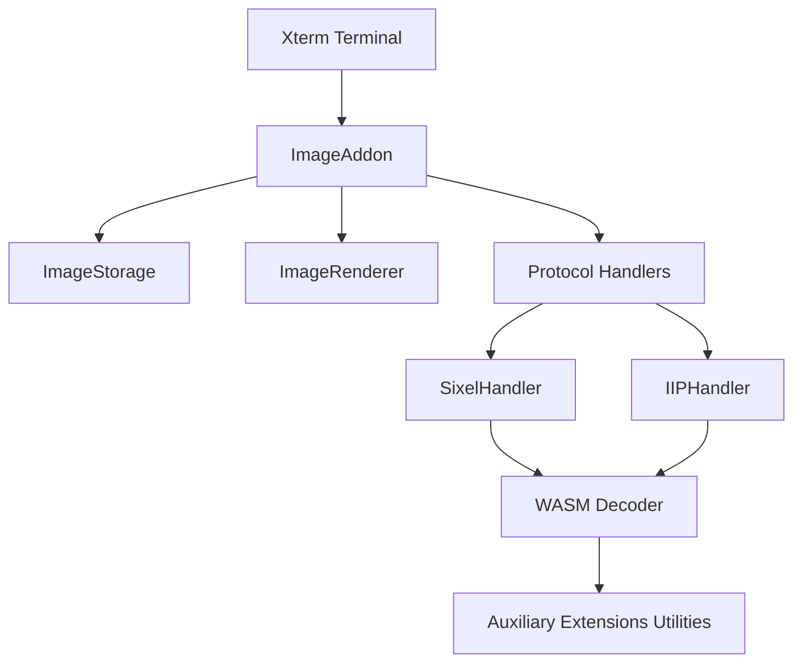
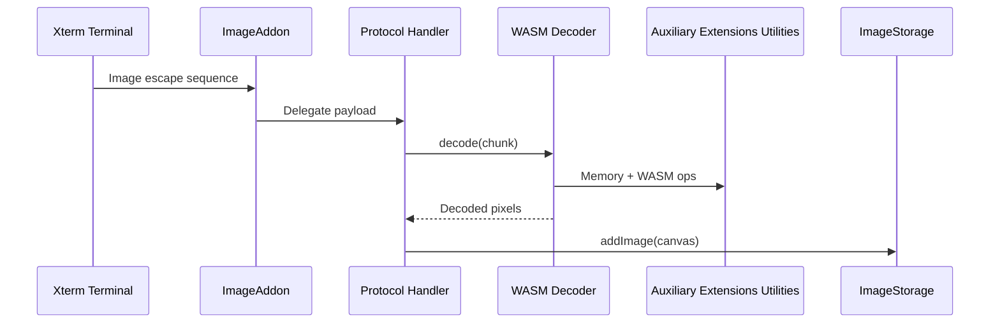
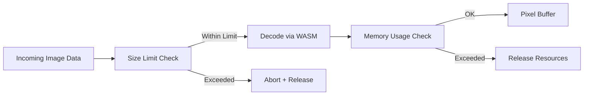

# Xterm Addon Image Auxiliary Extensions Utilities

The **Xterm Addon Image Auxiliary Extensions Utilities** module provides the lowest-level utility building blocks that support advanced image rendering capabilities in the Xterm image addon stack. It is part of the auxiliary extension layer of the Xterm Addon Image subsystem and focuses on decoding, memory handling, WASM integration, base64 processing, and performance-oriented helpers used by higher-level handlers.

This module contains the core utility component:

- `meshcentral.public.scripts.xterm-addon-image.u`

It acts as a foundational utility layer used by decoders and image handlers such as SIXEL and inline image protocol (IIP) implementations.

---

## Position in the Module Hierarchy

This module resides under:

- [Xterm Addon Image Auxiliary Extensions Core](../xterm-addon-image-auxiliary-extensions-core/xterm-addon-image-auxiliary-extensions-core.md)
- [Xterm Addon Image Auxiliary Extensions](../xterm-addon-image-auxiliary-extensions.md)
- [Xterm Addon Image Auxiliary](../../xterm-addon-image-auxiliary.md)
- [Xterm Addon Image](../../../xterm-addon-image.md)

It provides reusable infrastructure leveraged by higher-level handlers such as SIXEL and IIP decoders.

---

## Architectural Context

The Xterm image addon architecture is layered to separate responsibilities:

The **Xterm Addon Image Auxiliary Extensions Utilities** module supports the decoder layer with:

- WASM module bootstrapping
- Base64 decoding
- Memory management helpers
- Data transformation utilities
- Performance-optimized buffer handling

---

## Core Responsibilities

### 1. WebAssembly Integration Support

The module includes logic for loading and instantiating WebAssembly decoders dynamically. This enables:

- High-performance SIXEL decoding
- Efficient streaming decode operations
- Memory reuse across decoding sessions

Key responsibilities:

- Lazy instantiation of WASM modules
- Managing memory buffers (`WebAssembly.Memory`)
- Providing fallback behavior when WASM context is externally managed

---

### 2. Base64 and Binary Processing

Image protocols such as IIP use base64-encoded payloads. The utilities provide:

- Fast base64 decoding
- Efficient typed array conversions
- Cross-environment compatibility (Node.js `Buffer` vs browser `atob`)

This ensures image data can be safely transformed into `Uint8Array` or `Uint32Array` buffers for further processing.

---

### 3. Memory and Buffer Management

Image decoding can consume significant memory. The module supports:

- Dynamic memory growth
- Configurable memory limits
- Controlled release of large buffers
- Pixel-count-based constraints

These safeguards prevent runaway memory consumption in browser environments.

---

### 4. Decoder Support Infrastructure

Higher-level decoder classes depend on this module for:

- Chunked decoding
- Palette handling
- Raster width and height tracking
- Pixel buffer extraction

This allows streaming decoding without blocking the UI thread.

---

## Internal Data Flow

The typical data flow during image decoding:

The utilities module enables efficient decode cycles and ensures memory is bounded and reusable.

---

## Interaction with Core Components

### Integration with ImageRenderer

- Provides raw pixel data to be rendered
- Ensures proper buffer formatting (RGBA8888)
- Allows image resizing and raster alignment

See: [Xterm Addon Image Core Main](../../xterm-addon-image-core/xterm-addon-image-core-main/xterm-addon-image-core-main.md)

---

### Integration with ImageStorage

- Supplies pixel buffers
- Enables tile extraction
- Supports eviction logic via memory usage tracking

See: [Xterm Addon Image Auxiliary Core](../../xterm-addon-image-core-auxiliary/xterm-addon-image-core-auxiliary.md)

---

## Memory Safety Model

The module enforces memory boundaries using:

- `memoryLimit`
- `pixelLimit`
- `paletteLimit`
- Controlled buffer resizing

This layered defense ensures:

- Browser stability
- Predictable performance
- Protection against malformed input

---

## Performance Characteristics

The module is optimized for:

- Minimal allocations
- Typed array reuse
- Chunked decode loops
- Zero-copy subarray operations
- Deferred instantiation of heavy resources

These optimizations are critical because terminal image protocols can stream large image data in real time.

---

## Error Handling Strategy

The utilities follow a defensive error model:

- Early abort on malformed headers
- Immediate release of decoder state
- Graceful fallback when features are unsupported
- Safe no-op behavior when handlers are inactive

This ensures the terminal remains responsive even when encountering invalid image data.

---

## Extensibility Considerations

Because this module sits at the lowest layer of the auxiliary extension stack, changes here affect:

- SIXEL decoding performance
- IIP handling reliability
- Memory consumption patterns
- Rendering responsiveness

When extending this module:

- Avoid introducing blocking operations
- Preserve typed array usage
- Maintain strict memory guardrails
- Ensure compatibility with both browser and Node.js environments

---

## Summary

The **Xterm Addon Image Auxiliary Extensions Utilities** module is a foundational infrastructure layer supporting high-performance image decoding inside the Xterm image addon system. It provides:

- WASM lifecycle management
- Base64 decoding support
- Memory-safe buffer operations
- Streaming-friendly decode helpers
- Performance-optimized binary processing

Although not directly responsible for rendering or storage, it enables the entire image decoding pipeline to function efficiently and safely within browser constraints.

It is a critical component in the overall Xterm image addon architecture and underpins the advanced graphical capabilities of the terminal.