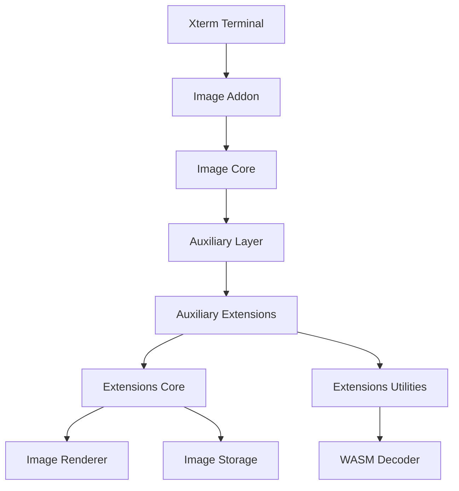
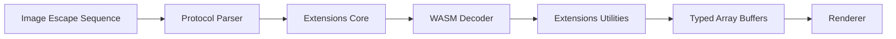
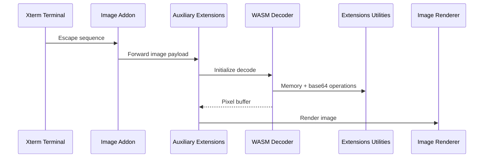
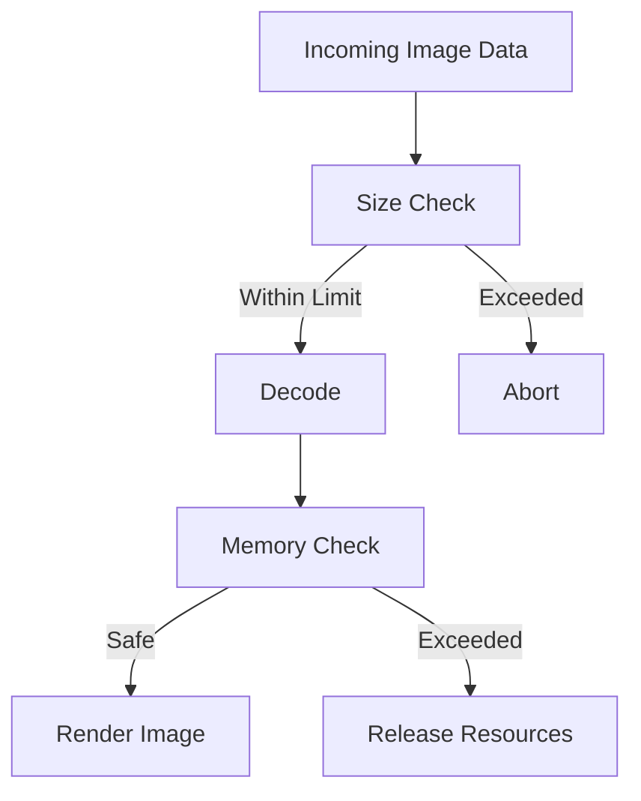

# Xterm Addon Image Auxiliary Extensions

The **Xterm Addon Image Auxiliary Extensions** module provides advanced protocol extensions and supporting logic for the Xterm image addon within the MeshCentral web terminal environment.

It sits above the auxiliary core layer and below high-level protocol handlers, extending image decoding capabilities (such as SIXEL and inline image protocols) while coordinating with rendering, storage, and WebAssembly-backed decoding infrastructure.

This module is part of the Xterm image subsystem located under:

```text
public/scripts/xterm-addon-image/
```

---

## Purpose of the Module

The **Xterm Addon Image Auxiliary Extensions** module is responsible for:

- Extending image decoding capabilities beyond the core image addon
- Supporting protocol-specific enhancements
- Coordinating advanced decoder workflows
- Managing structured image parsing pipelines
- Providing extension points for additional image formats

It bridges:

- The **Xterm Addon Image Core**
- The **Auxiliary decoding infrastructure**
- The **Utilities layer (WASM, base64, memory helpers)**

---

## Repository Structure

Path:

```text
public/scripts/xterm-addon-image/
```

Module scope:

```text
xterm-addon-image-auxiliary
└── xterm-addon-image-auxiliary-extensions
    ├── Core
    │   ├── meshcentral.public.scripts.xterm-addon-image.o
    │   └── meshcentral.public.scripts.xterm-addon-image.r
    └── Utilities
        └── meshcentral.public.scripts.xterm-addon-image.u
```

### Core Components

- `meshcentral.public.scripts.xterm-addon-image.o`
- `meshcentral.public.scripts.xterm-addon-image.r`

These components implement:

- Extended decoding behaviors
- Protocol-specific parsing logic
- Structured image data transformations
- Integration with WASM-backed decoders

### Utilities Component

- `meshcentral.public.scripts.xterm-addon-image.u`

This provides:

- WASM lifecycle handling
- Base64 decoding helpers
- Typed array utilities
- Memory guardrails
- Performance-optimized buffer operations

See detailed documentation:
- **Xterm Addon Image Auxiliary Extensions Utilities**

---

## Architectural Position

The module fits into the Xterm image rendering stack as follows:



---

## Internal Architecture

The module is divided into:

- **Extensions Core** – High-level protocol extensions
- **Extensions Utilities** – Low-level decoding infrastructure



---

## Data Flow During Image Handling



---

## Core Responsibilities

### 1. Protocol Extension Logic

The module enables:

- Advanced SIXEL features
- Inline image protocol enhancements
- Structured metadata parsing
- Incremental decoding support

It ensures compatibility with:

- Streaming terminals
- Chunked image payloads
- Large raster transfers

---

### 2. WASM-Backed Decoding Integration

The module coordinates:

- Decoder instantiation
- Shared memory allocation
- Buffer growth policies
- Safe resource release

It leverages utility helpers to avoid blocking the UI thread.

---

### 3. Memory Guardrails

To protect browser stability, the module enforces:

- Pixel limits
- Palette limits
- Memory growth constraints
- Controlled decoder resets



---

## Integration with Related Modules

### Xterm Addon Image Core

Handles:

- Terminal integration
- Canvas coordination
- Renderer wiring
- Storage lifecycle

See:
- **Xterm Addon Image Core Main**
- **Xterm Addon Image Core Auxiliary**

---

### Xterm Addon Image Auxiliary Core

Provides:

- Shared decode infrastructure
- Decoder abstractions
- Base parsing scaffolding

---

### Xterm Addon Image Auxiliary Extensions Utilities

Provides:

- WASM instantiation logic
- Base64 decoding
- Typed array conversions
- Performance-oriented memory helpers

This utilities layer is the foundation for all extension-level decoding.

---

## Performance Characteristics

The module is optimized for:

- Chunked decode operations
- Typed array reuse
- Minimal memory allocations
- Streaming-safe execution
- Zero-copy buffer slicing where possible

These optimizations are critical because terminal sessions may stream large graphical payloads over WebSocket connections.

---

## Extensibility Considerations

Because the module operates at the protocol-extension boundary:

- New image formats can be integrated here
- Additional decoding strategies can be introduced
- Experimental protocols can be isolated from the core

When extending:

- Avoid synchronous heavy computation
- Preserve strict memory limits
- Maintain compatibility with browser environments
- Ensure safe decoder teardown paths

---

## Summary

The **Xterm Addon Image Auxiliary Extensions** module is a high-level extension layer within the Xterm image addon architecture.

It:

- Extends protocol-level image decoding
- Coordinates with WASM decoders
- Enforces memory and safety boundaries
- Supplies structured pixel buffers to the renderer
- Builds upon the auxiliary and utilities layers

While not directly responsible for rendering, it is essential for enabling advanced terminal image capabilities safely and efficiently within MeshCentral’s browser-based Xterm environment.