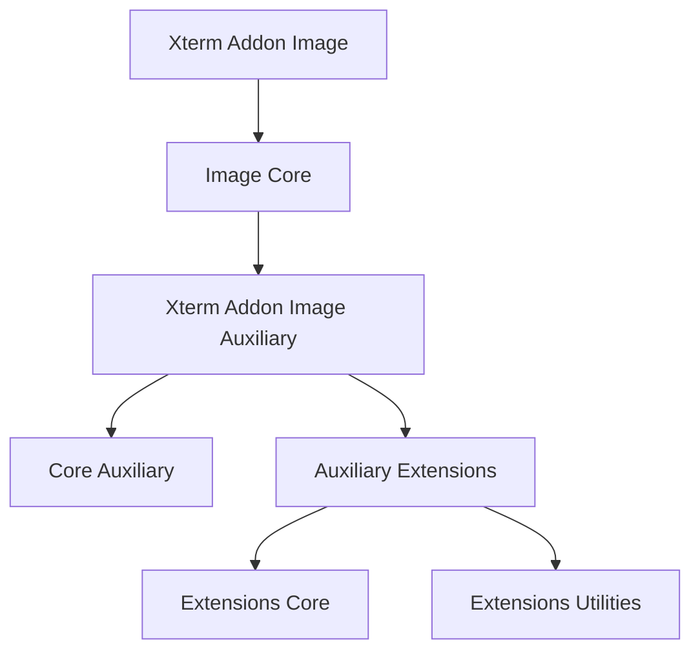
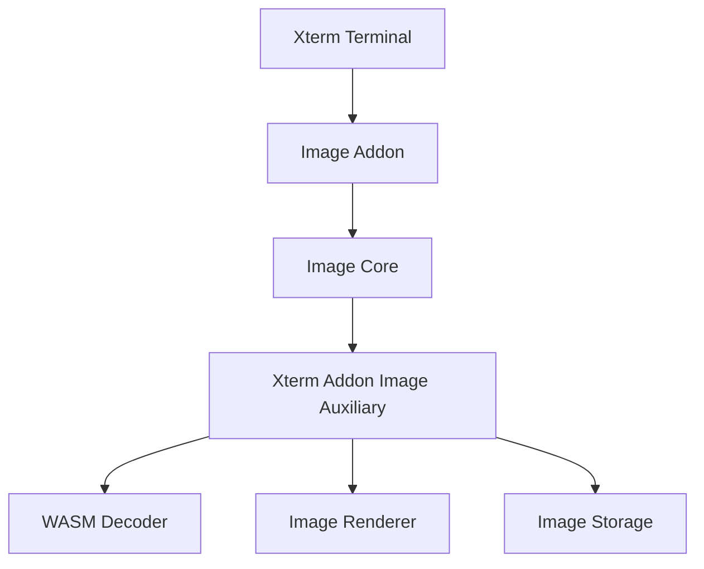
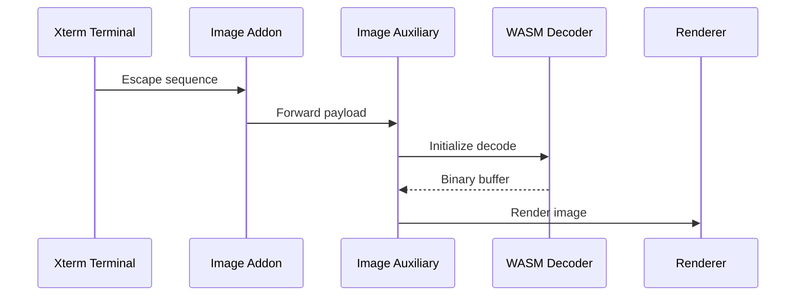
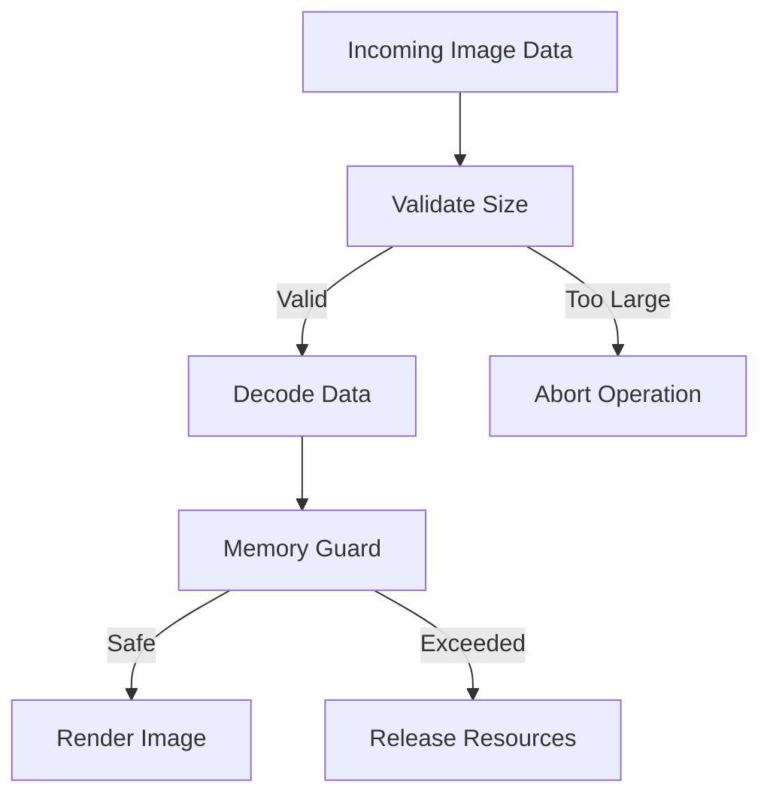

# Xterm Addon Image Auxiliary

The **Xterm Addon Image Auxiliary** module provides the extended support layer for the Xterm image addon inside MeshCentral’s browser-based terminal. It builds on the core image infrastructure and delivers protocol extensions, decoding coordination, and memory-safe utilities required to render inline graphical content such as SIXEL and inline image protocol (IIP) data.

This module resides in:

```text
public/scripts/xterm-addon-image/
```

It acts as the intermediate layer between:

- The **Xterm Addon Image Core**
- The **Core Auxiliary decoding infrastructure**
- The terminal renderer and image storage subsystems

---

## Purpose of the Module

The **Xterm Addon Image Auxiliary** module is responsible for:

- Coordinating extended image decoding workflows  
- Supporting protocol-specific enhancements (e.g., SIXEL, OSC inline images)  
- Managing structured parsing of image payloads  
- Integrating WebAssembly-backed decoders  
- Enforcing memory and safety guardrails  

It does **not** directly:

- Own the terminal rendering canvas  
- Handle terminal scrollback logic  
- Implement the base Xterm terminal engine  

Instead, it extends and orchestrates the image-processing pipeline.

---

## Repository Structure

```text
public/scripts/
└── xterm-addon-image/
    ├── h
    ├── n
    ├── o
    ├── r
    └── u
```

### Core Components

- `meshcentral.public.scripts.xterm-addon-image.h`
- `meshcentral.public.scripts.xterm-addon-image.n`
- `meshcentral.public.scripts.xterm-addon-image.o`
- `meshcentral.public.scripts.xterm-addon-image.r`
- `meshcentral.public.scripts.xterm-addon-image.u`

### Internal Module Hierarchy



---

## Architectural Position

Within the full terminal image stack:



The auxiliary module sits between protocol-level handlers and the rendering/storage layers.

---

## Internal Architecture

The module is logically divided into:

- **Core Auxiliary Coordination**
- **Protocol Extensions**
- **Utilities (WASM + Memory Helpers)**


### Responsibilities by Layer

| Layer | Responsibility |
|--------|----------------|
| Auxiliary Core | Structured decode orchestration |
| Extensions Core | Protocol-specific enhancements |
| Utilities | WASM lifecycle + buffer management |
| Integration | Safe renderer/storage handoff |

---

## Image Handling Flow

When the terminal receives inline image data:



Key characteristics:

- Chunk-based decoding  
- Controlled memory allocation  
- Typed array reuse  
- Explicit resource release  

---

## Memory and Safety Model

The module enforces strict safety controls to protect the browser environment.



### Safeguards

- Pixel count limits  
- Payload size validation  
- Controlled WASM memory growth  
- Explicit decoder teardown  
- Buffer reuse policies  

These controls prevent:

- Memory exhaustion  
- Oversized image denial-of-service  
- Malformed Base64 crashes  

---

## Core Component Roles

### 1. Auxiliary Core (`h`, `n`)

Provides:

- Decoder lifecycle coordination  
- Streaming decode support  
- Shared buffer management  
- Integration scaffolding for extensions  

### 2. Extensions Core (`o`, `r`)

Implements:

- Advanced protocol parsing  
- Structured image transformation  
- Incremental decode strategies  
- Integration with renderer/storage  

### 3. Utilities (`u`)

Provides:

- WASM instantiation helpers  
- Base64 decoding utilities  
- TypedArray manipulation  
- Memory guardrail logic  

---

## Relationship to Other Documentation

For deeper understanding, refer to:

- **Xterm Addon Image Core** – Terminal-level integration  
- **Xterm Addon Image Core Auxiliary** – Base decoding infrastructure  
- **Xterm Addon Image Auxiliary Extensions** – Advanced protocol extensions  
- **Xterm Addon Image Auxiliary Extensions Utilities** – Low-level WASM and memory helpers  

The **Xterm Addon Image Auxiliary** module sits above the core auxiliary layer and below rendering logic, acting as the structured extension and coordination layer.

---

## Summary

The **Xterm Addon Image Auxiliary** module is a critical extension layer within the MeshCentral Xterm image subsystem. It:

- Extends protocol-level image decoding  
- Coordinates WebAssembly-backed decoding  
- Enforces strict memory and size constraints  
- Supplies validated pixel buffers to rendering and storage layers  
- Maintains clean separation between decoding, parsing, and rendering  

By isolating protocol extensions and auxiliary utilities into this module, MeshCentral achieves:

- High-performance inline image handling  
- Predictable browser memory usage  
- Safe streaming of large graphical payloads  
- A modular and extensible terminal image architecture