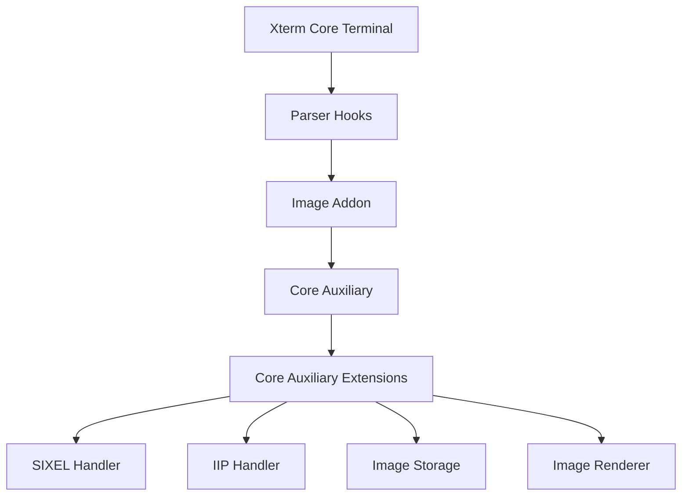
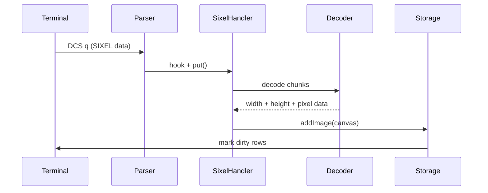
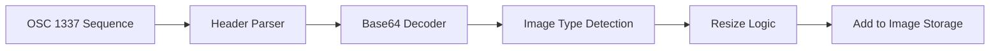
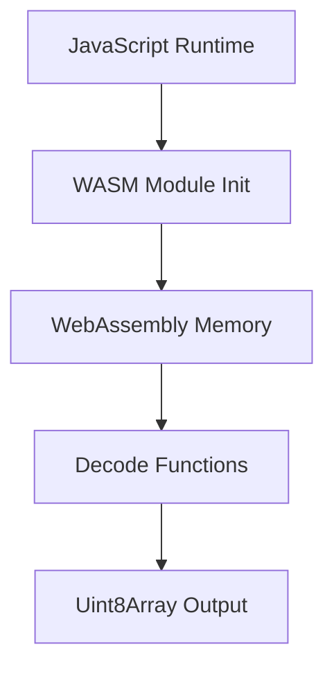
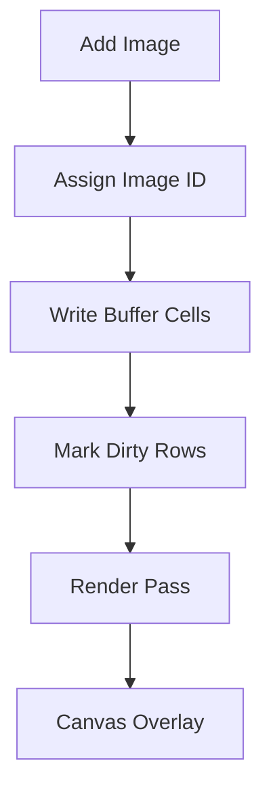

# Xterm Addon Image Core Auxiliary Extensions

## Overview

The **Xterm Addon Image Core Auxiliary Extensions** module provides extended image decoding and protocol handling capabilities for the Xterm image addon. It focuses on advanced image transport formats (SIXEL and IIP), WebAssembly-powered decoding, storage management, and renderer integration with the Xterm core.

Positioned within the auxiliary branch of the Xterm image addon hierarchy, this module enhances the lower-level image processing pipeline defined in the parent module:

- Parent: [Xterm Addon Image Core Auxiliary](../xterm-addon-image-core-auxiliary.md)
- Sibling: [Xterm Addon Image Core Auxiliary Main](../xterm-addon-image-core-auxiliary-main/xterm-addon-image-core-auxiliary-main.md)

It encapsulates the `meshcentral.public.scripts.xterm-addon-image.n` component, which contains the compiled runtime logic for:

- SIXEL decoding
- iTerm2 Inline Image Protocol (IIP) support
- WebAssembly-backed base64 decoding
- Image storage and eviction policies
- Terminal buffer image rendering

---

## Architectural Context

Within the overall Xterm image addon stack, this module operates as a protocol and decoding layer that bridges:

- Terminal parser hooks (CSI, DCS, OSC)
- Image decoders (SIXEL, IIP)
- Rendering abstraction
- Storage and eviction logic

### High-Level Placement

The **Xterm Addon Image Core Auxiliary Extensions** module is responsible for connecting protocol handlers to decoding logic and finally to rendering and storage subsystems.

---

## Core Responsibilities

### 1. SIXEL Graphics Support

SIXEL is a bitmap graphics protocol commonly used in terminal emulators. This module:

- Registers a DCS handler for SIXEL sequences (`final: "q"`)
- Streams image data to a WebAssembly decoder
- Applies palette limits and pixel limits
- Converts decoded pixel buffers into canvases
- Pushes rendered output into image storage

### SIXEL Processing Flow

Key features:

- Memory limit enforcement
- Configurable palette size (`sixelPaletteLimit`)
- Configurable maximum image size (`sixelSizeLimit`)
- Optional scrolling behavior (`sixelScrolling`)

---

### 2. Inline Image Protocol (IIP) Support

The module implements support for the iTerm2 Inline Image Protocol (OSC 1337).

Responsibilities include:

- Parsing inline image headers
- Base64 decoding of image payloads
- MIME detection (PNG, JPEG, GIF)
- Dynamic resizing according to terminal dimensions
- Respecting pixel limits

### IIP Processing Flow

The resizing logic:

- Supports `px`, `%`, and cell-relative sizing
- Preserves aspect ratio when requested
- Ensures final pixel count stays under configured limits

---

## WebAssembly-Backed Decoding

A major capability of this module is high-performance decoding using WebAssembly.

### Base64 Decoder (WASM)

The internal decoder:

- Allocates linear memory dynamically
- Streams chunks incrementally
- Tracks internal offsets
- Prevents uncontrolled memory growth

### WASM Integration Model

Key safeguards:

- `memoryLimit` enforcement
- Safe buffer growth
- Release of instances when exceeding thresholds

---

## Image Storage and Rendering Integration

Decoded images are handed off to the `ImageStorage` and `ImageRenderer` subsystems.

### Storage Responsibilities

- Assign incremental image IDs
- Track tile positions in buffer cells
- Enforce global pixel limits
- Evict oldest images when over capacity
- Handle alternate buffer switching

### Rendering Responsibilities

- Maintain overlay canvas
- Render only dirty rows
- Scale images to current cell dimensions
- Support placeholder rendering when enabled

### Rendering Pipeline

This separation ensures:

- Efficient scrolling
- Viewport-aware rendering
- Proper garbage collection of unused images

---

## Terminal Integration Hooks

The module registers multiple handlers with the Xterm parser:

- CSI `?h` / `?l` → enable/disable SIXEL scrolling
- CSI `c` → device attributes reporting
- CSI `?S` → graphics attribute queries
- DCS `q` → SIXEL
- OSC 1337 → IIP
- ESC `c` → reset

### Reset Behavior

On reset:

- Palette limits are restored
- Scrolling mode reset
- Storage cleared
- Handlers reinitialized

This ensures predictable terminal state restoration.

---

## Configuration Options

The module supports configurable runtime behavior:

| Option | Purpose |
|--------|----------|
| `pixelLimit` | Maximum allowed pixel count |
| `sixelSupport` | Enable SIXEL decoding |
| `sixelScrolling` | Scroll terminal after SIXEL render |
| `sixelPaletteLimit` | Max SIXEL palette entries |
| `sixelSizeLimit` | Max SIXEL data size |
| `storageLimit` | Maximum storage memory (MB) |
| `showPlaceholder` | Render placeholders for missing images |
| `iipSupport` | Enable IIP protocol |
| `iipSizeLimit` | Max IIP image size |

These limits protect the terminal from:

- Excessive memory usage
- Malformed image payloads
- Large image DoS vectors

---

## Data Model Overview

Each stored image contains:

- Original bitmap (`orig`)
- Scaled bitmap (`actual`)
- Cell dimension metadata
- Tile count
- Marker for lifecycle cleanup

Buffer cells are extended with:

- `imageId`
- `tileId`
- Extended attribute flags

This enables tile-based rendering instead of full-image redraw per cell.

---

## Error Handling and Safety

The module implements layered safeguards:

- Abort on excessive data (`sixelSizeLimit`)
- Abort on exceeding memory limit
- Abort on unsupported MIME types
- Controlled fallback if `createImageBitmap` is unavailable
- Automatic disposal of `ImageBitmap` resources

This ensures robustness across browsers and environments.

---

## How It Fits in the Overall System

The **Xterm Addon Image Core Auxiliary Extensions** module acts as the advanced graphics engine for terminal image rendering:

- Extends the core addon with protocol-level support
- Bridges terminal parser and rendering layer
- Offloads heavy decoding to WebAssembly
- Manages memory and lifecycle of image resources

It enables rich terminal graphics while maintaining:

- Performance
- Memory safety
- Viewport-aware rendering
- Compatibility with traditional terminal workflows

---

## Summary

The **Xterm Addon Image Core Auxiliary Extensions** module provides:

- SIXEL decoding via WebAssembly
- Inline image protocol support
- Palette and size management
- Tile-based buffer rendering
- Storage eviction and lifecycle control
- Deep integration with Xterm parser and render cycle

It is a critical extension layer that transforms the Xterm addon from a basic text terminal into a high-performance graphical terminal environment.