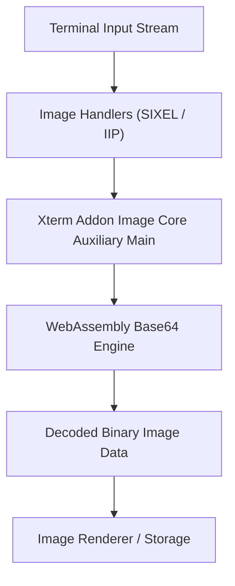
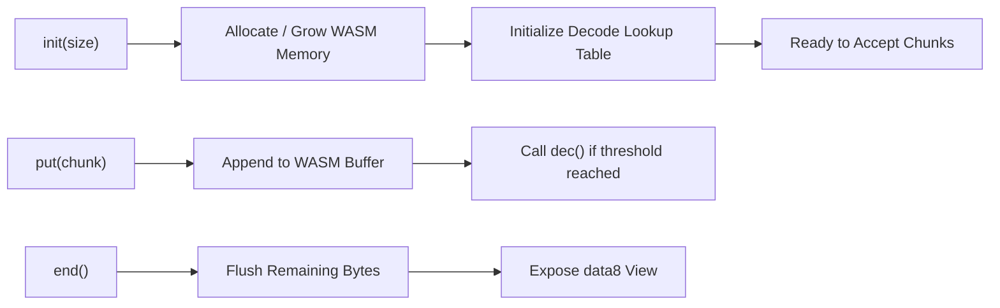
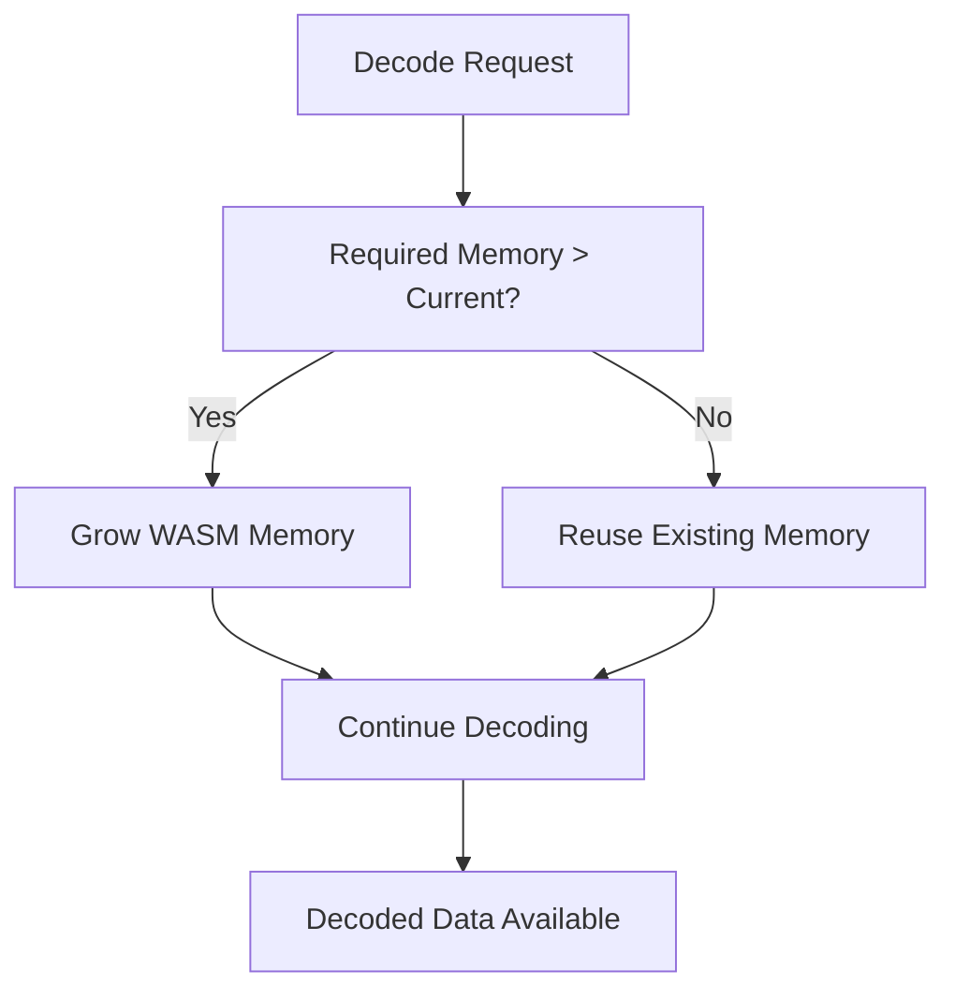
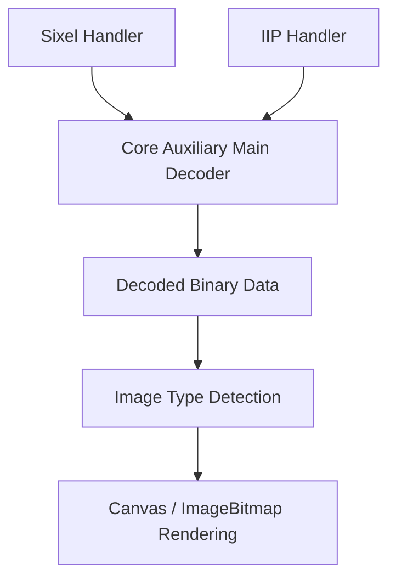
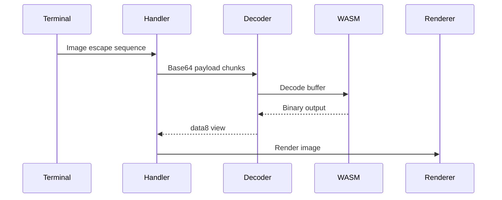

# Xterm Addon Image Core Auxiliary Main

## Overview

The **Xterm Addon Image Core Auxiliary Main** module provides the primary auxiliary decoding logic for image processing within the Xterm Image Addon subsystem. It is centered around the `meshcentral.public.scripts.xterm-addon-image.h` component, which implements a high-performance Base64 decoding engine backed by WebAssembly.

This module acts as a foundational utility for higher-level image handlers such as SIXEL and Inline Image Protocol (IIP) handlers. It focuses on:

- Efficient Base64 decoding of image payloads
- WebAssembly-backed performance optimization
- Memory-aware streaming decode support
- Safe lifecycle and buffer management

It is part of the **Xterm Addon Image Auxiliary → Core Auxiliary → Main** branch of the image addon architecture.

---

## Module Position in the Architecture

This module resides in the following hierarchy:

- [Xterm Addon Image](../../../../xterm-addon-image.md)
  - Xterm Addon Image Auxiliary
    - Xterm Addon Image Core Auxiliary
      - **Xterm Addon Image Core Auxiliary Main (current module)**

Related modules:

- Parent: [Xterm Addon Image Core Auxiliary](../xterm-addon-image-core-auxiliary.md)
- Sibling: [Xterm Addon Image Core Auxiliary Extensions](../xterm-addon-image-core-auxiliary-extensions/xterm-addon-image-core-auxiliary-extensions.md)

---

## Core Component

### Base64 Decoder (WebAssembly-backed)

**Component:**

- `meshcentral.public.scripts.xterm-addon-image.h`

This component implements a streaming Base64 decoder using a WebAssembly module for high-performance decoding. It is optimized for large inline image payloads such as:

- SIXEL graphics streams
- Inline Image Protocol (OSC 1337)
- Encoded image blobs transferred via terminal escape sequences

---

## Architectural Responsibilities



### Responsibility Breakdown

| Layer | Responsibility |
|--------|----------------|
| Image Handlers | Detect and parse escape sequences |
| Core Auxiliary Main | Decode Base64 image payload |
| WebAssembly Engine | Perform high-speed binary conversion |
| Renderer/Storage | Convert decoded bytes into displayable image |

---

## Internal Design

### 1. WebAssembly Integration

The decoder embeds a small WASM module compiled for Base64 decoding. It:

- Allocates memory dynamically
- Reuses memory when within `keepSize`
- Grows memory if required
- Exposes `dec()` and `end()` functions



---

### 2. Streaming Decode Model

The decoder supports chunked decoding:

- `init(size)` prepares memory
- `put(data, start, end)` streams partial chunks
- `end()` finalizes the decode process
- `data8` exposes decoded output
- `release()` reclaims memory

This model allows processing of large images without allocating excessively large intermediate buffers.

---

### 3. Memory Management Strategy

The module enforces memory discipline via:

- `keepSize` threshold
- Buffer reuse if under threshold
- Memory growth using WASM page expansion
- Explicit `release()` logic



This design prevents frequent allocation churn during repeated inline image rendering.

---

## Integration with Image Handlers

The Base64 decoder is used by higher-level modules such as:

- SIXEL handler
- Inline Image Protocol (OSC 1337) handler



The decoder itself is protocol-agnostic. It strictly performs Base64 transformation and exposes raw binary data.

---

## Public Interface Behavior

### Constructor

```text
new Decoder(keepSize)
```

- `keepSize`: Maximum buffer size before memory is discarded on release

### Key Methods

| Method | Purpose |
|--------|----------|
| `init(size)` | Prepare decoder for expected payload size |
| `put(buffer, start, end)` | Stream input data |
| `end()` | Finalize decoding |
| `data8` | Access decoded Uint8Array |
| `release()` | Cleanup or reuse memory |

---

## Error Handling Strategy

The module avoids throwing during streaming where possible. Instead:

- `put()` returns status codes
- Oversized input is safely rejected
- `release()` guarantees memory reset

Higher layers (e.g., IIP or SIXEL handlers) enforce:

- Size limits
- Pixel limits
- Abort logic

This separation ensures decoding remains deterministic and fast.

---

## Performance Characteristics

### Why WebAssembly?

- Significantly faster Base64 decoding than pure JavaScript
- Lower GC pressure
- Predictable memory footprint
- Suitable for large terminal-embedded images

### Optimization Techniques

- Precomputed lookup tables
- TypedArray memory views
- Minimal copying
- Chunked decode thresholding

---

## Security Considerations

The module itself does not validate image type or dimensions. Security is enforced by:

- Higher-level size limits
- Pixel limits
- Storage eviction policies
- Renderer sandboxing

This layered approach prevents:

- Memory exhaustion
- Large image DoS
- Unbounded Base64 payload attacks

---

## Relationship to Sibling Modules

| Module | Responsibility |
|--------|----------------|
| Xterm Addon Image Core Auxiliary | Shared auxiliary decoding utilities |
| Xterm Addon Image Core Auxiliary Main | WASM Base64 decoding engine (this module) |
| Xterm Addon Image Core Auxiliary Extensions | Extended decoding helpers |

---

## Data Flow Summary



---

## When to Modify This Module

Changes should be considered only if:

- Base64 decoding performance needs improvement
- WebAssembly memory model requires tuning
- Decoder streaming behavior must change
- Security-related decoding safeguards are required

Avoid modifying this module for:

- Rendering logic
- Storage eviction
- Escape sequence parsing

Those belong in higher-level modules.

---

## Conclusion

The **Xterm Addon Image Core Auxiliary Main** module is a low-level, performance-critical component responsible for transforming Base64-encoded image streams into binary data using WebAssembly acceleration.

It is:

- Stateless between decode sessions
- Optimized for streaming
- Memory-conscious
- Protocol-agnostic

By isolating high-performance decoding in this module, the Xterm Image Addon maintains a clean separation between:

- Protocol parsing
- Binary decoding
- Rendering
- Storage management

This modular design ensures scalability, maintainability, and predictable runtime behavior within the MeshCentral terminal image pipeline.