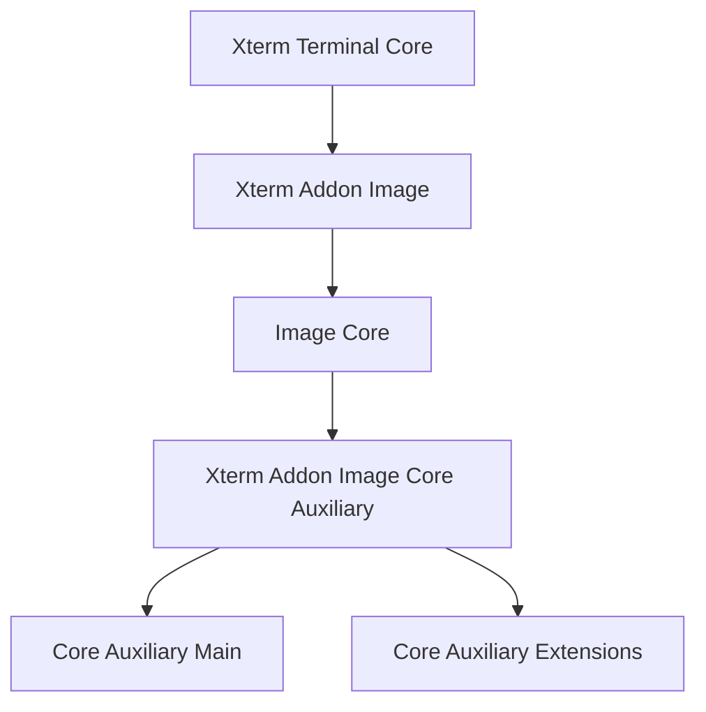
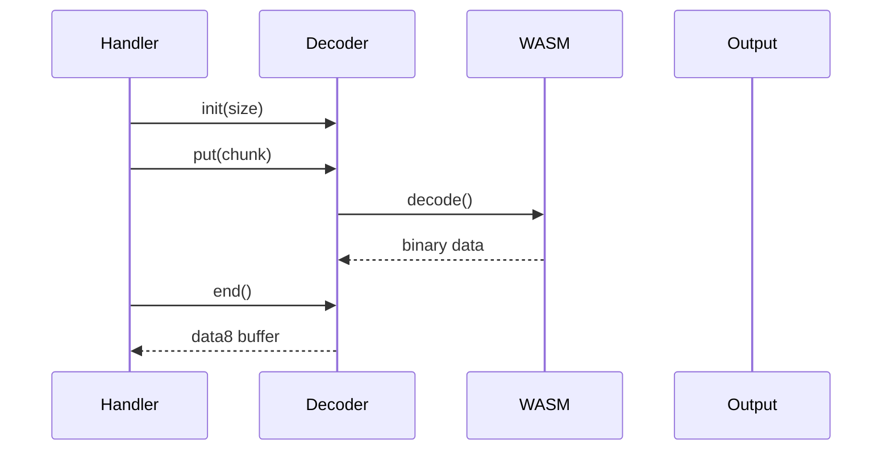
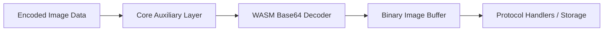
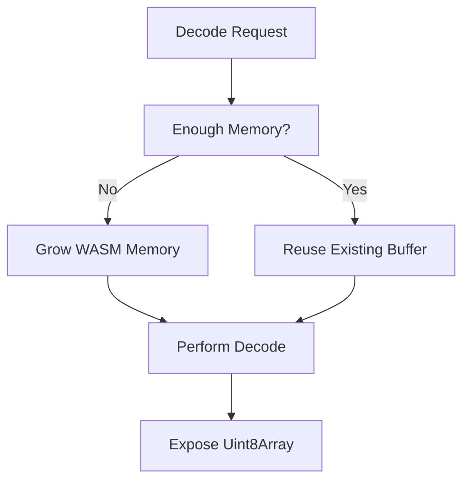
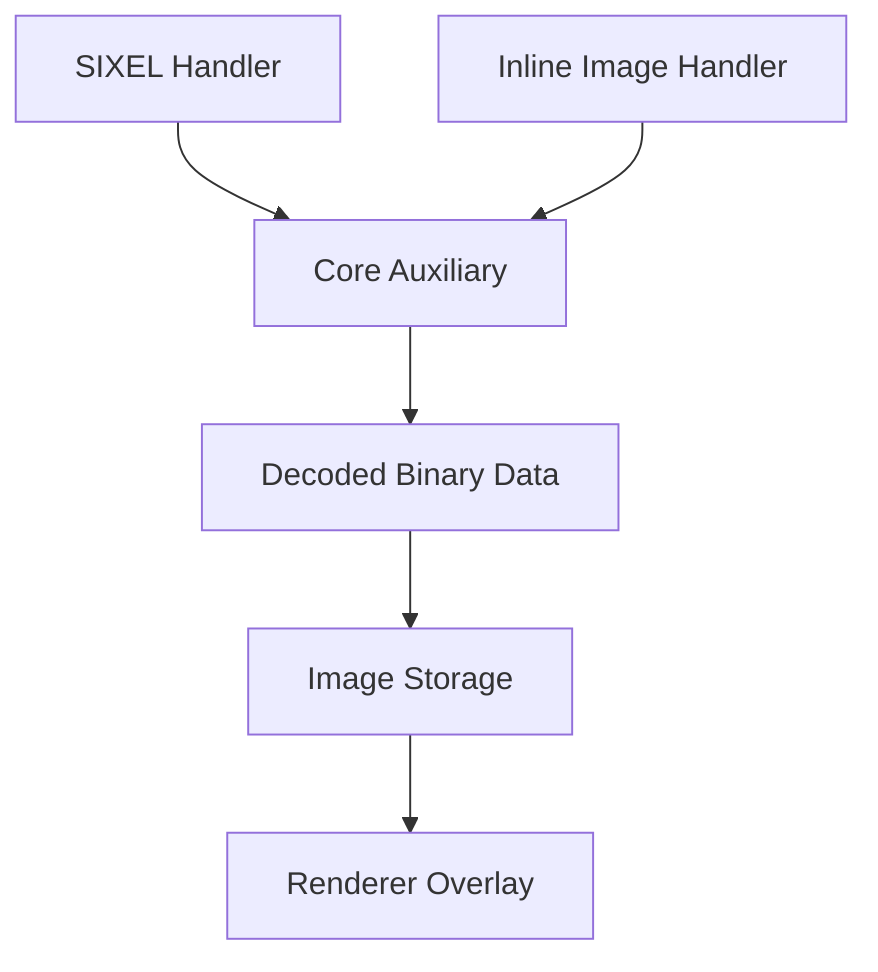

# Xterm Addon Image Core Auxiliary

## Overview

The **Xterm Addon Image Core Auxiliary** module provides foundational support utilities for the Xterm Image Addon within MeshCentral. It serves as the shared auxiliary layer that supports image decoding, memory coordination, and protocol-neutral helpers used by higher-level image handlers such as SIXEL and the Inline Image Protocol (IIP).

This module resides in:

```text
public/scripts/xterm-addon-image/
```

It includes the following core auxiliary components:

- `meshcentral.public.scripts.xterm-addon-image.h`
- `meshcentral.public.scripts.xterm-addon-image.n`

The module acts as a bridge between:

- Low-level decoding primitives (e.g., WebAssembly Base64 decoding)
- Protocol-specific handlers (SIXEL / IIP)
- Rendering and image storage subsystems

---

## Architectural Position

Within the Xterm image subsystem, the **Xterm Addon Image Core Auxiliary** module is part of the auxiliary branch under the image addon core:



### Hierarchy

- **Xterm Addon Image**
  - Xterm Addon Image Core
    - **Xterm Addon Image Core Auxiliary** (this module)
      - Core Auxiliary Main
      - Core Auxiliary Extensions

This module provides reusable infrastructure shared across decoding and rendering extensions.

---

## Purpose of the Module

The **Xterm Addon Image Core Auxiliary** module is responsible for:

- High-performance Base64 decoding (WebAssembly-backed)
- Streaming decode support
- Memory lifecycle control
- Integration helpers for protocol handlers
- Shared utilities for image buffer preparation

It does **not** directly:

- Parse escape sequences
- Render images to canvas
- Manage terminal scrolling

Those responsibilities belong to sibling or higher-level modules.

---

## Core Components

### 1. WebAssembly Base64 Decoder

**Component:**

- `meshcentral.public.scripts.xterm-addon-image.h`

This component implements:

- Streaming Base64 decoding
- WASM-backed memory management
- TypedArray buffer exposure (`Uint8Array`)
- Controlled memory growth and release

#### Decode Flow



Key characteristics:

- Chunk-based decoding
- Minimal copying
- Memory reuse via `keepSize`
- Explicit `release()` lifecycle

---

### 2. Core Auxiliary Integration Layer

**Component:**

- `meshcentral.public.scripts.xterm-addon-image.n`

This component coordinates:

- Decoder invocation
- Image payload transformation
- Integration with storage and rendering layers
- Enforcement of size and pixel limits

It acts as a protocol-neutral orchestration layer that ensures decoded data flows safely into the renderer.

---

## Internal Architecture

The module follows a layered auxiliary design:



### Responsibilities by Layer

| Layer | Responsibility |
|--------|----------------|
| Core Auxiliary | Streaming coordination |
| WASM Decoder | High-speed Base64 transformation |
| Integration Layer | Safe handoff to upper modules |

---

## Streaming and Memory Model

The decoder is designed for large terminal-embedded image payloads.

### Memory Strategy



Safeguards include:

- Configurable `keepSize`
- Explicit `release()` control
- Avoidance of repeated allocations
- Controlled WASM page expansion

This ensures predictable performance even with repeated large inline images.

---

## Integration with Higher-Level Modules

The **Xterm Addon Image Core Auxiliary** module is used by:

- SIXEL handler (DCS `q`)
- Inline Image Protocol handler (OSC 1337)
- Image storage subsystem
- Renderer overlay logic

### Integration Flow



The auxiliary module remains:

- Protocol-agnostic
- Rendering-agnostic
- Storage-agnostic

It strictly provides decoding and safe data transformation utilities.

---

## Security and Safety Design

The module supports system stability by:

- Preventing uncontrolled WASM memory growth
- Enforcing size thresholds
- Returning status codes instead of throwing during streaming
- Supporting upper-layer abort mechanisms

Upper layers enforce:

- Pixel limits
- Data size limits
- MIME type validation
- Storage eviction policies

This layered design prevents:

- Memory exhaustion
- Large image denial-of-service
- Malformed Base64 payload crashes

---

## Repository Structure

```text
public/scripts/
└── xterm-addon-image/
    ├── h   (WASM Base64 decoder)
    ├── n   (Core auxiliary integration layer)
```

Module classification:

- Parent Module: Xterm Addon Image Core
- Current Module: **Xterm Addon Image Core Auxiliary**
- Children:
  - Xterm Addon Image Core Auxiliary Main
  - Xterm Addon Image Core Auxiliary Extensions

---

## Relationship to Core Documentation

For deeper details, see:

- **Xterm Addon Image Core** – overall image architecture
- **Xterm Addon Image Core Auxiliary Main** – WASM decoding engine details
- **Xterm Addon Image Core Auxiliary Extensions** – protocol handlers and rendering integration

This module acts as the shared infrastructure layer used by both Main and Extensions modules.

---

## Summary

The **Xterm Addon Image Core Auxiliary** module is a foundational infrastructure layer within the MeshCentral Xterm image addon. It provides:

- WebAssembly-accelerated Base64 decoding
- Streaming decode support
- Memory-conscious buffer lifecycle management
- Safe integration points for protocol handlers

By isolating performance-critical and memory-sensitive logic into this auxiliary module, the Xterm image system achieves:

- High decoding performance
- Predictable memory usage
- Clean separation of concerns
- Robust handling of terminal-embedded image data

It is a critical internal layer that enables graphical terminal capabilities while maintaining stability and efficiency.