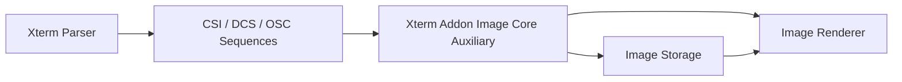
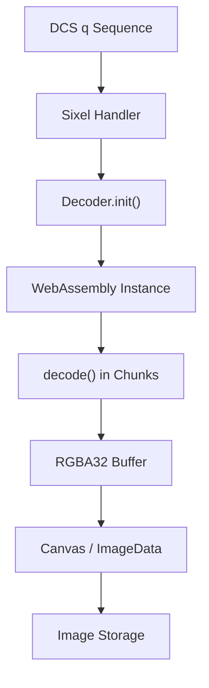
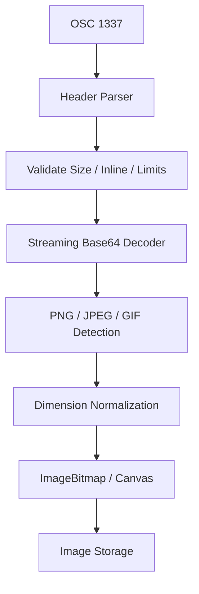
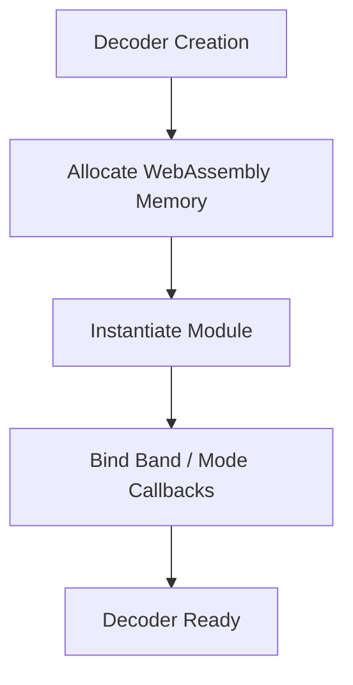
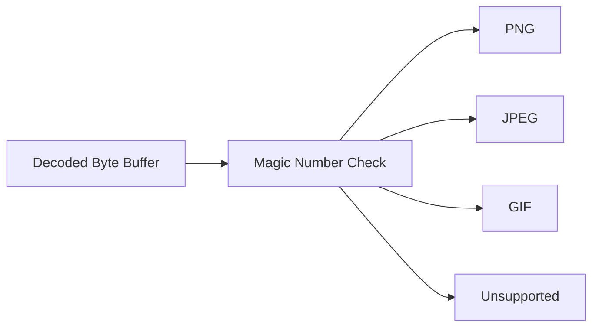
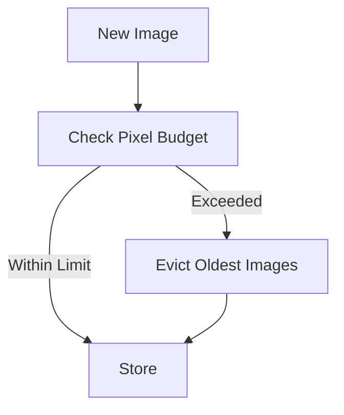

# Xterm Addon Image Core Auxiliary

The **Xterm Addon Image Core Auxiliary** module provides the low-level decoding, parsing, and binary processing primitives that power image rendering inside the Xterm Image Addon. It complements the primary control logic implemented in the core module by handling:

- Sixel decoding via WebAssembly
- Inline Image Protocol (IIP) parsing
- Base64 decoding and buffering
- Palette management and pixel normalization
- Image metadata detection (PNG, JPEG, GIF)

This module is a critical bridge between terminal escape sequences and the renderer/storage layers that ultimately display images in the terminal grid.

Parent module: [Xterm Addon Image Core](../xterm-addon-image-core.md)
Sibling module: [Xterm Addon Image Core Main](../xterm-addon-image-core-main/xterm-addon-image-core-main.md)

---

## 1. Architectural Role

Within the Xterm Image Addon stack, this module sits between the terminal parser and the rendering/storage layers.

### Responsibilities

- Decode SIXEL streams using WebAssembly
- Parse IIP headers and payloads
- Convert encoded image data into pixel buffers
- Enforce memory and pixel limits
- Provide normalized RGBA pixel output

It does **not** directly manage terminal cell painting logic — that responsibility belongs to storage and rendering components in the parent module.

---

## 2. Core Components

The module exposes two primary internal components:

- `meshcentral.public.scripts.xterm-addon-image._`
- `meshcentral.public.scripts.xterm-addon-image.a`

These components collectively implement:

- WebAssembly bootstrap and instantiation
- Sixel decoder engine
- IIP header parsing
- Base64 streaming decode
- Image type detection

---

## 3. SIXEL Decoding Pipeline

SIXEL is a bitmap graphics format encoded as terminal escape sequences. The decoding process is optimized using WebAssembly for performance.

### Flow Overview

### Key Characteristics

- Chunked decoding to respect `CHUNK_SIZE`
- Configurable palette limits
- Memory ceiling enforcement (`memoryLimit`)
- Automatic band handling for streaming images

### Decoder Modes

The decoder operates in multiple modes:

- Raster mode
- Band mode
- Palette mode

The WebAssembly layer maintains internal state arrays for:

- Width
- Height
- Current band offsets
- Palette entries

The JavaScript wrapper converts decoded data into:

- `Uint32Array` (RGBA8888)
- `Uint8ClampedArray` (for Canvas API)

---

## 4. Inline Image Protocol (IIP) Handling

IIP images are transmitted via OSC 1337 escape sequences.

### IIP Processing Flow

### Header Fields

Parsed attributes include:

- `inline`
- `size`
- `name`
- `width`
- `height`
- `preserveAspectRatio`

Validation rules:

- Must be inline
- Must not exceed configured size limit
- Must respect pixel limit

If any validation fails, decoding is aborted.

---

## 5. WebAssembly Integration

The auxiliary module embeds a compiled WebAssembly binary for SIXEL decoding.

### Initialization Strategy

### Runtime Interactions

- WASM exports: `init`, `decode`, `end`
- Shared memory buffer between JS and WASM
- State arrays mapped via `Uint32Array`
- Palette preloaded into WASM memory

### Safety Controls

- Memory growth capped by configured limits
- Pixel limit enforcement
- Automatic release of large buffers

---

## 6. Image Type Detection

The module performs lightweight header inspection to determine image format.

### Supported Formats

- PNG
- JPEG
- GIF

### Detection Strategy

For PNG:
- Width and height extracted from IHDR chunk

For JPEG:
- Scans markers for SOF segment

For GIF:
- Reads logical screen descriptor

Unsupported formats are rejected early to prevent resource waste.

---

## 7. Memory and Resource Management

Efficient resource management is a core concern.

### Mechanisms

- Configurable pixel limit
- Configurable storage limit (MB)
- WASM memory reuse
- Release on overflow
- ImageBitmap disposal when evicted

### Eviction Strategy (High-Level)

Storage eviction logic itself resides in the storage layer of the parent module.

---

## 8. Interaction with Rendering Layer

The auxiliary module produces decoded pixel data but does not directly draw into terminal cells.

Instead it:

1. Produces canvas or bitmap objects
2. Passes them to image storage
3. Storage maps tiles into terminal buffer cells
4. Renderer paints them in a dedicated overlay layer

See:
- [Xterm Addon Image Core](../xterm-addon-image-core.md)
- [Xterm Addon Image Core Main](../xterm-addon-image-core-main/xterm-addon-image-core-main.md)

---

## 9. Error Handling Strategy

Failures are handled defensively:

- Abort decoding on size overflow
- Abort on malformed header
- Abort on decode exception
- Release buffers on failure

Typical failure modes:

- Invalid Base64 payload
- Corrupted SIXEL stream
- Unsupported MIME type
- Pixel budget exceeded

All failures fail-safe without corrupting terminal state.

---

## 10. Summary

The **Xterm Addon Image Core Auxiliary** module is the binary and decoding engine of the Xterm Image Addon. It:

- Converts escape-encoded image streams into RGBA pixel buffers
- Uses WebAssembly for efficient SIXEL decoding
- Implements IIP protocol parsing
- Enforces strict memory and size boundaries
- Produces image objects for storage and rendering layers

Without this module, the higher-level addon logic would lack the low-level image processing capabilities required for safe and performant terminal image rendering.