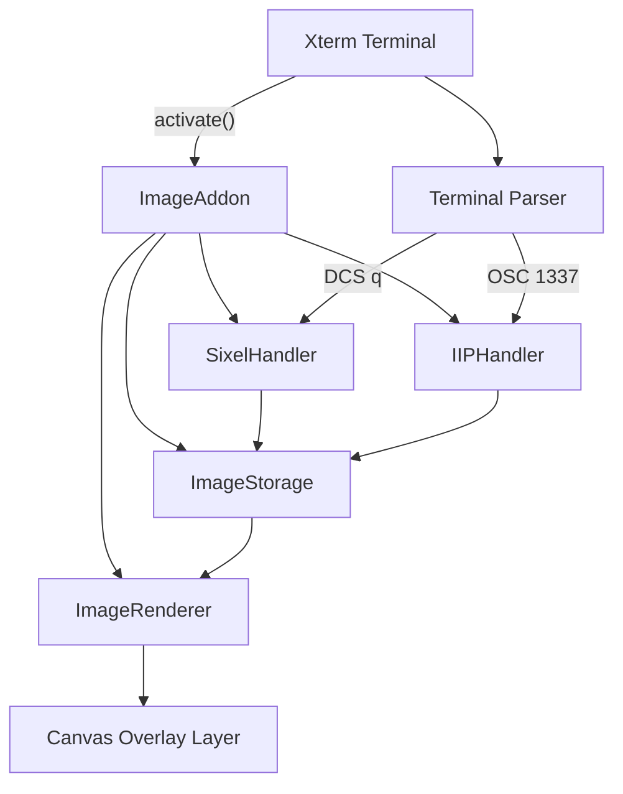
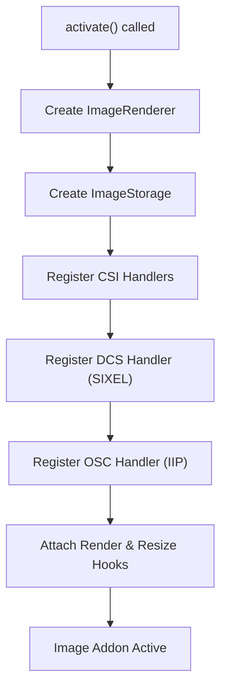
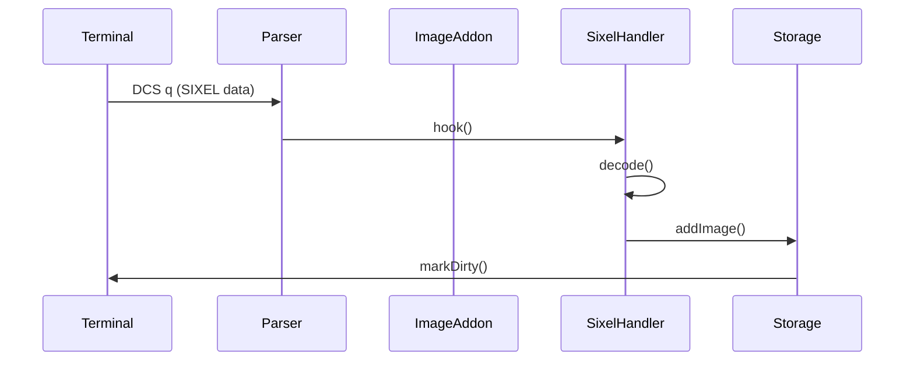
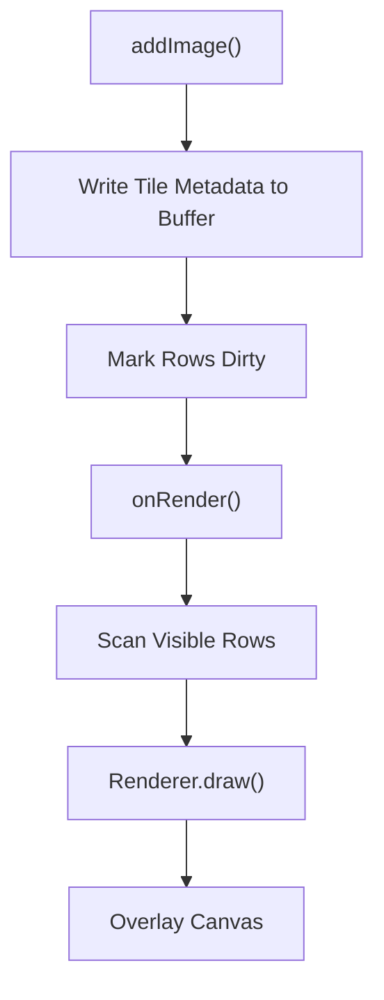
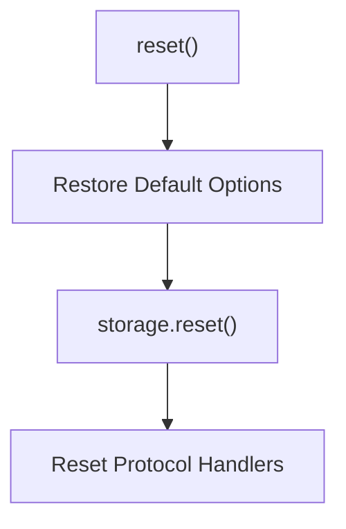
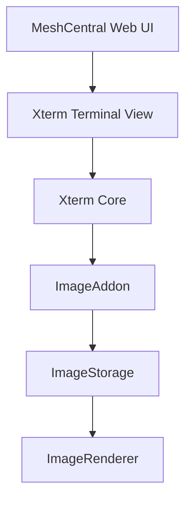

# Xterm Addon Image Core Main

The **Xterm Addon Image Core Main** module contains the primary runtime logic for the image addon integrated into Xterm.js within MeshCentral. It provides the central `ImageAddon` class and orchestrates image decoding, rendering, storage, and protocol integration (SIXEL and iTerm2 Inline Images Protocol).

This module is the operational heart of the image addon and connects:

- The Xterm terminal instance
- The image renderer layer
- The image storage subsystem
- Protocol handlers (SIXEL, IIP)
- Terminal parser hooks and lifecycle events

It works closely with:

- [Xterm Addon Image Core Auxiliary](../xterm-addon-image-core-auxiliary/xterm-addon-image-core-auxiliary.md)
- [Xterm Addon Image Core](../xterm-addon-image-core.md)
- [Xterm Addon Image](../../xterm-addon-image.md)

---

## Core Components

This module contains the following core components:

- `meshcentral.public.scripts.xterm-addon-image.B`
- `meshcentral.public.scripts.xterm-addon-image.Q`

These correspond to:

- The main `ImageAddon` implementation
- Supporting internal control and lifecycle logic

The `ImageAddon` class is the entry point and integrates with the Xterm API via the `activate()` lifecycle method.

---

# Architectural Overview

The **Xterm Addon Image Core Main** module acts as the coordination layer between the terminal, protocol handlers, rendering engine, and storage.

### Responsibilities

| Component | Responsibility |
|------------|----------------|
| ImageAddon | Lifecycle, configuration, terminal integration |
| ImageRenderer | Canvas layer drawing and scaling |
| ImageStorage | Image lifecycle, memory limits, tile mapping |
| SixelHandler | SIXEL decoding and rendering |
| IIPHandler | Inline image protocol (OSC 1337) support |

---

# ImageAddon Lifecycle

The `ImageAddon` class implements the Xterm addon interface.

## Activation Flow

When `activate(terminal)` is called:

1. Terminal reference is stored
2. Renderer and storage are initialized
3. Terminal parser handlers are registered
4. Render and resize hooks are attached
5. Protocol handlers are installed (if enabled)

---

# Protocol Integration

The module registers protocol handlers directly into the Xterm parser.

## SIXEL (DCS q)

- Registered via `registerDcsHandler({ final: "q" })`
- Decodes SIXEL bitmap data
- Sends decoded images to `ImageStorage`
- Supports palette configuration and scrolling behavior

## IIP (OSC 1337)

- Registered via `registerOscHandler(1337)`
- Parses inline image headers
- Decodes base64 payload
- Validates image size and pixel limits
- Sends image to storage

---

# Rendering Pipeline

Images are not drawn directly into the text layer. Instead:

1. Images are stored as logical objects
2. Cells are marked with image tile metadata
3. During render phase, visible rows are scanned
4. Matching tiles are drawn into a canvas overlay

### Key Concepts

- **Tile-based rendering**: Images are divided into cell-sized tiles
- **Overlay canvas**: Drawn above terminal text layer
- **Lazy rendering**: Only visible rows are processed
- **Marker-based cleanup**: Images disposed when buffer markers expire

---

# Configuration Model

The module defines default options and merges user overrides.

## Default Options

| Option | Purpose |
|---------|----------|
| enableSizeReports | Enables terminal size reporting |
| pixelLimit | Max pixels per image |
| sixelSupport | Enable SIXEL decoding |
| sixelScrolling | Allow SIXEL to scroll terminal |
| sixelPaletteLimit | Max palette entries |
| sixelSizeLimit | Max SIXEL data size |
| storageLimit | Max image storage in MB |
| showPlaceholder | Draw placeholder pattern |
| iipSupport | Enable OSC 1337 |
| iipSizeLimit | Max inline image size |

These options are dynamically adjustable at runtime.

---

# Memory and Resource Management

The module delegates memory control to `ImageStorage`, but coordinates:

- Storage limit updates
- Reset behavior
- Protocol resets
- Palette resets

## Reset Flow

Reset is triggered by:

- ESC c (Full Reset)
- CSI ! p (Soft Reset)
- Input handler reset event

---

# Graphics Attributes and Reports

The module implements xterm graphics attribute reporting via CSI sequences.

It supports:

- Palette size queries
- Maximum canvas size reports
- Pixel limit enforcement

Example internal handler:

- `CSI ? S` → Graphics attributes
- `CSI c` → Device attributes (DA1)

The addon responds with properly formatted escape sequences through `_report()`.

---

# Integration with Xterm Core

The module hooks into internal Xterm services:

- `_core._inputHandler`
- `_core._renderService`
- `_core.buffer`
- `onRender`
- `onResize`

This tight integration allows:

- Accurate viewport resizing
- Dirty row tracking
- Alternate buffer cleanup
- Marker-based disposal

---

# Error Handling Strategy

The module follows defensive safeguards:

- Pixel limit enforcement
- Size limit enforcement
- Abort on malformed data
- Release decoder memory when limits exceeded
- Graceful fallback if `createImageBitmap` unavailable

Handlers abort safely without breaking the terminal session.

---

# How It Fits Into the Overall System

Within the broader MeshCentral UI stack:

The **Xterm Addon Image Core Main** module enables:

- Remote terminals that display graphical output
- SIXEL-enabled legacy systems
- Inline image previews in remote sessions
- Richer CLI UX for advanced tooling

It transforms Xterm from text-only to mixed text-and-image rendering while preserving performance and memory safety.

---

# Relationship to Other Image Addon Modules

| Module | Role |
|--------|------|
| Xterm Addon Image Core | Core image infrastructure |
| Xterm Addon Image Core Auxiliary | Decoder and helper utilities |
| Xterm Addon Image | Public-facing addon wrapper |

This module specifically contains the runtime controller that binds all lower-level components together.

---

# Summary

The **Xterm Addon Image Core Main** module:

- Implements the `ImageAddon` class
- Registers and manages protocol handlers
- Coordinates rendering and storage
- Enforces memory and pixel limits
- Integrates deeply with Xterm internals
- Provides dynamic graphics capability reporting

It is the central orchestration layer that enables full image support inside MeshCentral's embedded Xterm terminal.
