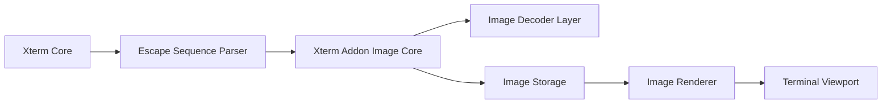
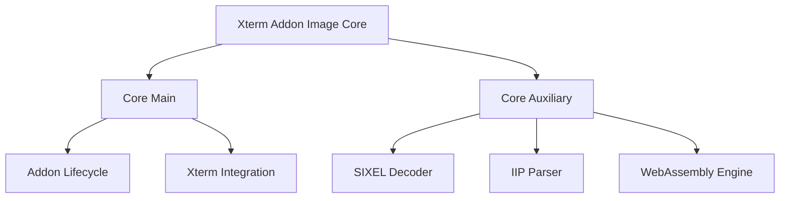
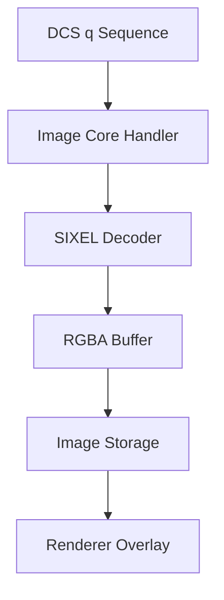
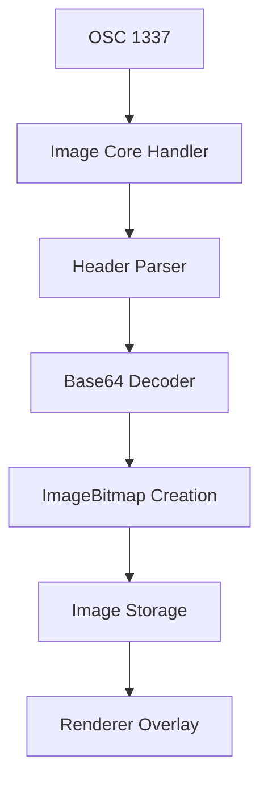
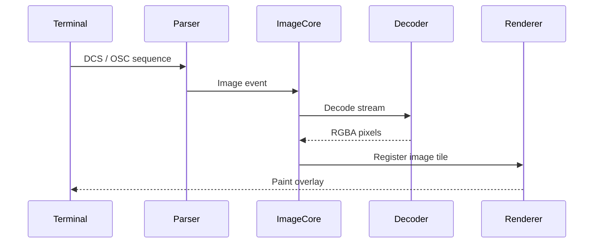
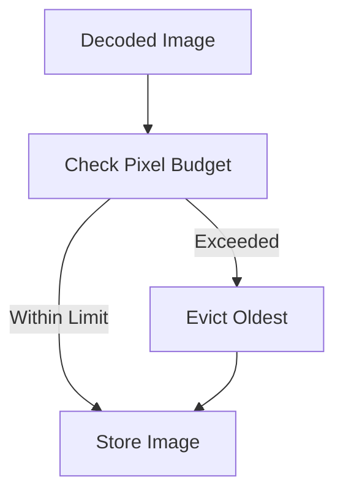

# Xterm Addon Image Core

The **Xterm Addon Image Core** module is the central orchestration layer responsible for enabling inline image rendering within the embedded Xterm terminal used by MeshCentral.

It coordinates:

- Terminal escape sequence interception  
- Image decoding (SIXEL, IIP)  
- Image storage and lifecycle management  
- Renderer integration with the terminal grid  
- Memory and pixel budget enforcement  

This module acts as the bridge between **Xterm core**, **image decoding logic**, and the **terminal rendering layer**.

---

## 1. Purpose of the Module

The Xterm Addon Image Core enables terminal-based image rendering by:

- Parsing image-related escape sequences (DCS/SIXEL, OSC 1337)
- Delegating binary decoding to the auxiliary decoder layer
- Managing decoded image objects
- Mapping images to terminal cell coordinates
- Ensuring resource-safe rendering inside the terminal viewport

It ensures images behave like first-class terminal content while preserving performance and stability.

---

## 2. Repository Structure

**Path:** `public/scripts`  
**Namespace:** `meshcentral.public.scripts.xterm-addon-image`

### Core Components

#### Xterm Addon Image Core
- `meshcentral.public.scripts.xterm-addon-image.B`
- `meshcentral.public.scripts.xterm-addon-image.Q`
- `meshcentral.public.scripts.xterm-addon-image._`
- `meshcentral.public.scripts.xterm-addon-image.a`

---

### Submodules

#### Xterm Addon Image Core Main
Primary orchestration and addon lifecycle:

- `meshcentral.public.scripts.xterm-addon-image.B`
- `meshcentral.public.scripts.xterm-addon-image.Q`

#### Xterm Addon Image Core Auxiliary
Low-level decoding and parsing:

- `meshcentral.public.scripts.xterm-addon-image._`
- `meshcentral.public.scripts.xterm-addon-image.a`

See detailed documentation:
- Xterm Addon Image Core Main  
- Xterm Addon Image Core Auxiliary  

---

## 3. High-Level Architecture

The module integrates deeply with Xterm and acts as a structured pipeline.

### Architectural Responsibilities

| Layer | Responsibility |
|-------|---------------|
| Xterm Core | Provides parser hooks and rendering surface |
| Image Core | Orchestrates image lifecycle |
| Decoder | Converts encoded streams to pixel buffers |
| Storage | Tracks image placement and memory limits |
| Renderer | Paints images aligned with terminal cells |

---

## 4. Internal Component Architecture

The core module is split into **Main** and **Auxiliary** domains.

### Core Main Responsibilities

- Registers with Xterm
- Hooks parser handlers (DCS / OSC)
- Maintains image registry
- Coordinates renderer refresh
- Handles terminal resize interactions

### Core Auxiliary Responsibilities

- WebAssembly-based SIXEL decoding
- Base64 streaming decode
- Inline Image Protocol parsing
- Pixel normalization (RGBA)
- Format detection (PNG, JPEG, GIF)

---

## 5. Image Rendering Flow

### SIXEL Flow

### IIP Flow

---

## 6. Integration with Xterm Core

The addon attaches to the Xterm instance and registers handlers for:

- DCS sequences (`q` for SIXEL)
- OSC 1337 (Inline Image Protocol)

The renderer integrates with Xterm’s rendering cycle without modifying core buffer logic.

---

## 7. Memory & Resource Management

Image rendering can be resource-intensive. The module enforces:

- Maximum pixel limits
- Maximum storage limits
- WebAssembly memory bounds
- Eviction of old images

This ensures stability even under large image streams.

---

## 8. Relationship to Other Modules

### Depends On

- **Xterm Core** (`meshcentral.public.scripts.xterm`)
- WebAssembly SIXEL runtime
- Browser Canvas / ImageBitmap APIs

### Provides Services To

- Terminal rendering subsystem
- Remote session UI
- Web-based shell consoles

### Related Documentation

- Xterm Addon Image Core Main  
- Xterm Addon Image Core Auxiliary  

---

## 9. Error Handling Strategy

The module fails safely under:

- Corrupt SIXEL streams  
- Invalid Base64 data  
- Unsupported image formats  
- Pixel limit violations  

In all failure cases:

- Decoding aborts  
- Memory is released  
- Terminal state remains intact  

---

## 10. Summary

The **Xterm Addon Image Core** module is the orchestration engine that enables secure, performant inline image rendering within the MeshCentral terminal environment.

It:

- Integrates deeply with Xterm’s parser and renderer
- Delegates binary decoding to WebAssembly-backed components
- Enforces strict memory and pixel limits
- Manages image lifecycle and viewport alignment
- Preserves terminal stability under high image throughput

Together with its **Core Main** and **Core Auxiliary** submodules, it forms a complete terminal image pipeline capable of handling modern terminal image protocols safely and efficiently.