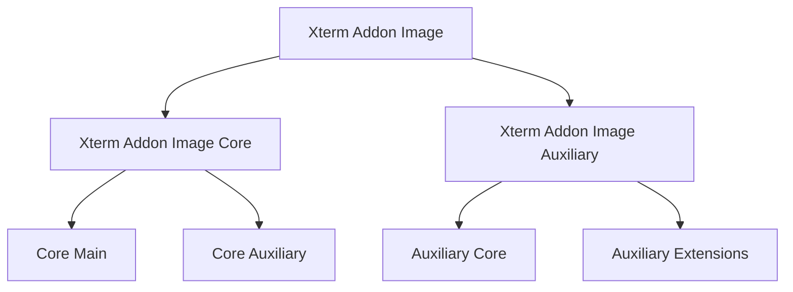
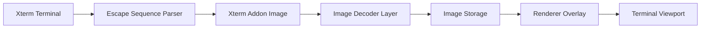
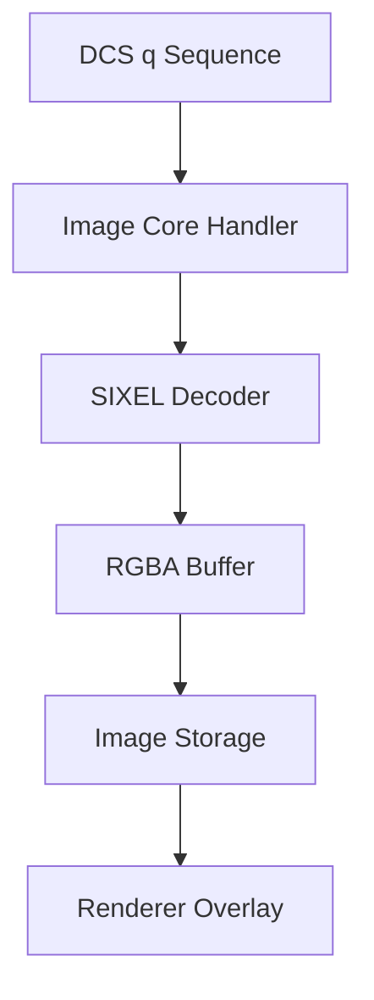
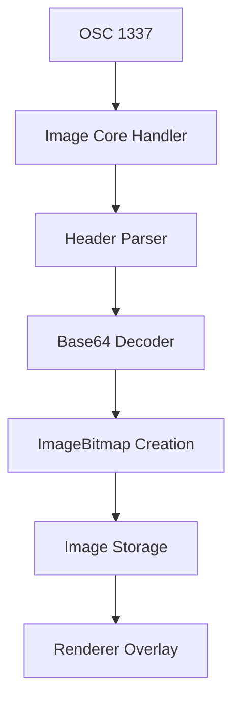
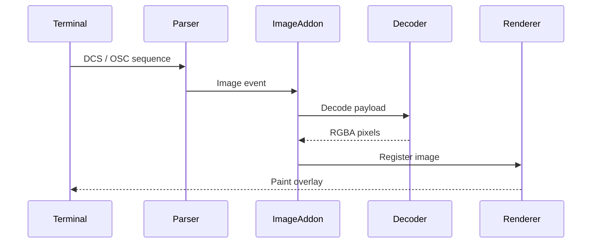
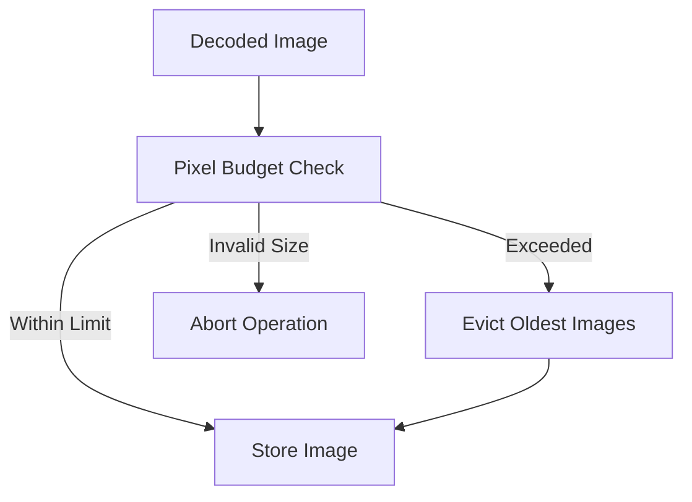

# Xterm Addon Image

The **Xterm Addon Image** module enables inline image rendering inside the browser-based Xterm terminal used by MeshCentral. It extends the core terminal engine to support modern terminal image protocols such as:

- **SIXEL (DCS q sequences)**
- **Inline Image Protocol (OSC 1337)**

The module integrates decoding, storage, rendering, and memory management into a structured pipeline that allows graphical content to behave like native terminal output while maintaining performance and safety.

---

## 1. Purpose of the Module

The **Xterm Addon Image** module provides:

- Escape sequence interception for image protocols  
- Streaming image decoding (SIXEL, Base64 inline images)  
- WebAssembly-backed pixel processing  
- Terminal cell-aligned image rendering  
- Memory and pixel budget enforcement  
- Safe integration with the Xterm rendering lifecycle  

It transforms encoded terminal image data into structured pixel buffers and renders them within the terminal viewport without modifying Xterm’s core buffer logic.

---

## 2. Repository Structure

**Path:** `public/scripts`  
**Namespace:** `meshcentral.public.scripts.xterm-addon-image`

### Top-Level Components

- `meshcentral.public.scripts.xterm-addon-image.B`
- `meshcentral.public.scripts.xterm-addon-image.Q`
- `meshcentral.public.scripts.xterm-addon-image._`
- `meshcentral.public.scripts.xterm-addon-image.a`
- `meshcentral.public.scripts.xterm-addon-image.h`
- `meshcentral.public.scripts.xterm-addon-image.n`
- `meshcentral.public.scripts.xterm-addon-image.o`
- `meshcentral.public.scripts.xterm-addon-image.r`
- `meshcentral.public.scripts.xterm-addon-image.u`

---

## 3. Internal Module Hierarchy

### Submodules

#### 1. Xterm Addon Image Core

Responsible for lifecycle orchestration and terminal integration.

**Core Main**
- `B`
- `Q`

**Core Auxiliary**
- `_`
- `a`

See detailed documentation:
- **Xterm Addon Image Core**
- **Xterm Addon Image Core Main**
- **Xterm Addon Image Core Auxiliary**

---

#### 2. Xterm Addon Image Auxiliary

Provides protocol extensions, decoding coordination, and memory-safe utilities.

**Auxiliary Core**
- `h`
- `n`

**Auxiliary Extensions**
- `o`
- `r`
- `u`

See detailed documentation:
- **Xterm Addon Image Auxiliary**
- **Xterm Addon Image Auxiliary Extensions**
- **Xterm Addon Image Auxiliary Extensions Utilities**

---

## 4. High-Level Architecture

The module operates as a layered image-processing pipeline:

### Architectural Layers

| Layer | Responsibility |
|-------|---------------|
| Xterm Terminal | Provides parser hooks and rendering surface |
| Image Addon | Coordinates image lifecycle |
| Decoder Layer | Converts encoded data to RGBA pixel buffers |
| Storage | Tracks image position and memory usage |
| Renderer | Paints images aligned to terminal grid |
| Viewport | Displays final composited output |

---

## 5. Protocol Processing Flow

### SIXEL (DCS q)

### Inline Image Protocol (OSC 1337)

---

## 6. Integration with Xterm

The addon registers parser hooks inside Xterm for:

- DCS sequences (`q` for SIXEL)
- OSC 1337 inline images

The renderer operates as an overlay layer, preserving:

- Scrollback behavior  
- Text buffer integrity  
- Cursor positioning logic  

---

## 7. Memory and Safety Model

Inline images can consume significant memory. The module enforces strict safeguards:

### Safety Controls

- Maximum pixel count per image  
- Maximum aggregate storage budget  
- Controlled WebAssembly memory growth  
- Streaming decode with bounded buffers  
- Safe abort on malformed data  

These protections ensure stability under:

- Large image streams  
- Corrupt Base64 input  
- Malformed SIXEL payloads  
- Memory exhaustion attempts  

---

## 8. Relationship to Other Modules

### Depends On

- **Xterm Core** (`meshcentral.public.scripts.xterm`)
- Browser Canvas / ImageBitmap APIs
- WebAssembly runtime for SIXEL decoding

### Provides Services To

- Web-based shell consoles  
- Remote terminal sessions  
- Browser-integrated command environments  

### Related Documentation

- Xterm Addon Image Core  
- Xterm Addon Image Core Main  
- Xterm Addon Image Core Auxiliary  
- Xterm Addon Image Auxiliary  
- Xterm Addon Image Auxiliary Extensions  
- Xterm Addon Image Auxiliary Extensions Utilities  

---

## 9. Design Principles

The **Xterm Addon Image** module is built around:

- **Modularity** – Clear separation between core orchestration and auxiliary decoding  
- **Safety** – Strict memory and pixel guardrails  
- **Performance** – WebAssembly-backed decoding and streaming pipelines  
- **Isolation** – No modification of Xterm’s internal buffer model  
- **Extensibility** – Protocol-specific extensions layered cleanly  

---

## 10. Summary

The **Xterm Addon Image** module is the complete image rendering subsystem for MeshCentral’s browser-based terminal. It:

- Intercepts terminal image escape sequences  
- Decodes graphical payloads using WebAssembly and streaming pipelines  
- Manages structured image storage and lifecycle  
- Renders images aligned with terminal cells  
- Enforces strict resource constraints  

By separating responsibilities into **Core** and **Auxiliary** layers, the module delivers secure, high-performance inline image support while preserving terminal correctness and stability.