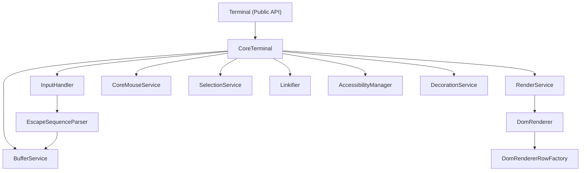
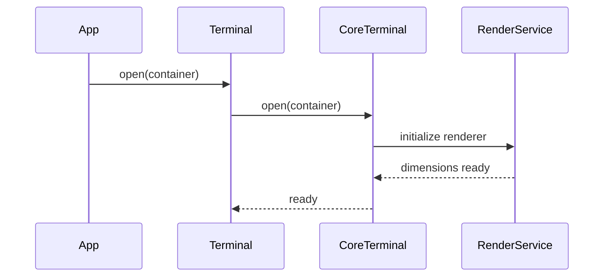
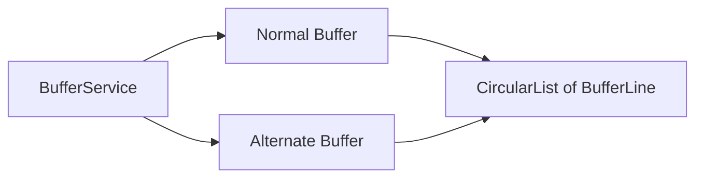
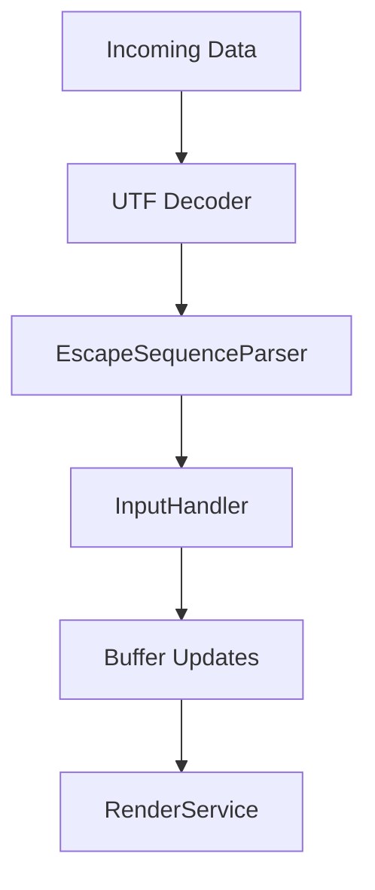
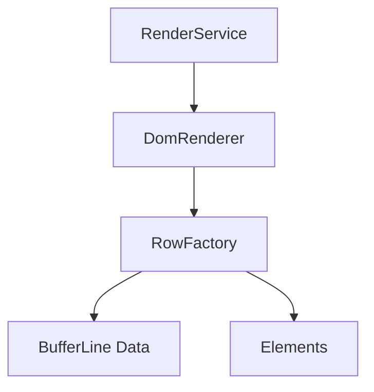
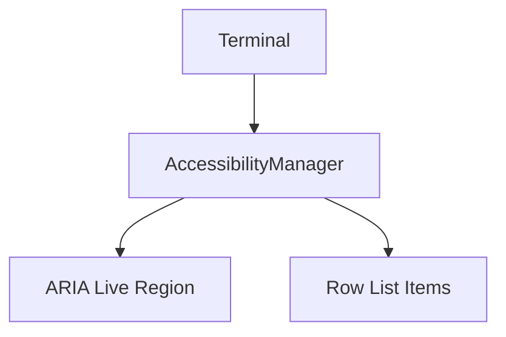
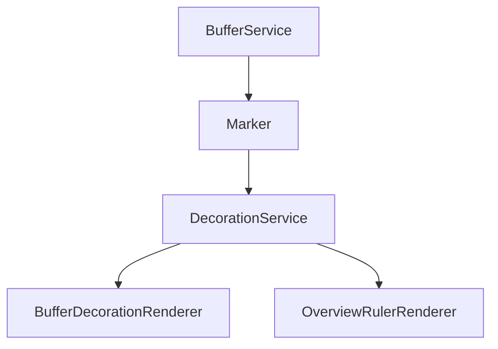
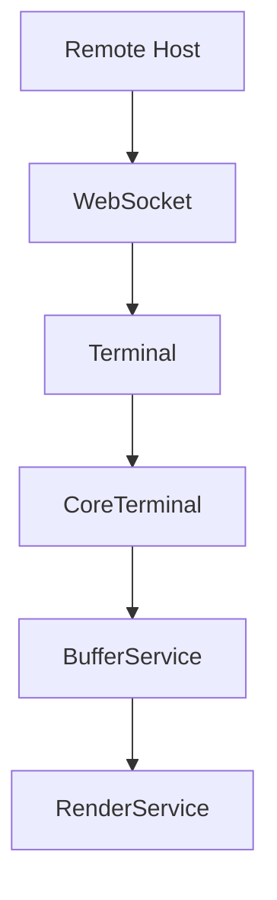

# Xterm Components

The **Xterm Components** module integrates the embedded terminal engine used across the MeshCentral web interface. It provides a full-featured browser-based terminal built on the xterm.js architecture, including rendering, input handling, accessibility, decorations, link detection, and protocol parsing.

This module is responsible for:

- Terminal lifecycle management (open, resize, reset, dispose)
- Rendering terminal content to the DOM
- Handling keyboard, mouse, clipboard, and composition input
- Parsing ANSI/VT escape sequences
- Managing scrollback buffers and alternate buffers
- Supporting accessibility and screen reader mode
- Enabling link detection and decorations

It acts as the client-side terminal engine used by remote shells, consoles, and command interfaces within the platform.

---

## High-Level Architecture

The Xterm Components module is structured around a layered architecture:

- **Public API Layer** – `Terminal` class
- **Core Engine Layer** – `CoreTerminal`, `InputHandler`, buffer services
- **Rendering Layer** – `RenderService`, `DomRenderer`, row factory
- **Interaction Layer** – keyboard, mouse, selection, linkifier
- **Support Services** – theme, accessibility, decorations, Unicode

### Architecture Overview

---

## Core Public Entry Point

### Terminal

**Component:** `meshcentral.public.scripts.xterm.P`

The `Terminal` class is the public API wrapper around the internal core. It:

- Exposes events such as `onData`, `onResize`, `onScroll`
- Provides high-level methods like `open()`, `write()`, `resize()`
- Manages addons via `AddonManager`
- Proxies configuration and runtime options

It delegates actual behavior to `CoreTerminal`, while enforcing API validation (e.g., integer checks for coordinates).

### Lifecycle Flow

---

## Core Engine Layer

### CoreTerminal

**Component:** `meshcentral.public.scripts.xterm.P` (extends CoreTerminal internally)

`CoreTerminal` orchestrates:

- Buffer management
- Input parsing
- Scroll and viewport logic
- Cursor state and modes
- Communication with the rendering layer

It connects services such as:

- `BufferService`
- `CoreService`
- `CoreMouseService`
- `InputHandler`
- `RenderService`

### BufferService and Buffers

Buffers manage:

- Scrollback history
- Normal and alternate buffers
- Cursor position (`x`, `y`)
- Viewport offset (`ydisp`, `ybase`)

The `CircularList` structure enables efficient scrollback trimming while maintaining performance.

---

## Escape Sequence Parsing

### InputHandler and EscapeSequenceParser

**Components:**
- `meshcentral.public.scripts.xterm.InputHandler`
- `EscapeSequenceParser`

The parser processes ANSI/VT control sequences and dispatches them to handlers.

Processing stages:

1. UTF decoding
2. State-machine-based parsing
3. CSI / OSC / DCS dispatch
4. Buffer mutation

Supported operations include:

- Cursor movement
- Text attributes (SGR)
- Scroll regions
- Alternate buffer switching
- Hyperlink OSC sequences

---

## Rendering Layer

### RenderService

Coordinates drawing and refresh cycles. It:

- Debounces rendering via `RenderDebouncer`
- Tracks dirty rows
- Handles resize and DPI changes
- Delegates drawing to a renderer

### DomRenderer

Responsible for:

- Creating DOM rows
- Applying CSS classes for attributes
- Rendering cursor and selection
- Injecting theme styles

The renderer computes:

- Character width and height
- Foreground/background colors
- Cursor style (block, underline, bar)
- Selection overlays

---

## Input and Interaction

### Keyboard Handling

Keyboard events are translated into terminal control sequences using `evaluateKeyboardEvent`.

- Arrow keys → CSI sequences
- Ctrl combinations → control codes
- Alt combinations → ESC-prefixed sequences

### Mouse Handling

`CoreMouseService` supports multiple protocols:

- X10
- VT200
- Drag
- Any-event tracking

Encodings include:

- DEFAULT
- SGR
- SGR_PIXELS

### SelectionService

Manages:

- Text selection ranges
- Column selection mode
- Word and line selection
- Clipboard integration

---

## Accessibility

### AccessibilityManager

Adds a hidden accessibility tree that mirrors visible rows for screen readers.

Key features:

- ARIA live region announcements
- Focus boundary handling
- Selection synchronization
- Debounced rendering for assistive output

This enables screen reader compatibility without interfering with visual rendering.

---

## Link Detection and Decorations

### Linkifier

Detects links within buffer rows and applies hover and activation logic.

- Uses link providers
- Emits underline events
- Handles click activation

### DecorationService

Allows visual overlays tied to buffer markers.

- Inline decorations
- Overview ruler rendering
- Marker-based lifecycle

---

## Theming and Unicode

### ThemeService

Manages:

- ANSI palette
- Cursor colors
- Selection colors
- Contrast enforcement

### UnicodeService

Provides:

- Character width calculations
- Emoji and wide character support
- Versioned Unicode providers

---

## Integration Within the Platform

The Xterm Components module is typically used by remote shell or console features layered above networking modules such as:

- [RFB and Display](../rfb-and-display/rfb-and-display.md)
- [Websock](../websock/websock.md)

In a remote session scenario:

The terminal engine focuses strictly on terminal emulation and rendering, while transport, authentication, and protocol negotiation are handled by higher-level modules.

---

## Key Responsibilities Summary

| Layer | Responsibility |
|--------|----------------|
| Public API | Terminal lifecycle and events |
| Core Engine | Buffer state, parsing, scrollback |
| Rendering | DOM updates and styling |
| Interaction | Keyboard, mouse, selection |
| Accessibility | Screen reader support |
| Decorations | Link and overlay rendering |
| Unicode & Theme | Visual correctness and compatibility |

---

## Conclusion

The **Xterm Components** module provides a production-grade browser terminal implementation. It combines a state-machine-based ANSI parser, optimized buffer management, layered rendering, and rich interaction support.

Its modular architecture ensures that terminal emulation remains isolated from transport and business logic layers, enabling reuse across remote shell, device console, and diagnostic interfaces within the system.