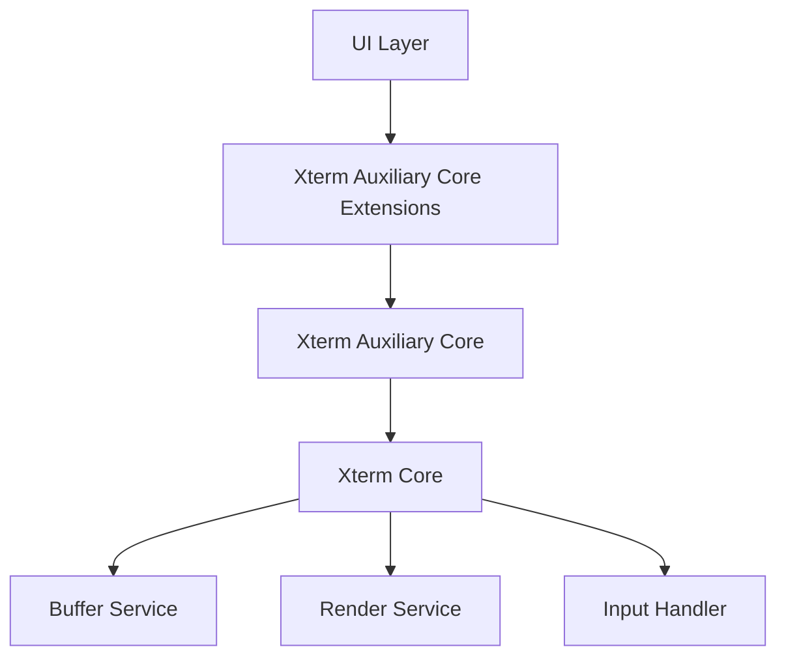
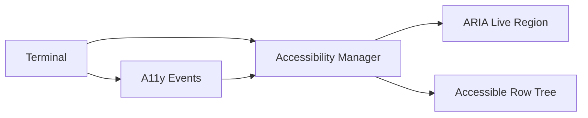
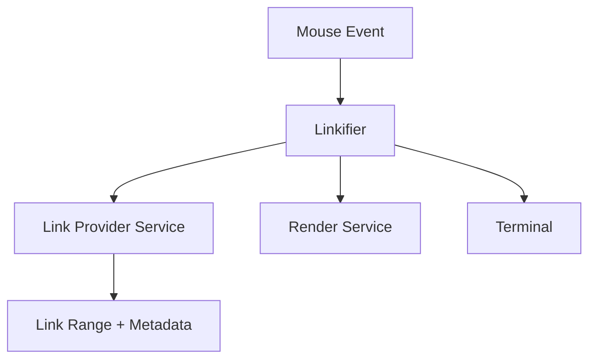
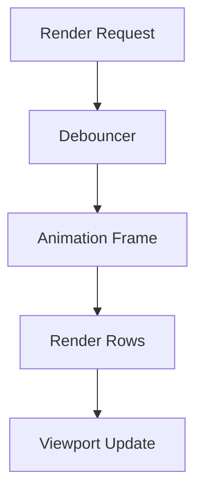
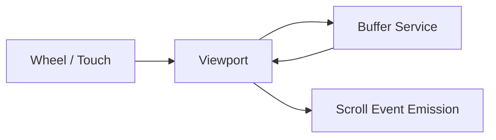
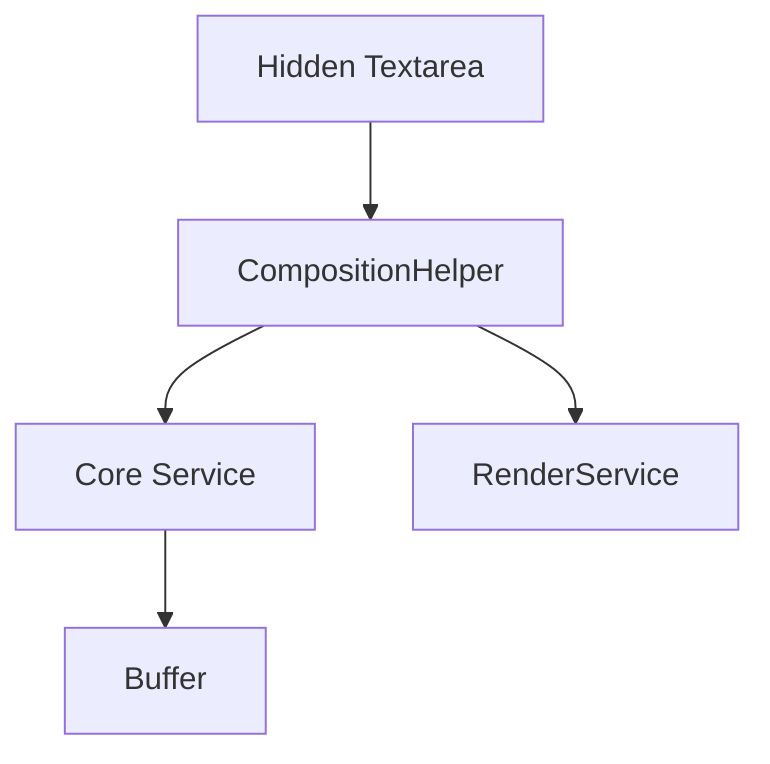
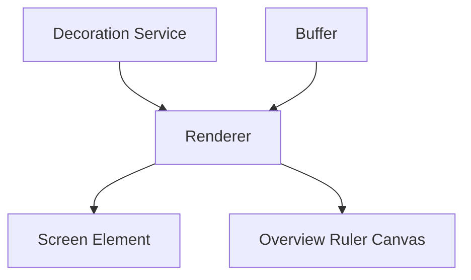
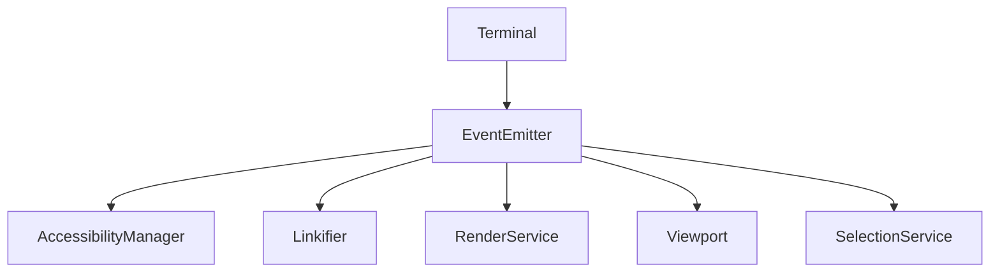
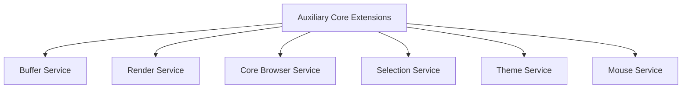

# Xterm Auxiliary Core Extensions

## Overview

**Xterm Auxiliary Core Extensions** enhances the auxiliary layer of the Xterm integration in MeshCentral by extending core terminal behavior with accessibility, link detection, rendering coordination, composition handling, and browser-specific services.

This module is centered around the `meshcentral.public.scripts.xterm.l` component (compiled bundle segment) and works in close coordination with:

- **Xterm Auxiliary Core** (parent module)
- **Xterm Core** (rendering, buffer, parser, services)
- Browser DOM services and event infrastructure

It provides advanced behaviors that sit *above* the core terminal engine but *below* higher-level UI integrations.

---

## Architectural Context

The Xterm stack is layered to separate responsibilities:

- **Xterm Core**: Terminal engine (buffer, parser, rendering, input handling).
- **Xterm Auxiliary Core**: Browser integration and lifecycle orchestration.
- **Xterm Auxiliary Core Extensions**: Accessibility, linkification, debouncing, decoration rendering, composition support, and browser coordination.

See also:  
- [Xterm Auxiliary Core](../xterm-auxiliary-core.md)  
- [Xterm Core](../../xterm-core/xterm-core.md)

---

## Key Responsibilities

### 1. Accessibility Management

Component: `AccessibilityManager`

Provides:
- Screen reader-compatible DOM tree
- ARIA live region updates
- Focus boundary handling
- Selection synchronization
- Resize-aware accessibility tree updates

### Accessibility Flow

The Accessibility Manager:
- Mirrors terminal rows into an accessible list structure
- Announces characters through a debounced live region
- Tracks scroll, resize, and render events

---

### 2. Linkification Layer

Component: `Linkifier`

Responsibilities:
- Detect links from link providers
- Track mouse hover state
- Underline and pointer cursor decoration
- Trigger activation callbacks
- Prevent overlapping link collisions

This layer ensures:
- Hover feedback is visually reflected
- Links respond correctly to clicks
- Viewport changes invalidate stale link ranges

---

### 3. Rendering Coordination & Debouncing

Components:
- `RenderDebouncer`
- `TimeBasedDebouncer`

Purpose:
- Prevent excessive re-rendering
- Batch row refresh operations
- Synchronize rendering with animation frames

This ensures:
- High throughput during large output
- Smooth scrolling
- Efficient DOM updates

---

### 4. Viewport & Scroll Management

Component: `Viewport`

Responsibilities:
- Sync scroll area with buffer state
- Smooth scroll animation
- Mouse wheel and touch support
- Scrollbar sizing and positioning

The Viewport maintains alignment between:
- `ydisp` (buffer display offset)
- Scroll area height
- Rendered canvas height

---

### 5. Composition & IME Handling

Component: `CompositionHelper`

Provides:
- IME composition lifecycle management
- Position-aware composition overlay
- Controlled commit of composed text
- Integration with cursor and rendering state

Ensures proper handling of:
- East Asian input
- Dead keys
- Multi-stage character composition

---

### 6. Decoration Rendering

Components:
- `BufferDecorationRenderer`
- `OverviewRulerRenderer`
- `ColorZoneStore`

Responsibilities:
- Render inline decorations
- Manage overview ruler zones
- Sync decoration positions with buffer markers

Decorations are anchored to:
- Buffer markers
- Line positions
- Column ranges

They automatically update on:
- Scroll
- Resize
- DPR (device pixel ratio) changes

---

### 7. Clipboard & Mouse Utilities

Utilities:
- Copy handler
- Paste handler
- Bracketed paste wrapping
- Right-click positioning logic

These ensure:
- Correct terminal paste semantics
- Respect for bracketed paste mode
- Accurate cursor positioning for context actions

---

## Event-Driven Design

The module relies heavily on an internal event emitter model.

Benefits:
- Loose coupling
- Reactive rendering updates
- Modular extensibility

---

## Integration with Core Services

Xterm Auxiliary Core Extensions integrates with the following core services:

- **Buffer Service** – text storage and scroll state
- **Render Service** – DOM renderer abstraction
- **Core Browser Service** – DPR, window, document abstraction
- **Selection Service** – selection state management
- **Theme Service** – color resolution
- **Mouse Service** – coordinate translation

This tight but structured coupling allows advanced behavior while preserving separation of concerns.

---

## Lifecycle

1. Terminal is constructed.
2. Core services are instantiated.
3. Auxiliary Core initializes DOM bindings.
4. **Xterm Auxiliary Core Extensions** attaches:
   - Accessibility manager
   - Linkifier
   - Viewport
   - Decoration renderers
   - Composition helper
5. Render and input events begin flowing.

---

## Performance Considerations

- Batched rendering using animation frames
- Debounced accessibility announcements
- Lazy decoration updates
- Idle-based memory cleanup for buffers
- Smart scroll recalculation

These strategies prevent performance degradation under:
- Large output streams
- High scrollback
- Continuous user interaction

---

## Summary

**Xterm Auxiliary Core Extensions** acts as the advanced behavior layer for the browser-based terminal environment in MeshCentral.

It provides:

- Accessibility compliance
- Intelligent link detection
- High-performance rendering coordination
- Robust scroll and viewport management
- IME and composition support
- Decoration overlays and overview rulers

By bridging low-level terminal mechanics with browser-level behavior, this module ensures the terminal experience is performant, accessible, and feature-rich within the MeshCentral UI ecosystem.
