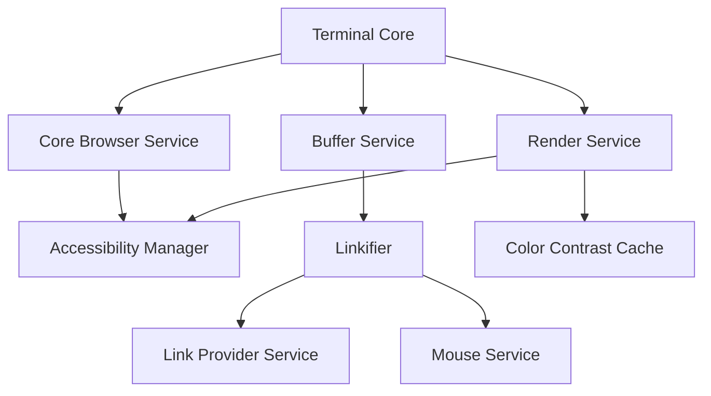
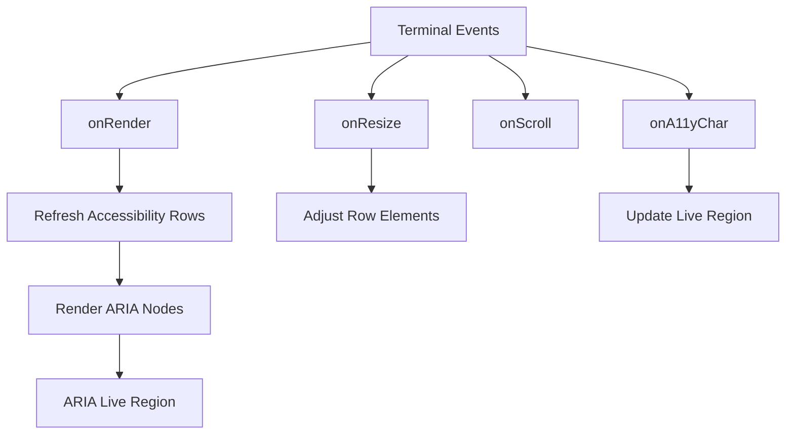
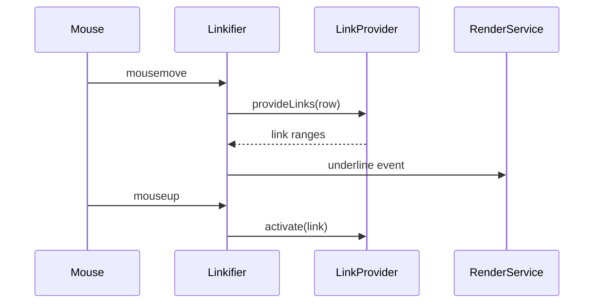
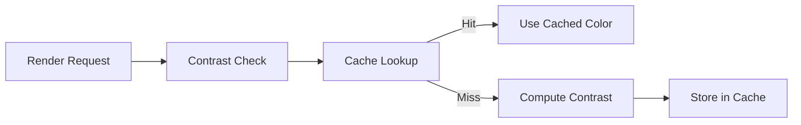
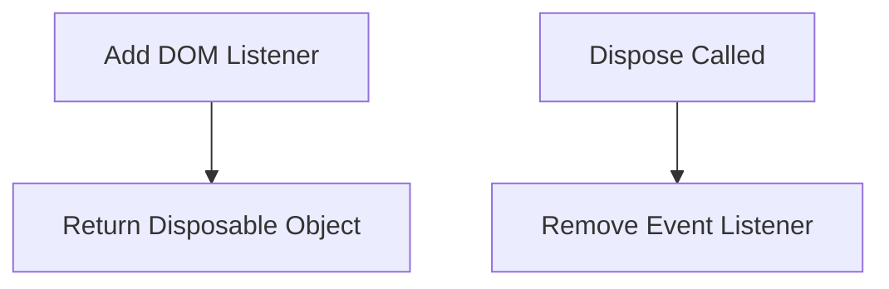
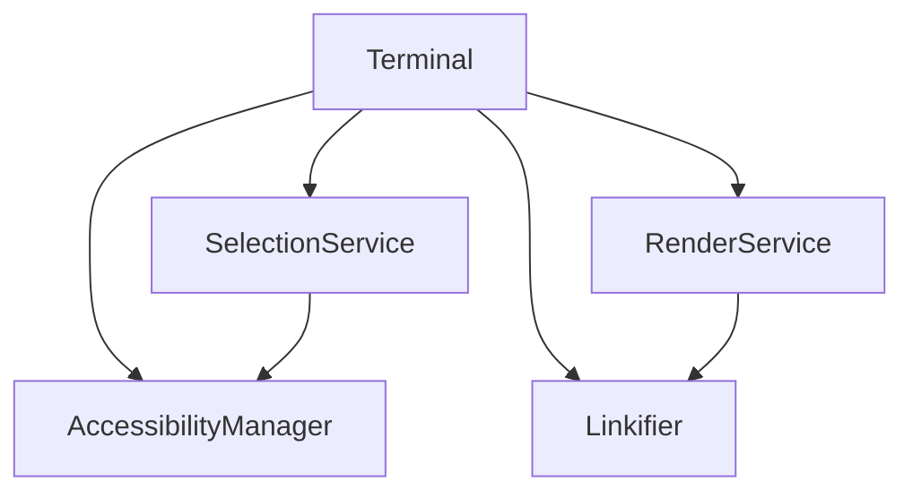

# Xterm Auxiliary Core Main

The **Xterm Auxiliary Core Main** module provides the primary auxiliary runtime features layered on top of the Xterm core engine. It focuses on accessibility, link detection, color contrast handling, and browser integration services that enhance the base terminal experience.

This module builds on the core terminal engine defined in [Xterm](../../xterm.md) and extends the auxiliary infrastructure described in [Xterm Auxiliary Core](../xterm-auxiliary-core.md).

---

## Purpose and Responsibilities

The Xterm Auxiliary Core Main module is responsible for:

- Managing accessibility features for screen readers
- Detecting and activating hyperlinks within terminal output
- Handling color contrast caching for accessible rendering
- Providing DOM lifecycle utilities for event handling
- Integrating auxiliary browser services into the terminal runtime

It acts as the bridge between:

- The **Terminal rendering pipeline**
- The **Buffer and Input subsystems**
- The **Browser DOM environment**

---

## Core Components

This module includes the following primary components from `public/scripts/xterm.js`:

- `AccessibilityManager`
- `Linkifier`
- `ColorContrastCache`
- `addDisposableDomListener`

These components cooperate with the Terminal, RenderService, BufferService, and Browser services.

---

## High-Level Architecture

The Xterm Auxiliary Core Main module plugs into the rendering and buffer lifecycle to enhance terminal output with accessibility and interactivity.

---

# Accessibility Manager

## Overview

The **Accessibility Manager** provides screen-reader-friendly output by building an ARIA-based accessibility tree synchronized with the terminal buffer.

It creates:

- A virtual accessibility container
- A row-based ARIA list
- A live region for announced characters

## Responsibilities

- Mirrors visible rows into ARIA list items
- Announces typed characters and line feeds
- Debounces render updates
- Tracks focus at top and bottom boundaries
- Synchronizes selection with the terminal buffer

## Internal Flow

## Key Design Characteristics

- Uses a debounced rendering strategy via a time-based debouncer.
- Maintains a weak mapping between DOM nodes and buffer column metadata.
- Limits excessive announcements using a line count threshold.
- Integrates with DPR (device pixel ratio) changes.

---

# Linkifier

## Overview

The **Linkifier** scans buffer content and turns detected links into interactive elements with hover, underline, and activation behavior.

It works with:

- `ILinkProviderService`
- `IMouseService`
- `IBufferService`
- `IRenderService`

## Link Detection Lifecycle

## Responsibilities

- Tracks active hover cell
- Queries registered link providers
- Filters overlapping link ranges
- Emits underline and cursor change events
- Handles click activation safely

## Design Highlights

- Uses event emitters for underline show and hide
- Cleans up stale link decorations on viewport changes
- Supports pointer cursor and underline toggling dynamically

---

# Color Contrast Cache

## Overview

The **Color Contrast Cache** optimizes rendering by caching contrast calculations between foreground and background colors.

This reduces repeated computation during:

- High-frequency row rendering
- Selection redraws
- Decoration updates

## Structure

Two maps are maintained:

- CSS-based contrast cache
- Raw color contrast cache

---

# Disposable DOM Listener Utility

The `addDisposableDomListener` helper wraps DOM event listeners with a disposable interface.

### Purpose

- Prevent memory leaks
- Integrate DOM listeners into the terminal disposable lifecycle
- Ensure listeners are removed on component disposal

### Pattern

This utility is used extensively by:

- Accessibility Manager
- Linkifier
- Terminal lifecycle bindings

---

# Interaction with the Terminal Core

The Xterm Auxiliary Core Main module integrates tightly with the Terminal class.

## Integration Points

- `onRender`
- `onResize`
- `onScroll`
- `onKey`
- `onA11yChar`
- `onA11yTab`

This ensures that auxiliary behavior remains synchronized with the core rendering and buffer state.

---

# Relationship to Other Modules

## Parent Module

- [Xterm Auxiliary Core](../xterm-auxiliary-core.md)

## Sibling Module

- [Xterm Auxiliary Core Extensions](../xterm-auxiliary-core-extensions/xterm-auxiliary-core-extensions.md)

## Root Terminal Module

- [Xterm](../../xterm.md)

The Xterm Auxiliary Core Main module provides the foundational auxiliary behavior, while extension modules build additional capabilities on top.

---

# Key Design Principles

- **Non-invasive enhancement**: Extends functionality without modifying buffer internals.
- **Event-driven architecture**: Relies on terminal and render events.
- **Accessibility-first design**: Prioritizes ARIA integration and screen reader support.
- **Performance-conscious rendering**: Uses caching and debouncing strategies.
- **Clean lifecycle management**: Disposable patterns ensure no memory leaks.

---

# Summary

The **Xterm Auxiliary Core Main** module enhances the terminal engine with accessibility, hyperlinking, color optimization, and DOM lifecycle management. It acts as the critical layer that makes the terminal interactive, accessible, and browser-integrated while remaining tightly synchronized with rendering and buffer state.

It is a central part of the Xterm auxiliary architecture and a prerequisite for advanced extensions and UI integrations.