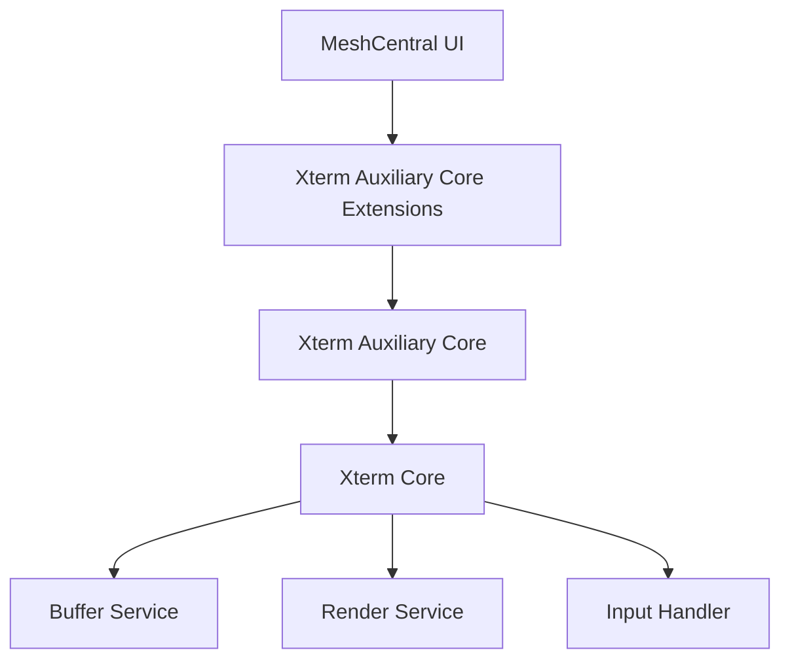
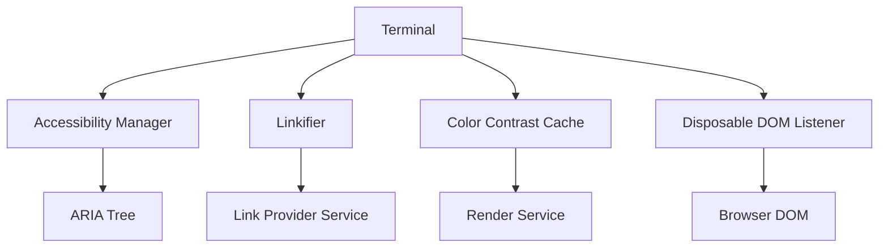
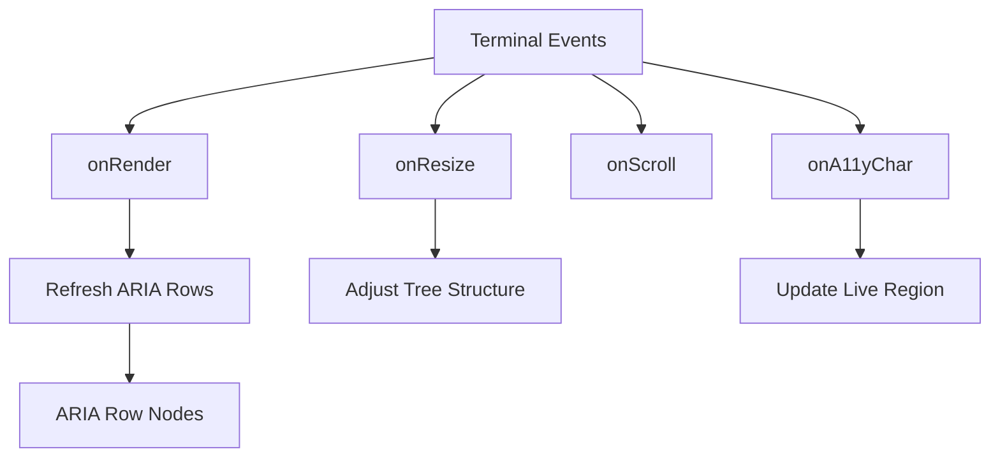
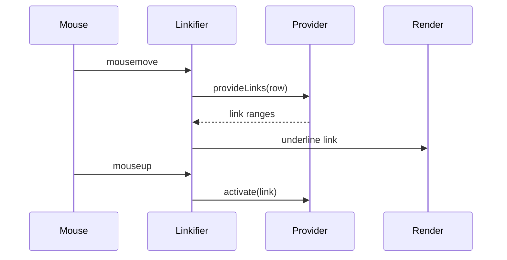
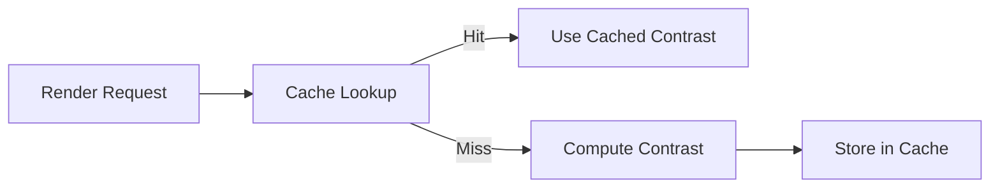
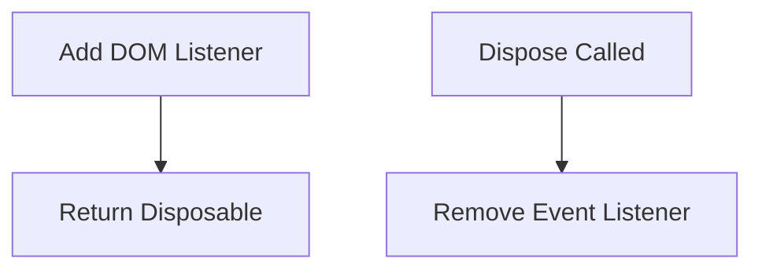
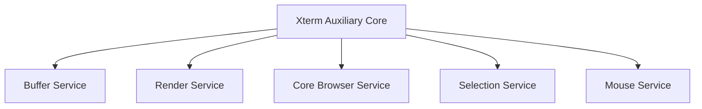

# Xterm Auxiliary Core

The **Xterm Auxiliary Core** module provides the foundational auxiliary runtime layer that enhances the Xterm terminal engine within MeshCentral. It acts as a bridge between the **Xterm Core engine** and higher-level browser integrations, delivering accessibility, link detection, rendering coordination, and DOM lifecycle utilities.

This module lives under:

```text
public/scripts (xterm → xterm-auxiliary → xterm-auxiliary-core)
```

It builds directly on top of the **Xterm Core** module and serves as the base for **Xterm Auxiliary Core Extensions**.

---

## Purpose

The Xterm Auxiliary Core module is responsible for:

- Accessibility integration (screen reader support, ARIA tree management)
- Hyperlink detection and activation
- Color contrast optimization
- Disposable DOM event management
- Synchronization between rendering, buffer, and browser services

It enhances the terminal runtime without modifying the internal buffer or parser logic of the Xterm Core.

---

## Architectural Position

The Xterm stack is layered to preserve separation of concerns.



- **Xterm Core**: Terminal engine (buffer, parser, renderer, services).
- **Xterm Auxiliary Core**: Browser-aware enhancement layer.
- **Xterm Auxiliary Core Extensions**: Advanced decoration, composition, viewport, and rendering extensions.

---

## High-Level Responsibilities



The module listens to terminal lifecycle events and augments behavior through event-driven services.

---

# Core Components

The Xterm Auxiliary Core module includes the following primary components:

## 1. Accessibility Manager  
Component reference:  
`meshcentral.public.scripts.xterm.h`

### Responsibilities

- Builds and maintains an ARIA-compliant accessibility tree
- Mirrors visible terminal rows into screen-reader-friendly nodes
- Manages live region announcements
- Synchronizes focus, scroll, and selection state
- Debounces high-frequency updates

### Accessibility Flow



---

## 2. Linkifier  
Component reference:  
`meshcentral.public.scripts.xterm.k`

### Responsibilities

- Detects hyperlinks within buffer content
- Queries registered link providers
- Manages hover state and underline decorations
- Activates links safely on click
- Cleans up stale link ranges during viewport changes

### Link Activation Lifecycle



---

## 3. Color Contrast Cache  
Component reference:  
Internal to auxiliary core layer

### Responsibilities

- Caches foreground/background contrast calculations
- Reduces repeated color computation during rendering
- Improves performance for high-frequency row updates
- Supports selection and decoration redraw cycles

### Cache Workflow



Two contrast maps are typically maintained:
- CSS-based contrast cache
- Raw color-based contrast cache

---

## 4. Disposable DOM Listener Utility  
Component reference:  
`meshcentral.public.scripts.xterm.l`

### Responsibilities

- Wraps DOM event listeners into disposable objects
- Integrates with terminal lifecycle management
- Prevents memory leaks during teardown

### Lifecycle Pattern



This utility is used throughout the auxiliary layer for clean resource management.

---

# Internal Module Structure

```text
xterm-auxiliary-core/
├── xterm-auxiliary-core-main
│   ├── meshcentral.public.scripts.xterm.h
│   ├── meshcentral.public.scripts.xterm.k
│   └── meshcentral.public.scripts.xterm.l
```

### Core Components

| Component | Responsibility |
|------------|----------------|
| `meshcentral.public.scripts.xterm.h` | Accessibility management |
| `meshcentral.public.scripts.xterm.k` | Link detection and activation |
| `meshcentral.public.scripts.xterm.l` | DOM listener & auxiliary utilities |

---

# Integration with Terminal Core

The module integrates tightly with:

- **Buffer Service**
- **Render Service**
- **Core Browser Service**
- **Selection Service**
- **Mouse Service**
- **Theme Service**



This ensures:

- Accessibility stays synchronized with scroll and buffer state
- Links remain accurate during viewport changes
- Rendering remains performant under heavy output

---

# Relationship to Other Modules

## Parent

- **Xterm Auxiliary**

## Extensions Layer

- **Xterm Auxiliary Core Extensions**

## Root Engine

- **Xterm**

The Xterm Auxiliary Core module provides the essential browser-integration layer upon which advanced extensions are built.

---

# Design Principles

- **Non-invasive enhancement** – Extends terminal behavior without modifying core buffer internals.
- **Event-driven architecture** – Responds to terminal lifecycle events.
- **Accessibility-first design** – ARIA and screen-reader integration.
- **Performance-conscious rendering** – Debouncing and caching strategies.
- **Clean lifecycle management** – Disposable patterns prevent memory leaks.

---

# Summary

The **Xterm Auxiliary Core** module is the foundational enhancement layer for the browser-based terminal environment in MeshCentral. It connects the Xterm Core engine to browser capabilities, delivering:

- Screen reader accessibility
- Hyperlink detection and activation
- Rendering performance optimizations
- Safe DOM lifecycle management

It ensures that the terminal is not only functional but accessible, interactive, and performant within the MeshCentral web interface.