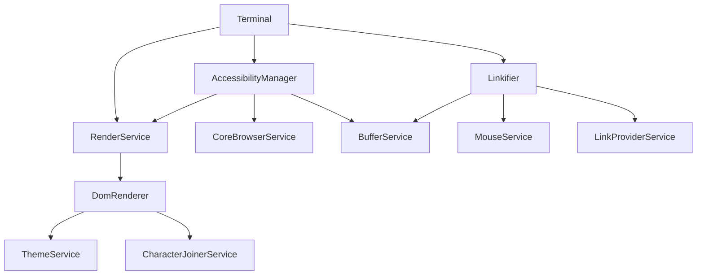
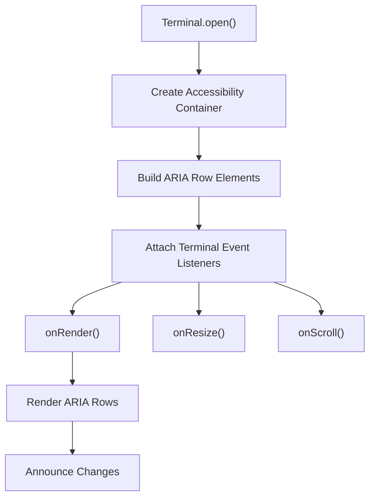
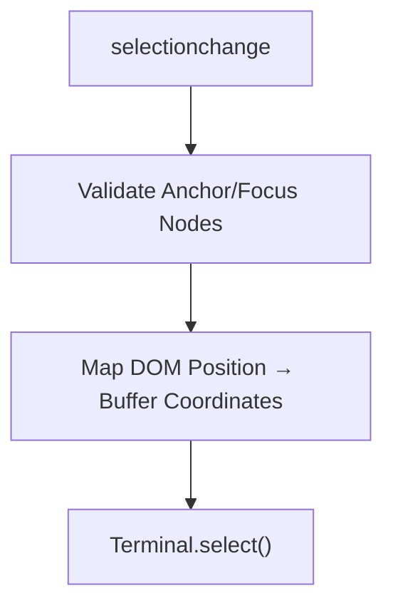
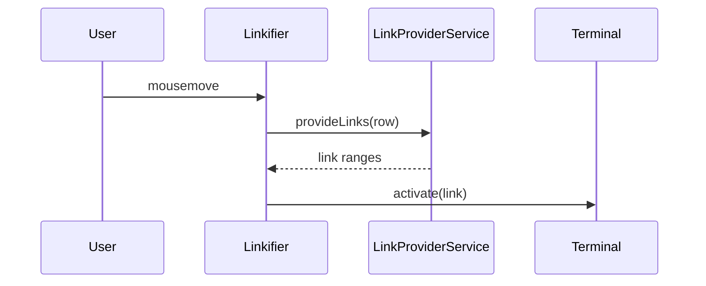
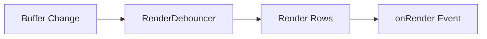
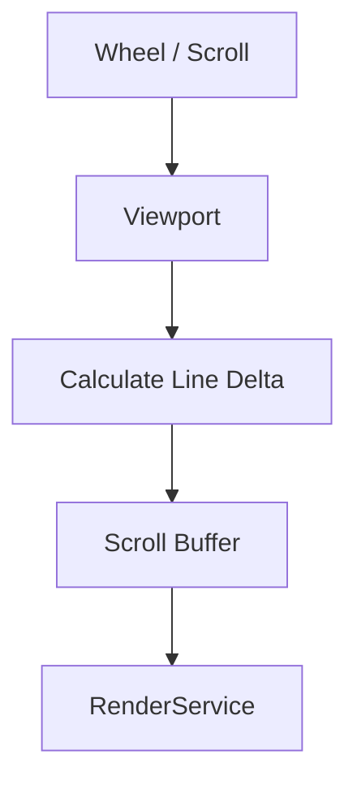
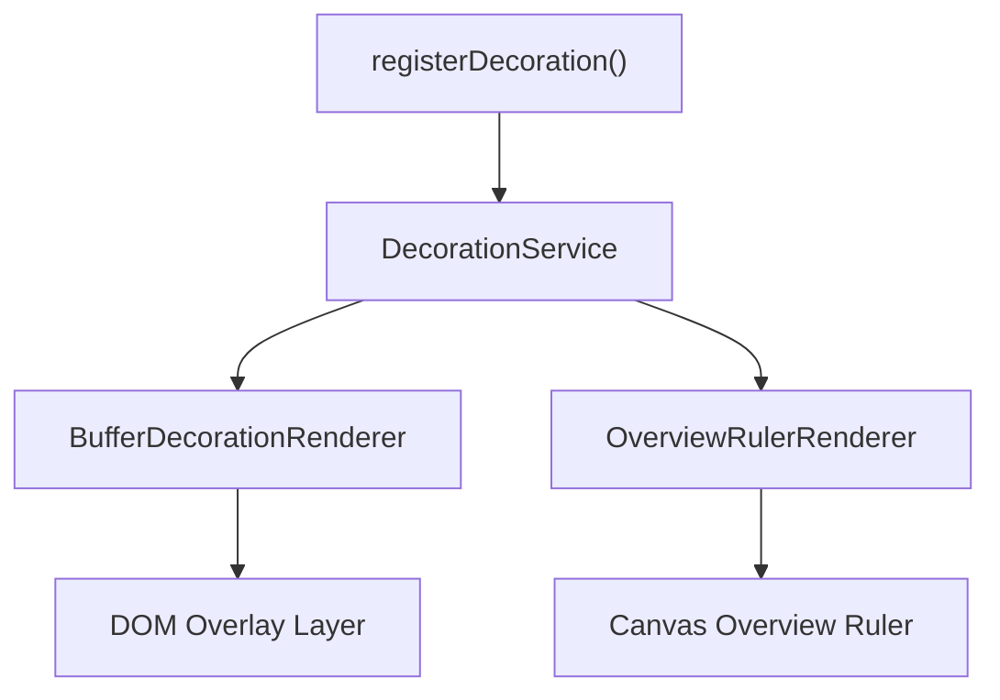
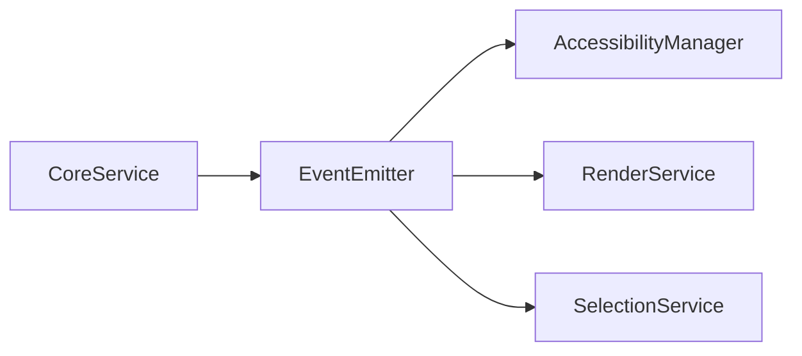

# Xterm Auxiliary Extensions Core Auxiliary

## Overview

**Xterm Auxiliary Extensions Core Auxiliary** is the lowest-level extension layer within the Xterm auxiliary extension stack. It provides foundational browser-side services that enhance the core terminal with advanced interaction capabilities such as:

- Accessibility (screen reader support)
- Link detection and activation
- Rendering debouncing and viewport coordination
- Clipboard, paste, and selection utilities
- Decoration and overview ruler rendering

This module centers around the `AccessibilityManager` and closely collaborates with the `Terminal` class and rendering services defined in the parent Xterm modules.

It belongs to the following hierarchy:

- Parent: [Xterm Auxiliary Extensions Core](../xterm-auxiliary-extensions-core/xterm-auxiliary-extensions-core.md)
- Root terminal implementation: [Xterm](../../xterm/xterm.md)

---

## Architectural Context

This module operates inside the browser runtime and extends the core terminal runtime with UI- and accessibility-focused behavior.

### Key Responsibilities

| Component | Responsibility |
|------------|----------------|
| AccessibilityManager | Builds ARIA tree, manages live region, synchronizes focus and buffer |
| Linkifier | Detects and activates links in terminal buffer |
| RenderService | Coordinates row rendering and viewport refresh |
| BufferDecorationRenderer | Renders decorations anchored to buffer lines |
| Viewport | Manages scroll synchronization and smooth scrolling |
| CompositionHelper | Handles IME composition input |

---

## AccessibilityManager

### Purpose

The `AccessibilityManager` enables screen reader compatibility by:

- Creating an ARIA-compatible representation of terminal rows
- Maintaining a live region for announcing output
- Synchronizing selection and focus events
- Tracking resize and scroll updates

### High-Level Flow

### Core Mechanisms

#### 1. ARIA Tree Construction

- Creates a container with `role="list"`
- Each row is represented as a `role="listitem"`
- Rows mirror the active buffer viewport

#### 2. Live Region Announcements

- Uses `aria-live="assertive"`
- Batches characters using `TimeBasedDebouncer`
- Limits excessive announcements to prevent screen reader overload

#### 3. Selection Synchronization

On DOM selection changes:

This ensures that browser-based selection remains consistent with internal buffer selection.

---

## Linkifier Integration

The `Linkifier` scans rendered rows for link providers and decorates ranges with hover and activation behavior.

### Capabilities

- Hover underline rendering
- Pointer cursor toggling
- Click activation callbacks
- OSC 8 hyperlink support

---

## Rendering Coordination

### RenderService and Debouncing

Rendering is coordinated through a `RenderDebouncer` to prevent excessive DOM updates.

This design ensures:

- Frame-aligned updates via `requestAnimationFrame`
- Efficient viewport diffing
- Reduced layout thrashing

---

## Viewport and Scrolling

The `Viewport` component synchronizes scroll position between:

- DOM scroll area
- Terminal buffer
- Render service

Features include:

- Smooth scroll animation
- Fast scroll modifiers
- Scrollback trimming
- Device pixel ratio awareness

---

## Decorations and Overview Ruler

The module provides visual enhancements via:

- `BufferDecorationRenderer`
- `OverviewRulerRenderer`
- `ColorZoneStore`

These components:

- Attach visual markers to buffer lines
- Track buffer insert/delete operations
- Render mini-map style overview indicators

---

## Input Composition Support

The `CompositionHelper` ensures proper IME (Input Method Editor) handling:

- Tracks composition start/update/end
- Positions composition overlay at cursor location
- Synchronizes text area and rendered cursor

This is critical for multi-byte languages and mobile environments.

---

## Event Model

The module heavily uses an event-driven architecture:

- `EventEmitter`
- Disposable pattern
- Dependency injection via service decorators

This enables:

- Loose coupling
- Service-level isolation
- Testable and replaceable components

---

## How It Fits into the Overall System

**Xterm Auxiliary Extensions Core Auxiliary** provides the browser-facing interaction layer for the terminal runtime.

It does not implement:

- Escape sequence parsing (handled in core input handler)
- Buffer storage logic
- Protocol handling

Instead, it focuses on:

- Accessibility
- DOM rendering coordination
- User interaction handling
- Decoration and UI overlays

It acts as the bridge between:

- The internal terminal engine
- The browser DOM
- Assistive technologies
- User input devices

---

## Design Characteristics

- Service-based architecture
- Strict separation of buffer vs DOM
- Optimized rendering via debouncing
- Accessibility-first enhancements
- Extensible link and decoration system

This module ensures that the terminal is not only functional but also accessible, performant, and visually extensible within modern browser environments.
