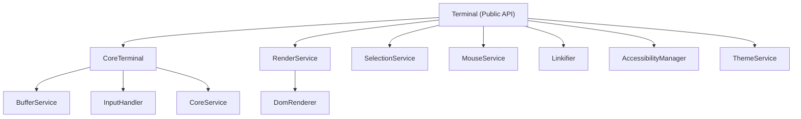
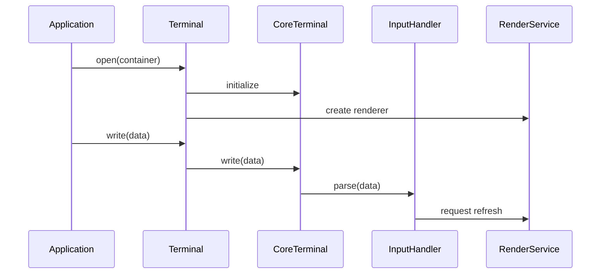
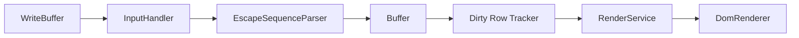
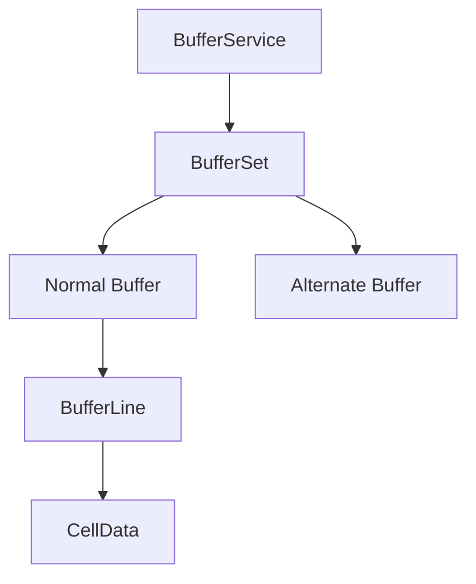
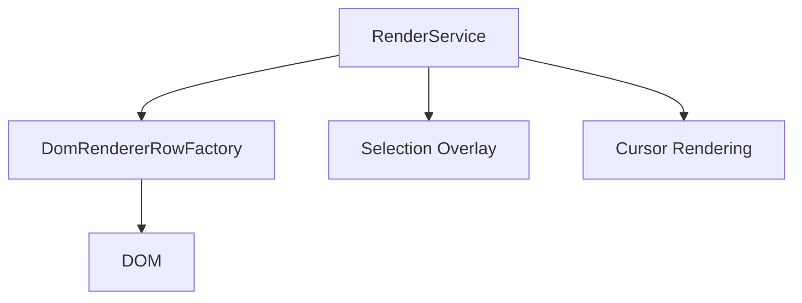
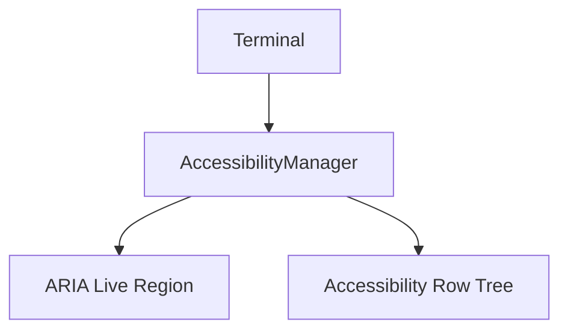
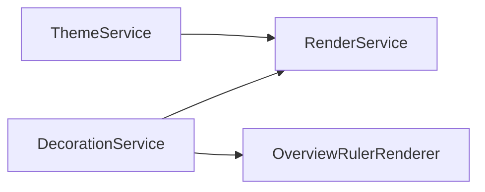
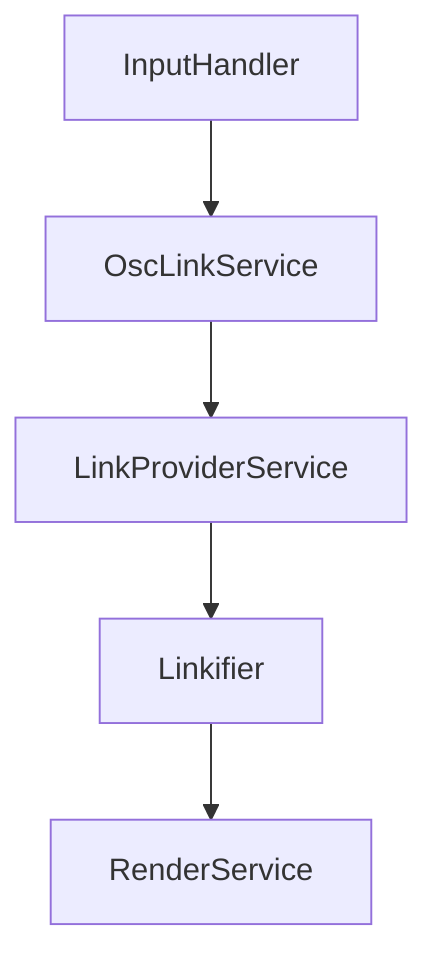
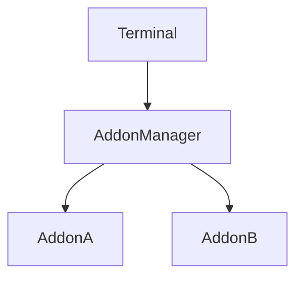
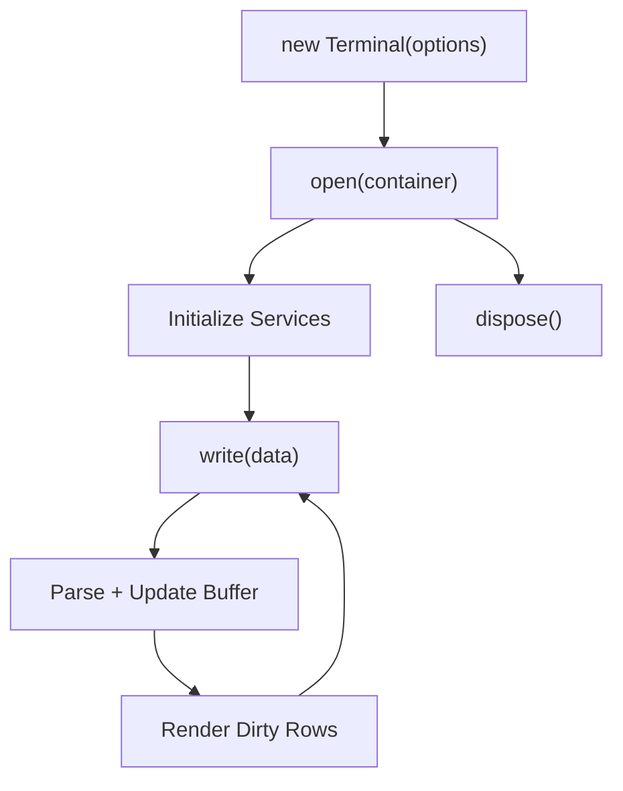

# Xterm Auxiliary Extensions Core Main

## Overview

The **Xterm Auxiliary Extensions Core Main** module provides the primary browser-side implementation of advanced Xterm functionality used within MeshCentral. It encapsulates the main `Terminal` class and its supporting infrastructure, enabling:

- Terminal rendering (DOM-based renderer)
- Input processing and keyboard handling
- Mouse tracking and selection
- Accessibility integration
- Link detection and OSC link support
- Buffer management (normal and alternate buffers)
- Theme, decoration, and overview ruler support
- Addon extensibility

At its core, this module wires together parsing, buffer state, rendering, and browser services into a cohesive terminal runtime suitable for web-based remote shells and device consoles.

---

## Position in the Module Hierarchy

This module is part of the Xterm auxiliary extension stack:

- Parent module: `xterm-auxiliary-extensions-core`
- Sibling module: `xterm-auxiliary-extensions-core-auxiliary`

The **Xterm Auxiliary Extensions Core Main** module focuses on the primary terminal runtime (`Terminal`), while auxiliary modules extend or specialize behavior.

---

## High-Level Architecture

The `Terminal` class acts as a façade over a rich internal architecture composed of services and subsystems.

### Layers

1. **Public API Layer** – `Terminal`
2. **Core Processing Layer** – `CoreTerminal`, `InputHandler`, `CoreService`
3. **Buffer Layer** – `BufferService`, `Buffer`, `BufferLine`
4. **Rendering Layer** – `RenderService`, `DomRenderer`, `Viewport`
5. **Interaction Layer** – Keyboard, Mouse, Selection, Linkifier
6. **Auxiliary Services** – Theme, Accessibility, Decoration, Unicode

---

## Core Component: Terminal

The `Terminal` class:

- Extends `CoreTerminal`
- Integrates browser services
- Manages DOM structure
- Exposes events and APIs
- Coordinates rendering and input

### Responsibilities

- Lifecycle management (`open`, `dispose`, `reset`)
- DOM attachment and viewport setup
- Event forwarding (key, data, resize, scroll)
- Service instantiation
- Addon loading via `AddonManager`

---

## Parsing and Input Flow

The terminal processes data using an escape sequence parser and an input handler.

### Flow

1. `Terminal.write()` queues data.
2. `WriteBuffer` forwards chunks to `InputHandler`.
3. `InputHandler` uses `EscapeSequenceParser`.
4. Parsed instructions mutate `Buffer`.
5. Dirty rows are flagged for rendering.
6. `RenderService` redraws affected rows.

---

## Buffer Architecture

The buffer subsystem models terminal screen and scrollback state.

### Key Components

- `BufferService` – manages dimensions and scroll operations
- `BufferSet` – normal and alternate buffers
- `Buffer` – scrollback and viewport logic
- `BufferLine` – per-line cell storage
- `CellData` – individual cell state (char, fg, bg, flags)

### Scrollback Model

- `ybase` – total scrollback offset
- `ydisp` – current viewport position
- `y` – cursor row relative to viewport
- `x` – cursor column

The separation of scrollback and viewport allows efficient history management.

---

## Rendering Pipeline

Rendering is driven by `RenderService` and implemented via `DomRenderer`.

### Responsibilities

- Track dirty rows
- Handle device pixel ratio changes
- Coordinate selection and cursor drawing
- Inject theme-based CSS

### Optimizations

- Batched refresh via `RenderDebouncer`
- Width caching (`WidthCache`)
- Minimal DOM replacement per row

---

## Interaction Systems

### Keyboard Handling

- `evaluateKeyboardEvent()` maps DOM events to escape sequences.
- Supports application cursor keys and keypad modes.
- Integrates with bracketed paste mode.

### Mouse Handling

- `CoreMouseService` supports protocols:
  - X10
  - VT200
  - DRAG
  - ANY
- Encodings:
  - DEFAULT
  - SGR
  - SGR_PIXELS

### Selection

- `SelectionService` tracks ranges
- Supports word, line, and column selection
- Emits redraw events to rendering layer

---

## Accessibility Integration

The `AccessibilityManager` provides screen reader support:

- Maintains a hidden accessibility tree
- Announces characters via live region
- Tracks focus boundaries
- Synchronizes with render updates

This ensures compatibility with assistive technologies without compromising rendering performance.

---

## Theme and Decoration

### ThemeService

- Manages ANSI palette
- Applies foreground/background colors
- Enforces minimum contrast ratio
- Emits change events for renderer

### DecorationService

- Allows cell-level visual decorations
- Supports overview ruler integration
- Handles marker-based tracking

---

## Linkification and OSC Links

Two link systems exist:

1. **Linkifier** – scans visible text for link providers
2. **OscLinkService** – handles OSC 8 hyperlink sequences

This supports both protocol-driven and pattern-based hyperlinks.

---

## Unicode and Character Width Handling

`UnicodeService`:

- Provides Unicode width calculations
- Supports pluggable Unicode versions
- Handles combining characters

`CharacterJoinerService`:

- Allows custom grapheme joining
- Ensures correct multi-codepoint rendering

---

## Addon Extensibility

`AddonManager` enables runtime extension:

- Addons implement `activate(terminal)` and `dispose()`
- Wrapped to ensure safe disposal
- Multiple addons supported simultaneously

This architecture allows integration of features like search, fit-to-container, or image support.

---

## Event Model

The terminal exposes a rich event surface:

- `onData`
- `onBinary`
- `onResize`
- `onScroll`
- `onSelectionChange`
- `onTitleChange`
- `onBell`
- `onRender`

Events originate from core services and are forwarded by `Terminal`.

---

## Lifecycle Summary

---

## Key Design Characteristics

- **Service-oriented architecture** (dependency injection)
- **Separation of concerns** between parsing, buffering, and rendering
- **Efficient scrollback handling** with circular buffers
- **Renderer abstraction** (DOM-based implementation here)
- **Extensible via addons and link providers**
- **Accessibility-first support built-in**

---

## Conclusion

The **Xterm Auxiliary Extensions Core Main** module is the central runtime for browser-based terminal emulation within MeshCentral. It integrates:

- A VT-compatible parser
- A high-performance buffer model
- A DOM rendering engine
- Rich input and interaction systems
- Accessibility and theming services
- Addon-based extensibility

Together, these components form a production-grade terminal engine capable of supporting remote shells, device consoles, and advanced browser-based terminal workflows.