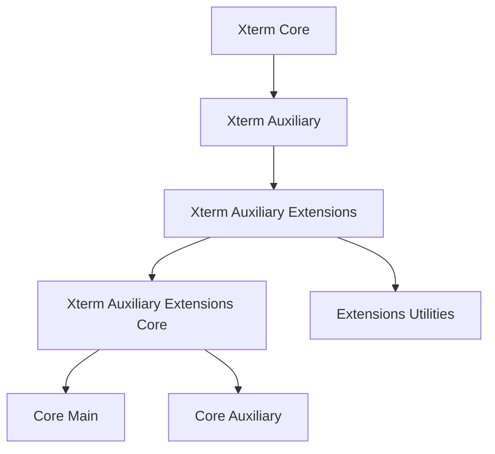
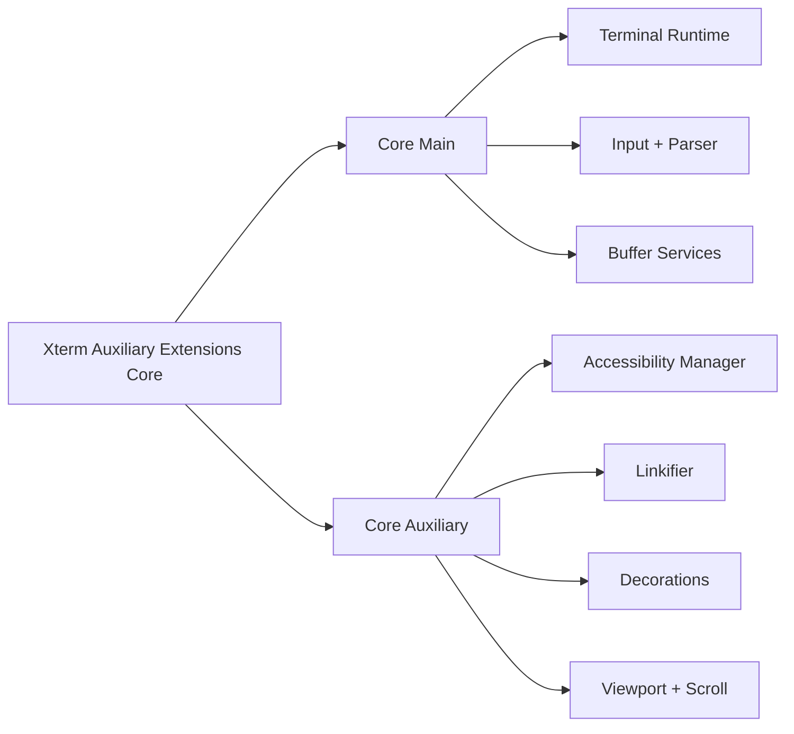
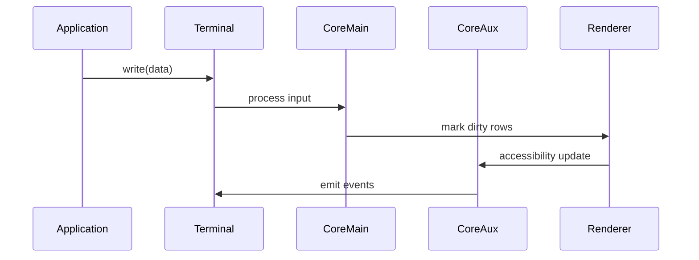

# Xterm Auxiliary Extensions Core

## Overview

The **Xterm Auxiliary Extensions Core** module provides the foundational browser-side extension layer for Xterm within MeshCentral. It acts as the structured bridge between the base `xterm` runtime and higher-level auxiliary and extension features.

This module:

- Encapsulates the auxiliary terminal runtime components
- Organizes core and extension layers of Xterm functionality
- Provides separation between main runtime logic and extension-driven behavior
- Serves as the parent module for:
  - **Xterm Auxiliary Extensions Core Main**
  - **Xterm Auxiliary Extensions Core Auxiliary**

It ensures a modular and scalable architecture for advanced browser-based terminal functionality used in remote shells and device consoles.

---

## Repository Structure

**Path:** `public/scripts`  
**Namespace:** `meshcentral.public.scripts.xterm`

### Module Hierarchy

```text
xterm
└── xterm-auxiliary
    └── xterm-auxiliary-extensions
        ├── xterm-auxiliary-extensions-core
        │   ├── xterm-auxiliary-extensions-core-main
        │   │   └── meshcentral.public.scripts.xterm.n
        │   └── xterm-auxiliary-extensions-core-auxiliary
        │       └── meshcentral.public.scripts.xterm.o
        └── xterm-auxiliary-extensions-utilities
```

### Core Components

The **Xterm Auxiliary Extensions Core** module aggregates:

- `meshcentral.public.scripts.xterm.n`  
  → Core Main runtime implementation

- `meshcentral.public.scripts.xterm.o`  
  → Auxiliary browser interaction layer

These components are responsible for organizing terminal runtime behavior and browser-specific enhancements.

---

## Architectural Position

The module sits between the base Xterm runtime and higher-level extensions.



### Layer Responsibilities

| Layer | Responsibility |
|-------|---------------|
| Xterm Core | Base terminal engine |
| Xterm Auxiliary | Additional runtime services |
| Xterm Auxiliary Extensions | Feature expansion layer |
| **Xterm Auxiliary Extensions Core** | Structured core extension grouping |
| Core Main | Primary terminal runtime logic |
| Core Auxiliary | Accessibility, rendering coordination, overlays |

---

## Internal Composition

The **Xterm Auxiliary Extensions Core** module organizes two primary submodules:



### 1. Core Main

The **Core Main** submodule contains:

- Primary `Terminal` runtime implementation
- Parser and input handler integration
- Buffer and scrollback services
- Rendering coordination

📘 See: **Xterm Auxiliary Extensions Core Main**

---

### 2. Core Auxiliary

The **Core Auxiliary** submodule provides:

- Accessibility (ARIA + screen reader support)
- Link detection and activation
- Decoration overlays
- Viewport synchronization
- IME composition handling

📘 See: **Xterm Auxiliary Extensions Core Auxiliary**

---

## Runtime Interaction Model

The module coordinates runtime behavior between parsing, buffer management, and browser-facing services.



This separation ensures:

- Clear boundaries between logic and presentation
- Extensibility without modifying core runtime
- Accessibility integration without polluting parsing logic
- Maintainable service-based architecture

---

## Design Principles

The **Xterm Auxiliary Extensions Core** module follows these architectural principles:

- **Modular hierarchy** – Clear separation of main runtime and auxiliary services
- **Service-based design** – Internal dependency injection pattern
- **Event-driven communication** – Loose coupling between subsystems
- **Browser-focused extensions** – DOM and accessibility enhancements isolated from core parsing logic
- **Extensibility-first approach** – Supports addons and utility extensions

---

## Relationship to Other Modules

| Module | Relationship |
|--------|-------------|
| Xterm Core | Provides base terminal engine |
| Xterm Auxiliary | Adds runtime enhancements |
| Xterm Auxiliary Extensions | Expands feature capabilities |
| Xterm Auxiliary Extensions Core Main | Implements primary runtime |
| Xterm Auxiliary Extensions Core Auxiliary | Implements browser-facing services |
| Xterm Auxiliary Extensions Utilities | Provides helper utilities |

---

## Summary

The **Xterm Auxiliary Extensions Core** module is the structural foundation for advanced terminal behavior within MeshCentral’s browser environment.

It:

- Organizes the main runtime and auxiliary layers
- Separates parsing/buffer logic from browser/UI concerns
- Enables accessibility, decoration, and linkification
- Provides a scalable extension point for future terminal enhancements

By isolating core runtime logic from auxiliary browser integrations, this module ensures that the MeshCentral terminal remains:

- Maintainable  
- Extensible  
- Accessible  
- High-performance  

For detailed implementation specifics, refer to:

- **Xterm Auxiliary Extensions Core Main**
- **Xterm Auxiliary Extensions Core Auxiliary**