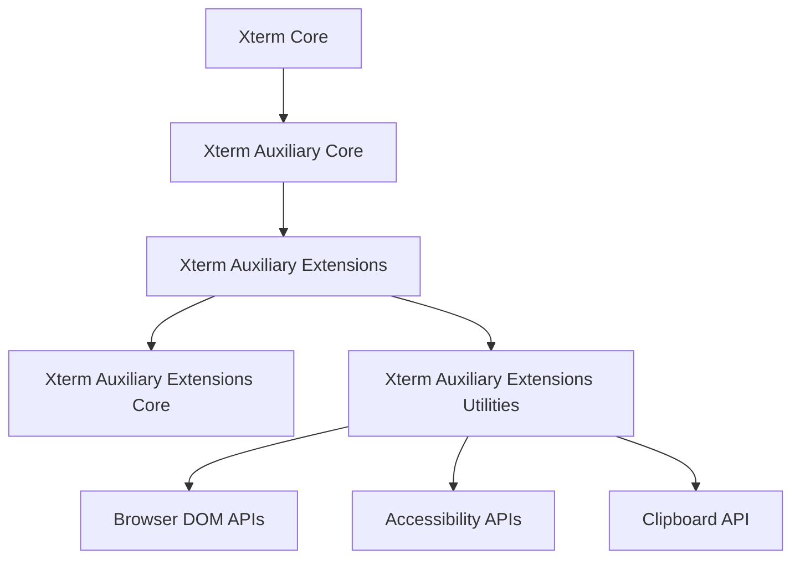
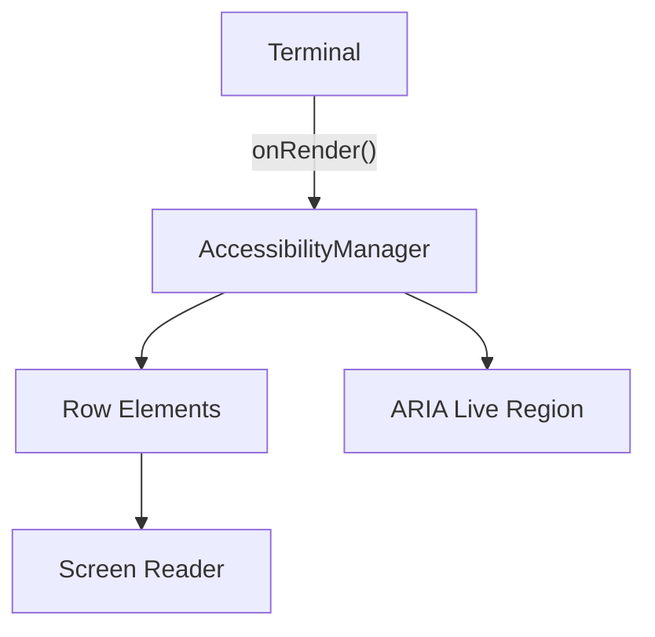
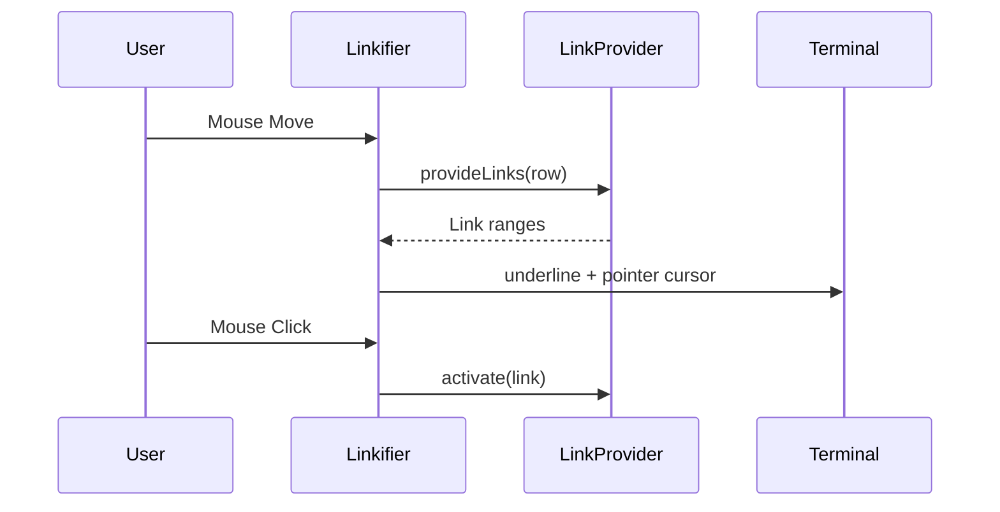
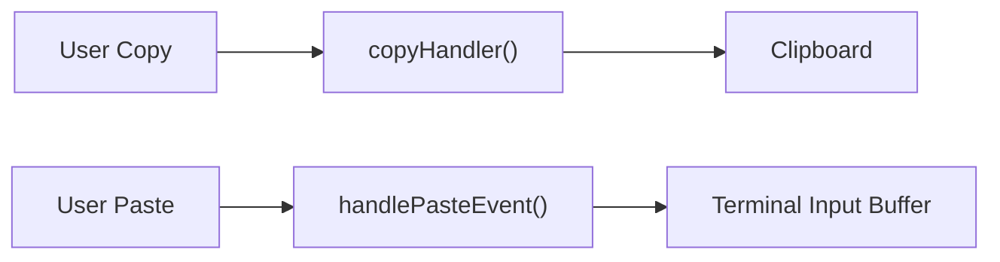
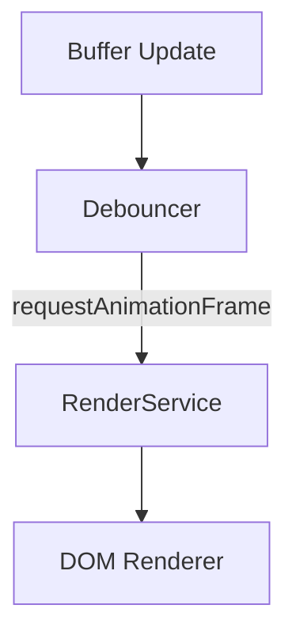
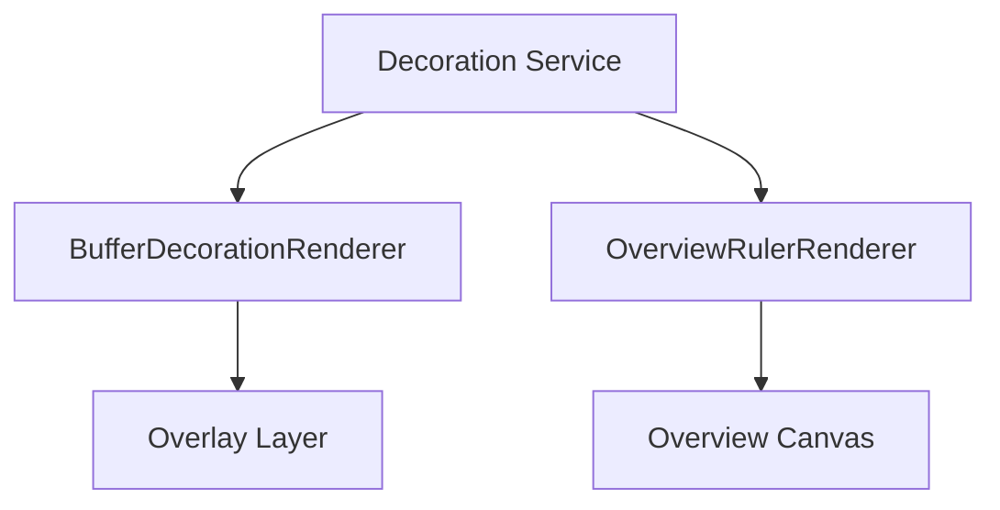
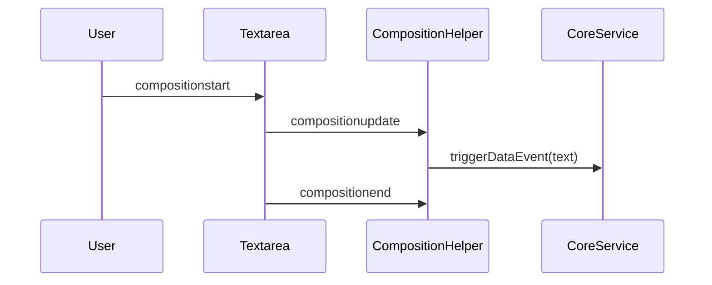
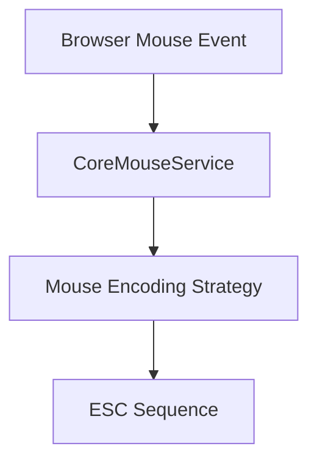
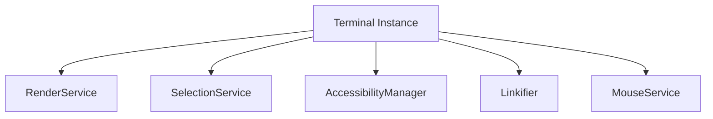
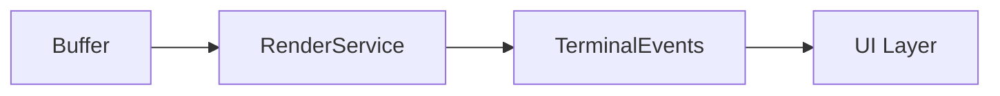

# Xterm Auxiliary Extensions Utilities

The **Xterm Auxiliary Extensions Utilities** module encapsulates utility-level capabilities that support advanced behaviors in the Xterm auxiliary extension layer. It primarily exposes and orchestrates terminal-facing features implemented in `meshcentral.public.scripts.xterm.s`, building on the Xterm core runtime and its auxiliary extension stack.

This module focuses on:

- Accessibility enhancements (screen reader integration)
- Link detection and interaction
- Clipboard and selection utilities
- Rendering optimizations and debouncing
- Decoration and overview ruler support
- Input composition and IME handling
- Mouse protocol utilities

It sits at the outer edge of the Xterm auxiliary extension layer and interacts closely with:

- [Xterm Auxiliary Extensions Core](../xterm-auxiliary-extensions-core/xterm-auxiliary-extensions-core.md)
- [Xterm Auxiliary Core](../../xterm-auxiliary-core/xterm-auxiliary-core.md)
- [Xterm Core](../../../xterm-core/xterm-core.md)

---

## 1. Architectural Position

### High-Level Placement

The Xterm Auxiliary Extensions Utilities module enhances the terminal with browser-integrated capabilities such as:

- DOM-based accessibility trees
- Clipboard and selection synchronization
- Mouse protocol encoding
- Decoration overlays
- Rendering and scroll management

---

## 2. Core Responsibilities

### 2.1 Accessibility Management

**Key class:** `AccessibilityManager`

The accessibility subsystem creates an off-screen accessibility tree synchronized with the terminal buffer. It:

- Mirrors visible rows into ARIA-compatible elements
- Emits live region updates for screen readers
- Tracks focus boundaries
- Converts terminal output into assistive-friendly text

#### Accessibility Rendering Flow

The live region buffers characters and line feeds to avoid overwhelming assistive tools while still preserving meaningful updates.

---

### 2.2 Linkification and Hyperlink Support

**Key components:**
- `Linkifier`
- `OscLinkProvider`
- `LinkProviderService`

The utilities layer enables clickable links inside terminal output by:

1. Scanning rendered buffer lines
2. Resolving OSC 8 hyperlinks
3. Tracking mouse movement over link ranges
4. Applying hover decorations and click activation

#### Link Activation Sequence

This ensures hyperlinks are:

- Keyboard and mouse accessible
- Decorated using theme-aware styles
- Dynamically updated during viewport changes

---

### 2.3 Clipboard and Selection Utilities

**Key utilities:**
- `copyHandler`
- `handlePasteEvent`
- `rightClickHandler`
- `moveTextAreaUnderMouseCursor`

These utilities synchronize terminal selection and browser clipboard behavior:

- Converts `\n` to `\r` for terminal compatibility
- Supports bracketed paste mode
- Enables right-click selection
- Repositions hidden textarea for IME correctness

---

### 2.4 Rendering and Debouncing

**Key classes:**
- `RenderDebouncer`
- `TimeBasedDebouncer`

These prevent excessive rendering during rapid buffer updates.

- Batch row refreshes
- Use animation frames for smooth updates
- Collapse multiple resize events into single render cycles

This improves performance under heavy output (e.g., logs, remote shells).

---

### 2.5 Decorations and Overview Ruler

**Key components:**
- `BufferDecorationRenderer`
- `OverviewRulerRenderer`
- `ColorZoneStore`

Decorations allow visual overlays such as:

- Error markers
- Search highlights
- Diagnostics indicators
- Overview ruler mini-map markers

These overlays are:

- Layer-aware (top or bottom layer)
- DPI-aware
- Efficiently redrawn using cached zones

---

### 2.6 Input Composition and IME Handling

**Key class:** `CompositionHelper`

Handles complex input scenarios such as:

- IME composition (CJK languages)
- Dead keys
- Multi-step character input

This ensures accurate character rendering without breaking terminal cursor alignment.

---

### 2.7 Mouse Protocol Handling

**Key class:** `CoreMouseService`

Encodes browser mouse events into terminal-compatible escape sequences.

Supported protocols include:

- X10
- VT200
- Drag tracking
- SGR
- Pixel-precise SGR

This enables full-featured terminal applications (e.g., Vim, TUI apps) inside the browser.

---

## 3. Integration with the Terminal Lifecycle

The utilities module integrates deeply with the `Terminal` class:

- Subscribes to `onRender`, `onResize`, `onScroll`
- Hooks into selection and buffer services
- Observes DPR (device pixel ratio) changes
- Bridges DOM events to terminal input

Each utility registers listeners and disposables to ensure:

- Proper cleanup on terminal dispose
- No memory leaks
- Isolation between normal and alternate buffers

---

## 4. Event Model

The module relies heavily on event emitters:

- `onRender`
- `onDimensionsChange`
- `onScroll`
- `onSelectionChange`
- `onColor`
- `onBell`

Events propagate upward through the Terminal instance and outward to UI integrations.

---

## 5. Design Characteristics

### Performance-Oriented
- Animation-frame based rendering
- Idle-task memory cleanup
- Incremental row updates

### Accessibility-First
- ARIA-compliant tree
- Live region throttling
- Keyboard-friendly link activation

### Browser-Native Integration
- Uses DOM APIs directly
- Leverages `requestAnimationFrame`
- Integrates Clipboard and IME events

### Extensible
- Link providers are pluggable
- Decoration service supports custom layers
- Mouse encoding strategies are extensible

---

## 6. Relationship to Other Modules

| Module | Role | Relationship |
|--------|------|--------------|
| Xterm Core | Core terminal engine | Provides buffer and rendering primitives |
| Xterm Auxiliary Core | Shared auxiliary infrastructure | Supplies services used by utilities |
| Xterm Auxiliary Extensions Core | Extension orchestration | Registers utilities into extension layer |

For foundational terminal mechanics, see:

- [Xterm Core](../../../xterm-core/xterm-core.md)
- [Xterm Auxiliary Core](../../xterm-auxiliary-core/xterm-auxiliary-core.md)
- [Xterm Auxiliary Extensions Core](../xterm-auxiliary-extensions-core/xterm-auxiliary-extensions-core.md)

---

## Conclusion

The **Xterm Auxiliary Extensions Utilities** module is the browser-integration and enhancement layer for advanced Xterm behavior. It bridges:

- Terminal buffer logic
- Rendering services
- Accessibility frameworks
- Clipboard and mouse APIs

By modularizing these utilities, the architecture keeps the Xterm core lean while enabling rich, production-ready terminal experiences in the browser.
