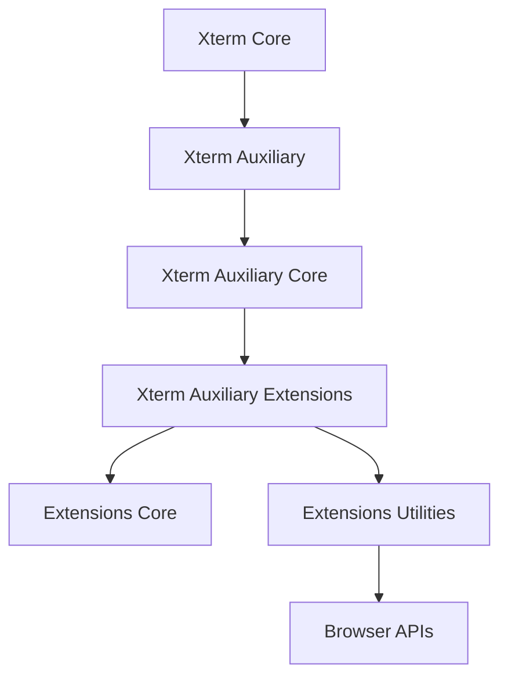
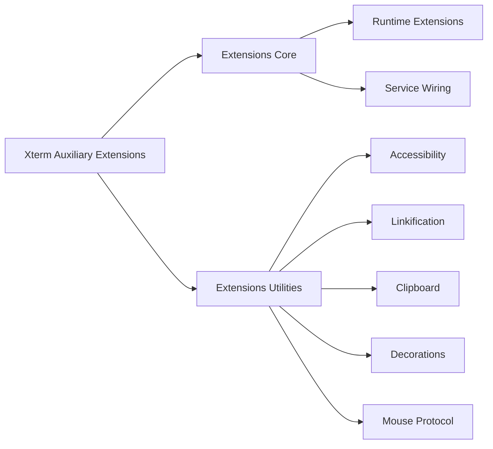
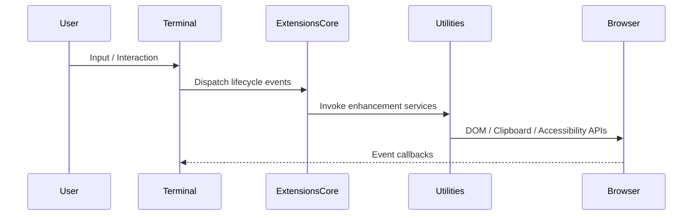
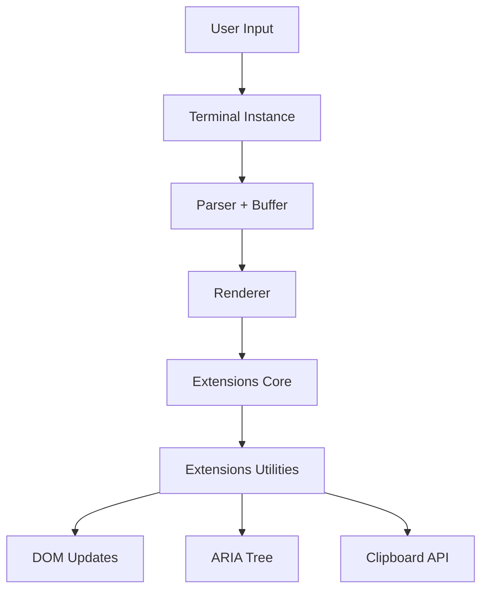

# Xterm Auxiliary Extensions

The **Xterm Auxiliary Extensions** module extends the base Xterm runtime inside MeshCentral’s browser client. It provides advanced extension capabilities layered on top of:

- **Xterm Core**
- **Xterm Auxiliary**
- **Xterm Auxiliary Core**

This module organizes feature extensions into structured sublayers, separating core extension orchestration from browser-focused utilities. It enables:

- Runtime extension management  
- Feature augmentation of the terminal  
- Accessibility, rendering, and interaction enhancements  
- Clean separation between core runtime logic and browser-integrated utilities  

---

## Repository Structure

**Path:** `public/scripts`  
**Namespace:** `meshcentral.public.scripts.xterm`

### Module Hierarchy

```text
xterm
└── xterm-auxiliary
    └── xterm-auxiliary-extensions
        ├── xterm-auxiliary-extensions-core
        │   ├── xterm-auxiliary-extensions-core-main
        │   │   └── meshcentral.public.scripts.xterm.n
        │   └── xterm-auxiliary-extensions-core-auxiliary
        │       └── meshcentral.public.scripts.xterm.o
        └── xterm-auxiliary-extensions-utilities
            └── meshcentral.public.scripts.xterm.s
```

### Primary Components

| Component | Responsibility |
|------------|----------------|
| `meshcentral.public.scripts.xterm.n` | Core extension orchestration |
| `meshcentral.public.scripts.xterm.o` | Auxiliary extension logic |
| `meshcentral.public.scripts.xterm.s` | Browser-facing utilities and services |

---

## Architectural Position

The **Xterm Auxiliary Extensions** module sits between the auxiliary runtime layer and higher-level browser integrations.



### Layer Responsibilities

| Layer | Role |
|-------|------|
| Xterm Core | Terminal engine (buffer, parser, renderer) |
| Xterm Auxiliary | Runtime services and coordination |
| Xterm Auxiliary Core | Shared auxiliary infrastructure |
| **Xterm Auxiliary Extensions** | Feature expansion layer |
| Extensions Core | Structured extension registration |
| Extensions Utilities | DOM, accessibility, clipboard, rendering integration |

---

## Internal Architecture

The module is divided into two primary subsystems.



---

## 1. Extensions Core

The **Extensions Core** organizes and registers extension behaviors into the terminal lifecycle.

### Responsibilities

- Extension initialization
- Service registration
- Lifecycle management
- Buffer and rendering coordination
- Separation of main and auxiliary extension layers

### Submodules

- **Xterm Auxiliary Extensions Core Main**
- **Xterm Auxiliary Extensions Core Auxiliary**

These submodules encapsulate the primary runtime extension logic and supporting auxiliary behaviors.

📘 See:
- **Xterm Auxiliary Extensions Core**
- **Xterm Auxiliary Extensions Core Main**
- **Xterm Auxiliary Extensions Core Auxiliary**

---

## 2. Extensions Utilities

The **Extensions Utilities** layer integrates terminal features with browser APIs.

### Functional Areas

- Accessibility management (ARIA live regions)
- Link detection and activation
- Clipboard synchronization
- Rendering debouncing
- Decoration overlays
- Mouse protocol encoding
- IME and composition handling



📘 See:
- **Xterm Auxiliary Extensions Utilities**

---

## Runtime Interaction Flow

The module coordinates parsing, rendering, and browser integration without polluting the core runtime.



This separation ensures:

- Clean abstraction boundaries  
- Extensible feature layering  
- Maintainable service composition  
- Performance-aware rendering  

---

## Design Principles

### Modular Layering
Each extension concern is isolated into a dedicated submodule.

### Event-Driven Architecture
Lifecycle events such as:

- `onRender`
- `onResize`
- `onScroll`
- `onSelectionChange`

are propagated through the extension layer.

### Browser Isolation
DOM operations and accessibility logic remain outside of the core terminal engine.

### Extensibility
New features can be added without modifying:

- Core parser
- Buffer logic
- Rendering primitives

---

## Relationship to Other Modules

| Module | Relationship |
|--------|-------------|
| Xterm Core | Provides terminal engine |
| Xterm Auxiliary | Adds runtime service layer |
| Xterm Auxiliary Core | Shared infrastructure |
| Xterm Auxiliary Extensions Core | Organizes extension lifecycle |
| Xterm Auxiliary Extensions Utilities | Implements browser-facing enhancements |

---

## Summary

The **Xterm Auxiliary Extensions** module is the feature expansion layer for MeshCentral’s browser-based terminal system.

It:

- Bridges runtime and browser APIs  
- Separates core logic from DOM integrations  
- Enables accessibility, linkification, decorations, and mouse protocol support  
- Provides structured extension orchestration  

By organizing advanced terminal capabilities into layered core and utility subsystems, the module ensures that MeshCentral’s Xterm integration remains:

- Maintainable  
- Extensible  
- Accessible  
- High-performance  

For implementation details, refer to:

- **Xterm Auxiliary Extensions Core**
- **Xterm Auxiliary Extensions Utilities**