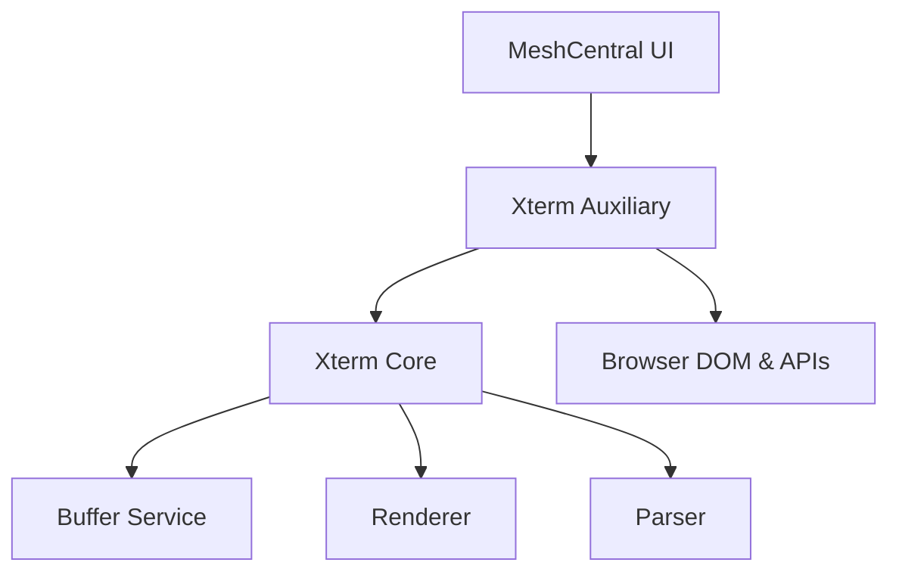
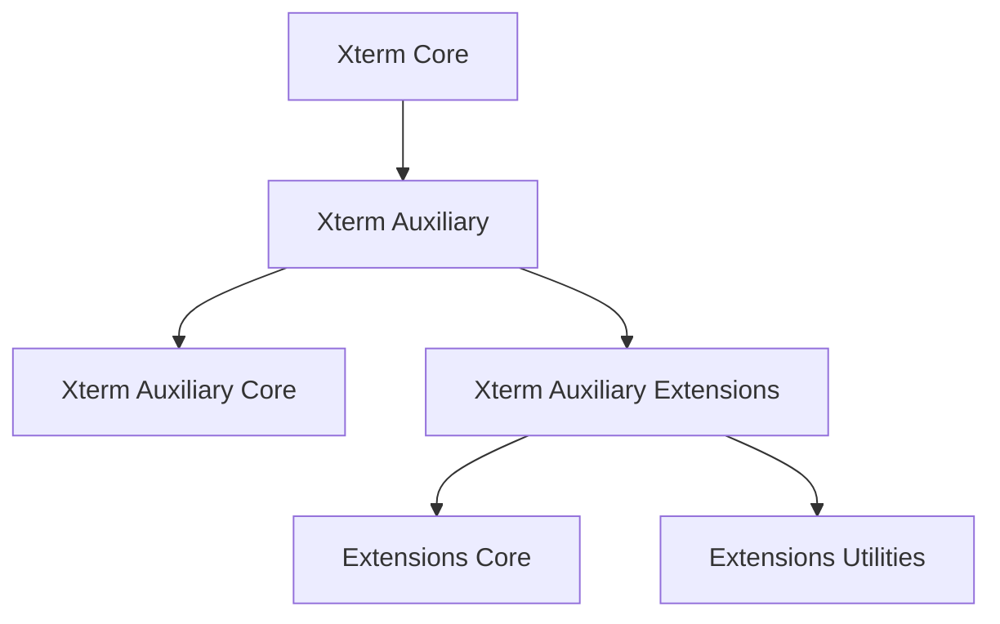
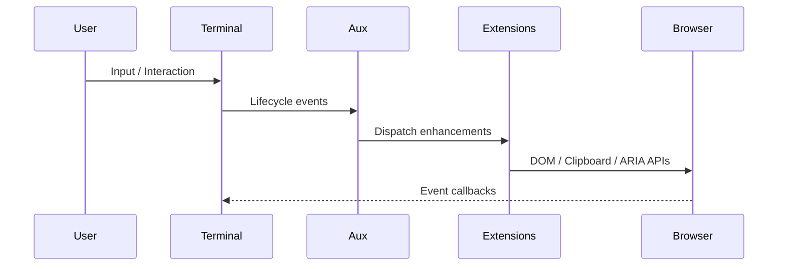
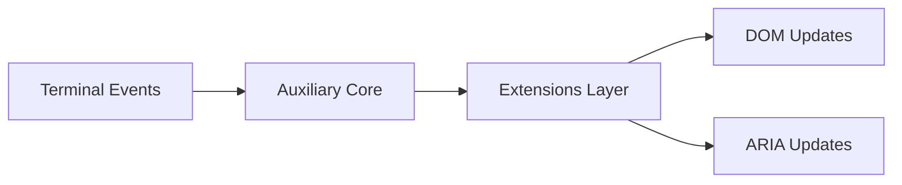
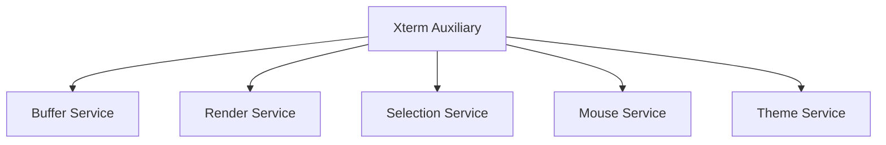

# Xterm Auxiliary

The **Xterm Auxiliary** module is the browser integration and enhancement layer for the Xterm terminal engine inside MeshCentral. It extends the **Xterm Core** runtime with accessibility, link detection, lifecycle management, and feature extensions while preserving a clean separation from the core terminal buffer and rendering engine.

This module lives under:

```text
public/scripts/xterm → xterm-auxiliary
```

It acts as the intermediary layer between:

- **Xterm Core** (terminal engine)
- **Browser APIs & DOM**
- **Feature Extensions**
- **MeshCentral UI**

---

# Purpose

The Xterm Auxiliary module is responsible for:

- Accessibility integration (ARIA tree, screen reader support)
- Hyperlink detection and activation
- DOM lifecycle management and disposal
- Rendering coordination with browser services
- Extension orchestration and runtime enhancements
- Clipboard, decorations, and mouse protocol integration (via extensions)

It ensures that the terminal is:

- Accessible
- Interactive
- Extensible
- Performant in the browser environment

---

# Architectural Overview

The module sits between the Xterm engine and browser services.



### Layered Structure



---

# Repository Structure

```text
public/scripts/xterm/
└── xterm-auxiliary/
    ├── xterm-auxiliary-core/
    │   ├── meshcentral.public.scripts.xterm.h
    │   ├── meshcentral.public.scripts.xterm.k
    │   └── meshcentral.public.scripts.xterm.l
    └── xterm-auxiliary-extensions/
        ├── meshcentral.public.scripts.xterm.n
        ├── meshcentral.public.scripts.xterm.o
        └── meshcentral.public.scripts.xterm.s
```

---

# Core Submodules

The Xterm Auxiliary module is divided into two major subsystems:

## 1. Xterm Auxiliary Core

The foundational enhancement layer that integrates Xterm with browser services.

### Primary Components

| Component | Responsibility |
|------------|----------------|
| `meshcentral.public.scripts.xterm.h` | Accessibility Manager |
| `meshcentral.public.scripts.xterm.k` | Linkifier |
| `meshcentral.public.scripts.xterm.l` | Disposable DOM utilities |

### Responsibilities

- ARIA tree management
- Screen reader synchronization
- Hyperlink detection
- DOM listener lifecycle management
- Color contrast caching
- Event-driven rendering coordination

📘 See: **Xterm Auxiliary Core**

---

## 2. Xterm Auxiliary Extensions

The feature expansion layer built on top of the Auxiliary Core.

### Primary Components

| Component | Responsibility |
|------------|----------------|
| `meshcentral.public.scripts.xterm.n` | Extension orchestration |
| `meshcentral.public.scripts.xterm.o` | Auxiliary extension logic |
| `meshcentral.public.scripts.xterm.s` | Browser-facing utilities |

### Responsibilities

- Runtime extension registration
- Clipboard integration
- Decoration overlays
- Mouse protocol encoding
- IME and composition handling
- Advanced accessibility enhancements

📘 See:
- **Xterm Auxiliary Extensions Core**
- **Xterm Auxiliary Extensions Utilities**

---

# Runtime Interaction Flow

The auxiliary layer enhances terminal behavior without modifying core internals.



---

# Key Architectural Concepts

## 1. Non-Invasive Enhancement

The module does **not** alter:

- Buffer internals
- Parser logic
- Rendering primitives

Instead, it listens to lifecycle events such as:

- `onRender`
- `onResize`
- `onScroll`
- `onSelectionChange`

And augments behavior externally.

---

## 2. Event-Driven Design



All enhancements are reactive and service-oriented.

---

## 3. Clean Lifecycle Management

Disposable patterns ensure:

- No dangling DOM listeners
- Proper teardown on terminal dispose
- Predictable resource management

---

# Integration with Xterm Core

The Xterm Auxiliary module coordinates with:

- Buffer Service
- Render Service
- Selection Service
- Mouse Service
- Theme Service
- Browser Service



This guarantees synchronization between:

- Scroll position and ARIA output
- Link ranges and buffer mutations
- Rendering and accessibility updates
- User input and browser APIs

---

# Design Principles

- **Layered architecture** — Clear separation from Xterm Core
- **Accessibility-first** — Screen reader and ARIA compliance
- **Extensibility** — Structured extension subsystems
- **Performance-aware** — Caching and debouncing strategies
- **Browser isolation** — DOM logic kept outside core engine
- **Clean disposal model** — Memory-safe listener management

---

# Relationship to Other Modules

| Module | Role |
|--------|------|
| Xterm | Root namespace |
| Xterm Core | Terminal engine |
| Xterm Auxiliary | Browser integration layer |
| Xterm Auxiliary Core | Foundational enhancements |
| Xterm Auxiliary Extensions | Feature expansion layer |

---

# Summary

The **Xterm Auxiliary** module is the browser-facing enhancement layer of MeshCentral’s terminal system.

It:

- Bridges Xterm Core and browser APIs
- Provides accessibility and link detection
- Manages DOM lifecycle and performance
- Enables structured feature extensions
- Preserves clean abstraction boundaries

By separating core engine logic from browser integration, Xterm Auxiliary ensures that MeshCentral’s terminal remains:

- Maintainable  
- Extensible  
- Accessible  
- High-performance  

For implementation details, refer to:

- **Xterm Auxiliary Core**
- **Xterm Auxiliary Extensions**
- **Xterm Core**