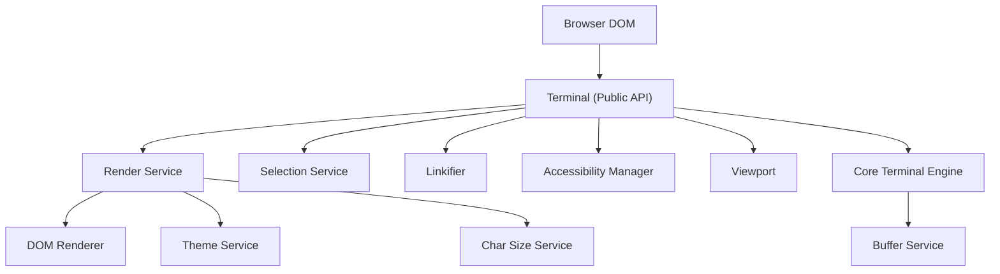
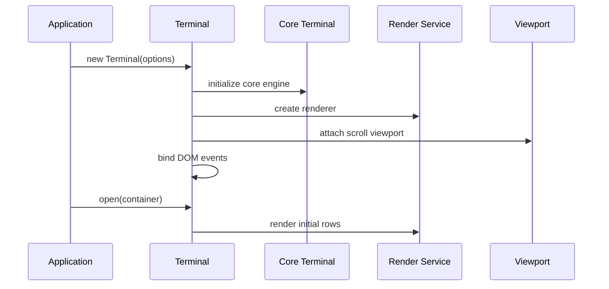
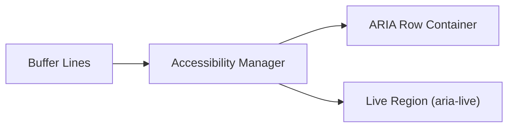
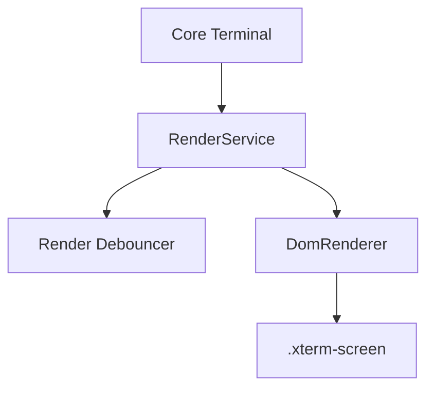
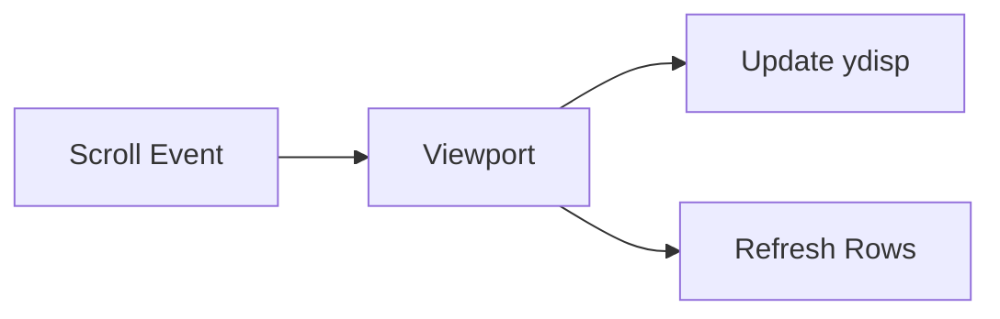
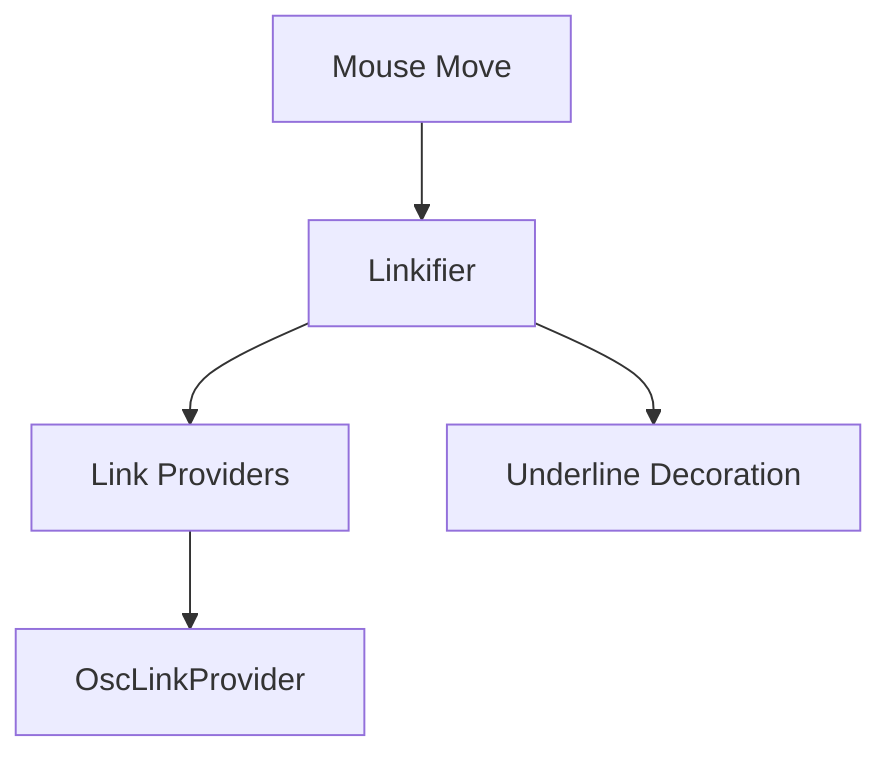
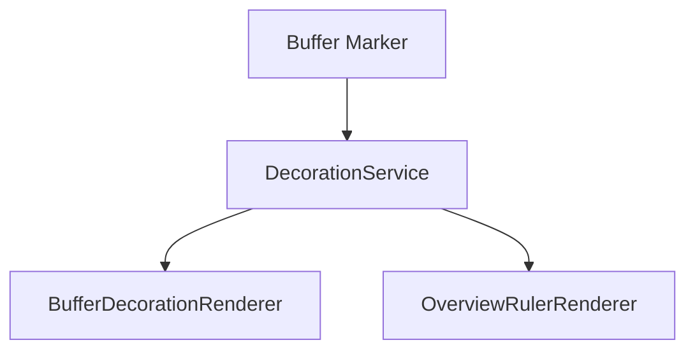
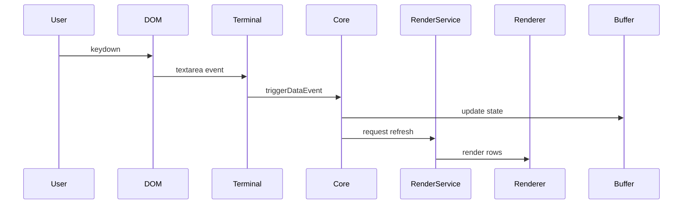

# Xterm Core Auxiliary

The **Xterm Core Auxiliary** module provides advanced browser-facing capabilities that extend the core terminal engine. It focuses on accessibility, link detection, rendering orchestration, viewport management, selection handling, decorations, theming, and browser integration.

This module builds on the fundamental terminal engine defined in **Xterm Core Main** and complements higher-level features in **Xterm Auxiliary**.

- Parent module: [Xterm Core](../xterm-core.md)
- Sibling module: [Xterm Core Main](../xterm-core-main/xterm-core-main.md)
- Higher-level features: [Xterm Auxiliary](../../xterm-auxiliary/xterm-auxiliary.md)

---

## 1. Purpose and Responsibilities

The Xterm Core Auxiliary module is responsible for:

- Accessibility tree and screen reader integration
- DOM-based rendering and layout coordination
- Viewport scrolling and smooth scroll handling
- Mouse, keyboard, and composition event bridging
- Selection model and clipboard interaction
- Link detection and activation
- Decorations and overview ruler rendering
- Theme management and color handling
- Browser service abstraction (DPR, focus, window changes)

These capabilities transform the raw terminal buffer into a fully interactive browser terminal component.

---

## 2. High-Level Architecture

The module sits between the browser DOM and the core terminal engine.

### Key Idea

- **Core Terminal Engine**: Manages buffer, parsing, escape sequences (in Xterm Core Main).
- **Xterm Core Auxiliary**: Manages how that state is rendered and interacted with in the browser.

---

## 3. Core Components

### 3.1 Terminal (Browser-Oriented Wrapper)

**Component:** `meshcentral.public.scripts.xterm.P`

The `Terminal` class:

- Extends the core terminal engine
- Instantiates browser services
- Wires rendering, selection, linkification, decorations
- Bridges DOM events to terminal input

#### Initialization Flow

---

### 3.2 Accessibility Manager

**Component:** `meshcentral.public.scripts.xterm.a`

Provides a virtual accessibility tree for screen readers.

Responsibilities:

- Creates ARIA-compliant row container
- Mirrors visible buffer rows into accessible nodes
- Announces typed characters and output via live region
- Tracks focus boundaries for smooth keyboard navigation

The accessibility layer is optional and enabled when `screenReaderMode` is active.

---

### 3.3 Render Service

**Component:** `RenderService`

Coordinates rendering between the buffer and the DOM renderer.

Responsibilities:

- Tracks dirty row ranges
- Debounces render operations
- Reacts to resize and DPR changes
- Delegates row painting to `DomRenderer`

The service ensures efficient partial updates instead of full reflows.

---

### 3.4 DOM Renderer

**Component:** `DomRenderer`

Renders each buffer row as a `
` containing styled `` elements.

Key tasks:

- Converts buffer cells to DOM spans
- Applies CSS classes for:
  - Foreground/background colors
  - Bold, italic, underline, blink
  - Cursor style
- Handles selection overlay
- Integrates with link underline events

Rendering is cell-accurate and width-aware (including wide and combined characters).

---

### 3.5 Viewport

**Component:** `Viewport`

Manages scroll synchronization between:

- Buffer `ydisp`
- Scrollbar position
- Rendered canvas height

Features:

- Smooth scrolling
- Wheel handling with modifiers
- Touch scroll support
- Scroll area resizing

---

### 3.6 Selection Service

Manages:

- Mouse drag selection
- Word and line selection (double/triple click)
- Column selection
- Linux primary selection
- Interaction with clipboard handlers

Selection state is separate from rendering but triggers redraw when updated.

---

### 3.7 Linkifier and OSC Link Provider

**Components:**

- `Linkifier`
- `OscLinkProvider`

Linkifier:

- Tracks mouse movement over buffer cells
- Queries registered link providers
- Applies hover styling (underline, pointer cursor)
- Activates links on click

The OSC link provider interprets terminal escape sequences that embed hyperlinks.

---

### 3.8 Decoration and Overview Ruler

**Components:**

- `DecorationService`
- `BufferDecorationRenderer`
- `OverviewRulerRenderer`

These allow visual annotations tied to buffer markers.

Use cases:

- Highlighted regions
- Inline widgets
- Overview ruler (minimap-style markers)

Decorations react to:

- Scroll
- Resize
- Buffer trimming

---

### 3.9 Theme and Color Management

**Component:** `ThemeService`

Handles:

- ANSI color palette
- Extended colors (256 + true color)
- Cursor and selection styling
- Contrast adjustments

Color changes propagate to renderer via event emitters.

---

### 3.10 Browser and Utility Services

Includes:

- `CoreBrowserService` (DPR, focus, window changes)
- `CharSizeService` (font measurement)
- `MouseService` (cell coordinate translation)
- `RenderDebouncer` and `TimeBasedDebouncer`

These services isolate browser-specific behavior from the core engine.

---

## 4. Input and Rendering Flow

The following diagram summarizes a typical key press:

Mouse and selection events follow a similar pattern but route through `SelectionService` and `MouseService`.

---

## 5. Interaction with Other Modules

- **Xterm Core Main** provides:
  - Escape sequence parsing
  - Buffer management
  - Core state transitions

- **Xterm Core Auxiliary** provides:
  - Browser rendering
  - Accessibility
  - Decorations
  - Selection and interaction

- **Xterm Auxiliary** builds on top with:
  - Add-ons
  - Higher-level features
  - Integrations

This separation ensures:

- Clear boundary between engine and UI
- Testable core logic
- Browser-agnostic processing layer

---

## 6. Design Characteristics

- Event-driven architecture
- Dirty-region rendering for performance
- Strict separation of buffer state and DOM
- Modular service injection pattern
- Support for advanced Unicode and wide characters
- Pluggable link and decoration systems

---

## 7. Summary

The **Xterm Core Auxiliary** module transforms the core terminal engine into a full-featured, accessible, and high-performance browser terminal.

It orchestrates rendering, accessibility, scrolling, theming, selection, and link handling — serving as the bridge between terminal state and user interaction.

For parsing logic and buffer internals, see [Xterm Core Main](../xterm-core-main/xterm-core-main.md).