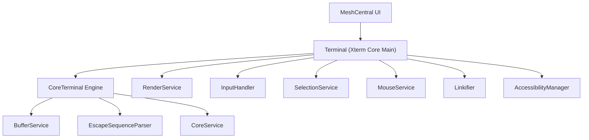
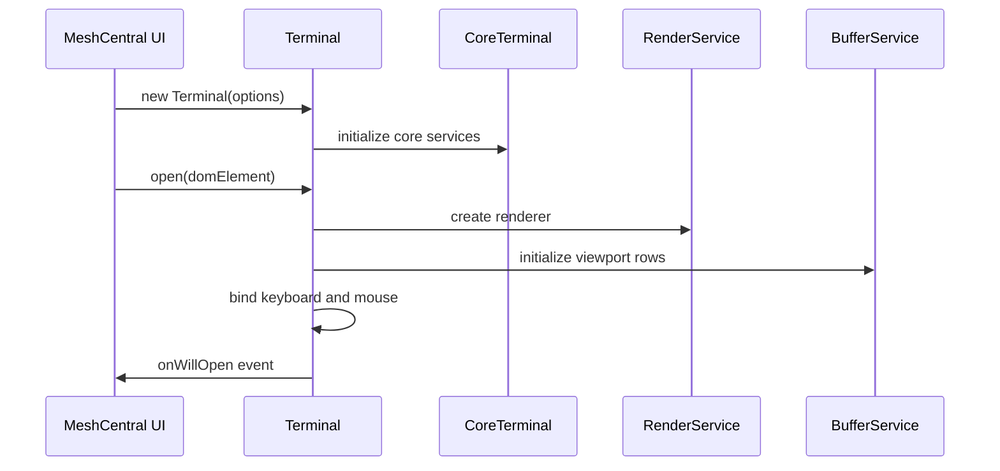
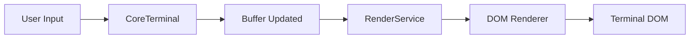
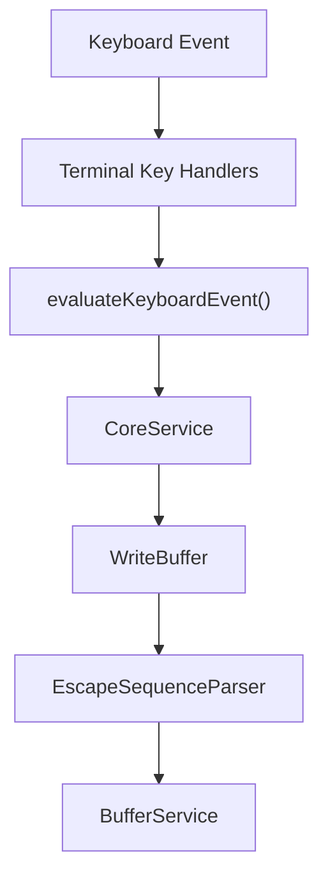
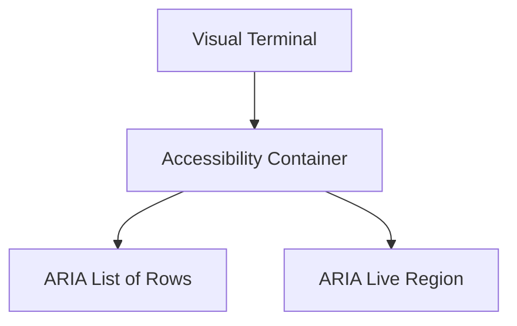
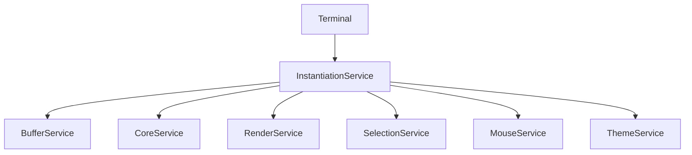

# Xterm Core Main

## Overview

**Xterm Core Main** is the primary runtime layer of the Xterm integration within MeshCentral. It provides the high-level `Terminal` API and connects the browser-facing terminal UI to the lower-level core engine (parser, buffer, renderer, input handling, and services).

This module is responsible for:

- Exposing the public `Terminal` class
- Orchestrating rendering, input, selection, and scrolling
- Managing browser integration (DOM, focus, clipboard, accessibility)
- Bridging between the Core Terminal engine and UI services

The core components defined in this module are:

- `meshcentral.public.scripts.xterm.P` → **Terminal**
- `meshcentral.public.scripts.xterm.S` → Supporting exports and entry wiring

---

## Architectural Position

Xterm Core Main sits at the boundary between:

- The **Core Terminal Engine** (buffer, parser, core services)
- The **Browser/DOM Layer** (rendering, mouse, keyboard, accessibility)
- The **Public API Surface** consumed by MeshCentral UI components

### High-Level Architecture

**Key idea:**
Xterm Core Main does not implement terminal emulation itself. Instead, it wires together services and exposes a cohesive, browser-ready terminal API.

---

## Core Component: Terminal

The `Terminal` class is the central public interface. It extends the internal `CoreTerminal` and adds:

- DOM mounting (`open()`)
- Event binding (keyboard, mouse, clipboard)
- Renderer integration
- Selection management
- Accessibility support
- Link detection and activation

### Responsibilities

1. **Lifecycle Management**
   - `open(parentElement)` creates and mounts DOM structure
   - `dispose()` tears down resources
   - `reset()` resets state and services

2. **Rendering Integration**
   - Instantiates `RenderService`
   - Connects resize and refresh events
   - Delegates row rendering to the active renderer (e.g., DOM renderer)

3. **Input Handling**
   - Binds keyboard events to `InputHandler`
   - Handles composition events for IME
   - Forwards processed input to `CoreService`

4. **Selection & Clipboard**
   - Integrates `SelectionService`
   - Handles copy/paste via browser APIs
   - Supports column selection and word selection

5. **Mouse & Scroll Management**
   - Integrates `MouseService`
   - Supports multiple mouse tracking protocols
   - Coordinates with `Viewport` for scroll synchronization

6. **Accessibility**
   - Dynamically enables `AccessibilityManager`
   - Exposes ARIA live regions
   - Announces characters and line feeds

---

## Terminal Initialization Flow

When a terminal is created and opened, the following sequence occurs:

This separation ensures that:

- The core emulation engine remains platform-agnostic
- The browser-specific wiring is contained within Xterm Core Main

---

## Rendering Pipeline

Rendering is coordinated by the `RenderService`, which receives refresh requests from:

- Buffer changes
- Cursor movement
- Selection changes
- Resize events
- Decoration updates

### Rendering Flow

The Terminal class triggers rendering through:

- `refresh(start, end)`
- Resize hooks
- Cursor movement callbacks
- Selection updates

The renderer is abstracted, allowing alternative rendering backends.

---

## Input Processing Flow

Keyboard input is captured at the textarea level and processed as follows:

Highlights:

- Modifier combinations are translated into ANSI escape sequences
- Application cursor mode is respected
- Dead keys and composition events are handled safely
- Screen reader mode alters certain behaviors

---

## Mouse Handling and Protocols

The Terminal integrates `CoreMouseService` to support:

- X10 protocol
- VT200 protocol
- Drag tracking
- Any-event tracking
- SGR and pixel encodings

Mouse events are:

1. Captured in the DOM
2. Translated to buffer coordinates
3. Encoded according to the active protocol
4. Sent to the backend via `CoreService.triggerDataEvent()`

---

## Selection and Decorations

### SelectionService

Responsible for:

- Word and line selection
- Column selection
- Drag-based selection
- Linux-style primary selection

Selection changes trigger:

- Redraw requests
- `onSelectionChange` events
- Clipboard integration

### DecorationService

Decorations allow:

- Inline visual markers
- Background highlights
- Overview ruler integration

The Terminal wires decorations into:

- Render pipeline
- Overview ruler renderer
- Selection refresh logic

---

## Accessibility Model

The `AccessibilityManager` provides:

- A parallel DOM tree for screen readers
- ARIA roles and live regions
- Debounced row updates
- Character announcement limits

### Accessibility Structure

This ensures compatibility with screen readers without compromising visual rendering performance.

---

## Service Composition Model

Xterm Core Main relies heavily on dependency injection via an instantiation service.

### Core Services Used

- `BufferService`
- `CoreService`
- `CoreMouseService`
- `OptionsService`
- `RenderService`
- `ThemeService`
- `SelectionService`
- `LinkProviderService`
- `DecorationService`

These services are registered and injected during construction.

This design provides:

- Clear separation of concerns
- Testability
- Pluggable renderers and link providers

---

## Integration in MeshCentral

Within MeshCentral, Xterm Core Main acts as:

- The interactive terminal for remote shells
- The frontend for SSH, agent consoles, or device command sessions
- A rendering surface for streamed terminal output

It integrates with:

- WebSocket transport layers
- Authentication flows
- Device session management

The `Terminal` instance becomes the interactive bridge between:

- Remote device I/O
- Local browser input and rendering

---

## Key Design Principles

1. **Separation of Core and UI**
   - Core emulation is independent from the DOM.

2. **Event-Driven Architecture**
   - Rendering and updates propagate through event emitters.

3. **Performance-Oriented Rendering**
   - Batched updates
   - Debounced rendering
   - Minimal DOM churn

4. **Protocol Compliance**
   - Full ANSI escape parsing
   - Multiple mouse tracking standards
   - OSC and DCS handling

5. **Extensibility**
   - Addon system
   - Custom link providers
   - Character joiners
   - Decorations

---

## Summary

**Xterm Core Main** is the orchestration layer that transforms a low-level terminal emulation engine into a fully interactive, browser-integrated terminal component.

It:

- Exposes the public `Terminal` API
- Wires core services to browser DOM
- Manages rendering, input, selection, and accessibility
- Acts as the integration surface for MeshCentral remote sessions

Without Xterm Core Main, the underlying terminal engine would exist in isolation. This module is what makes it usable, interactive, and production-ready within the MeshCentral ecosystem.
