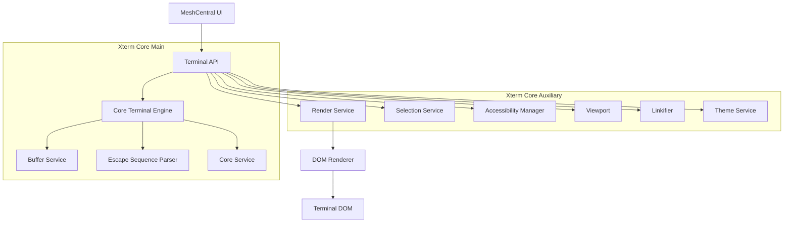
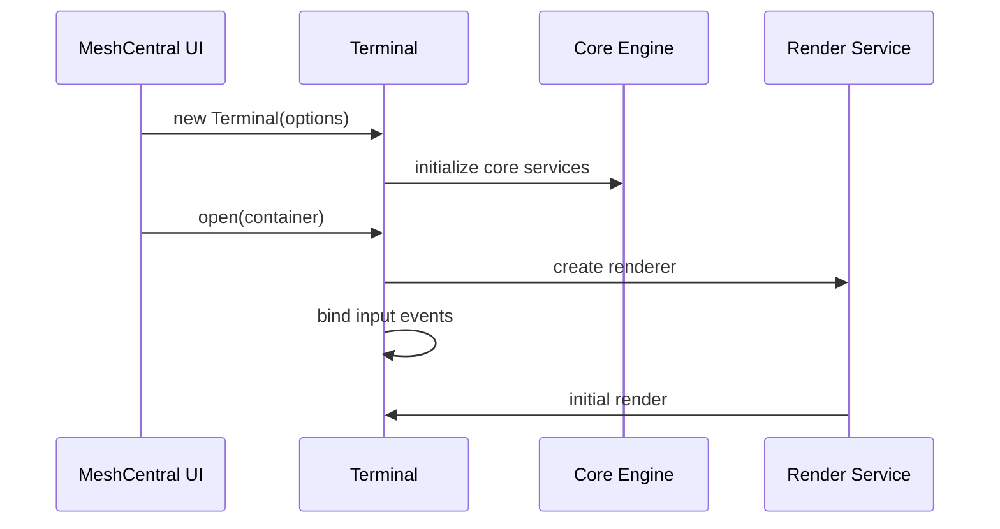
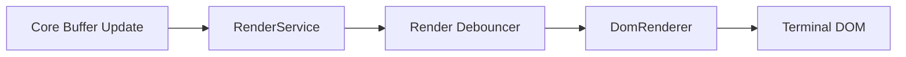
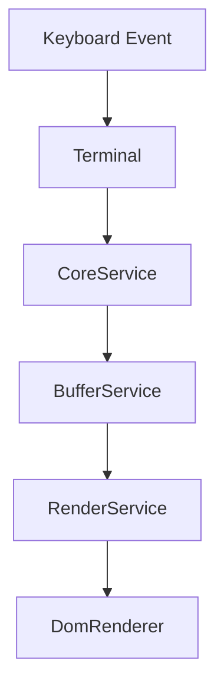
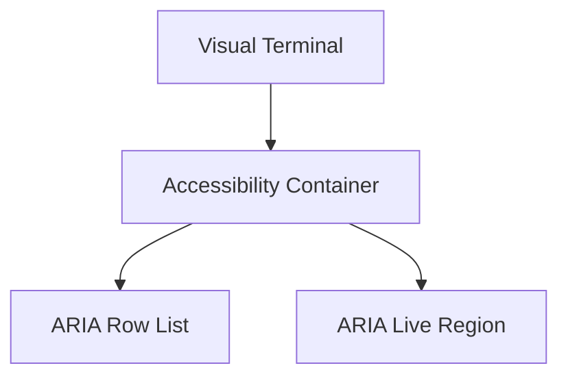
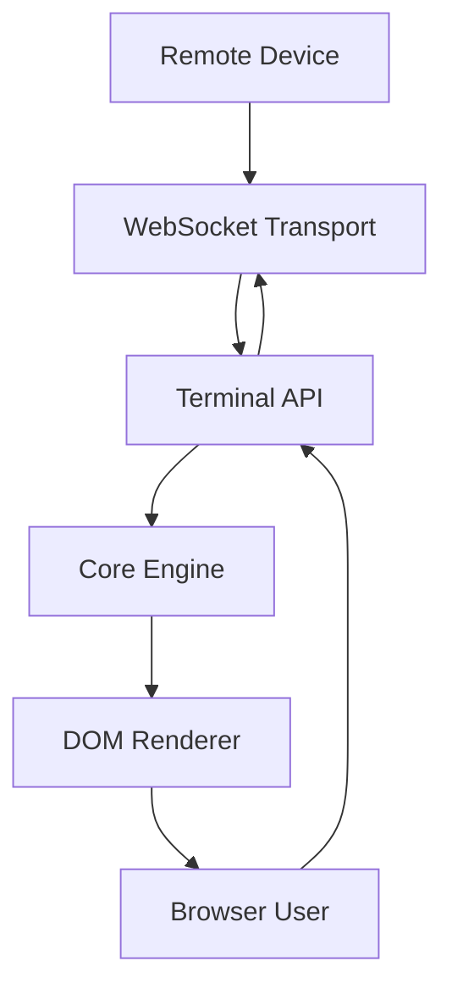

# Xterm Core

The **Xterm Core** module is the foundational terminal runtime used by MeshCentral to provide a fully interactive, browser-based terminal experience. It combines the core terminal engine with browser-facing orchestration layers, delivering ANSI-compliant emulation, rendering, input processing, accessibility, and extensibility.

This module lives under:

```text
public/scripts/xterm
```

It is composed of:

- **Xterm Core Main** – Core runtime and public `Terminal` API
- **Xterm Core Auxiliary** – Rendering, accessibility, selection, linkification, theming, and browser services

---

## 1. Purpose of Xterm Core

Xterm Core is responsible for:

- Providing the public `Terminal` API
- Managing ANSI escape parsing and buffer state
- Rendering terminal output into the DOM
- Processing keyboard and mouse input
- Handling selection and clipboard integration
- Supporting screen readers and accessibility
- Enabling link detection and decorations
- Integrating with MeshCentral remote session streams

It acts as the bridge between:

- Remote shell or device I/O streams
- The internal terminal emulation engine
- The browser’s DOM and event system

---

## 2. High-Level Architecture

Xterm Core is divided into two logical layers:



### Architectural Principles

- **Strict separation of core logic and browser integration**
- **Event-driven updates**
- **Service-based dependency injection**
- **Dirty-region rendering for performance**
- **Protocol-compliant ANSI handling**

---

## 3. Repository Structure

```text
public/scripts/xterm
├── xterm-core
│   ├── xterm-core-main
│   └── xterm-core-auxiliary
└── xterm-auxiliary
```

### Xterm Core Components

**Core Main Components**
- `meshcentral.public.scripts.xterm.P` → Terminal
- `meshcentral.public.scripts.xterm.S`

**Core Auxiliary Components**
- `meshcentral.public.scripts.xterm.a`
- `meshcentral.public.scripts.xterm.c`
- `meshcentral.public.scripts.xterm.d`

---

## 4. Xterm Core Main

**Xterm Core Main** provides the primary runtime engine and public API.

### Responsibilities

- Exposes the `Terminal` class
- Initializes core services
- Parses ANSI escape sequences
- Manages buffer state
- Coordinates rendering lifecycle
- Handles input-to-buffer flow

### Initialization Flow



### Core Responsibilities

1. **Lifecycle**
   - `open()`
   - `dispose()`
   - `reset()`

2. **Buffer & Parser**
   - Escape sequence parsing
   - Cursor tracking
   - Scroll region handling
   - Write buffer batching

3. **Input Processing**
   - Keyboard translation to ANSI
   - Application mode handling
   - IME composition support

---

### Reference Documentation

For detailed documentation of this layer, see:

- **Xterm Core Main** – Core engine and public API

---

## 5. Xterm Core Auxiliary

**Xterm Core Auxiliary** extends the core engine with browser-facing functionality.

### Responsibilities

- DOM rendering
- Scroll and viewport management
- Selection model
- Link detection
- Decorations and overview ruler
- Theme and color handling
- Accessibility tree

### Rendering Pipeline



### Input and Selection Flow



### Accessibility Model



Accessibility is enabled when screen reader mode is active and mirrors visible rows into ARIA-compliant structures.

---

### Reference Documentation

For detailed documentation of this layer, see:

- **Xterm Core Auxiliary** – Rendering, accessibility, and browser integration

---

## 6. Interaction with MeshCentral

Within MeshCentral, Xterm Core:

- Receives remote device output via WebSocket streams
- Renders remote shell sessions
- Sends keyboard and mouse input back to the remote endpoint
- Integrates with authentication and session lifecycle

### End-to-End Flow



---

## 7. Design Characteristics

- ANSI/VT-compatible escape parsing
- Service-based modular architecture
- Efficient row-based rendering
- Screen reader support
- Decoration and link provider system
- Pluggable renderers and addons
- Clear boundary between engine and UI

---

## 8. Summary

The **Xterm Core** module is the foundational terminal subsystem in MeshCentral.

It:

- Provides the public `Terminal` API
- Implements ANSI-compliant terminal emulation
- Coordinates rendering, selection, and accessibility
- Bridges remote device I/O with browser interaction
- Separates core engine logic from browser-specific concerns

Together, **Xterm Core Main** and **Xterm Core Auxiliary** form a robust, extensible, and production-ready browser terminal engine used throughout MeshCentral.