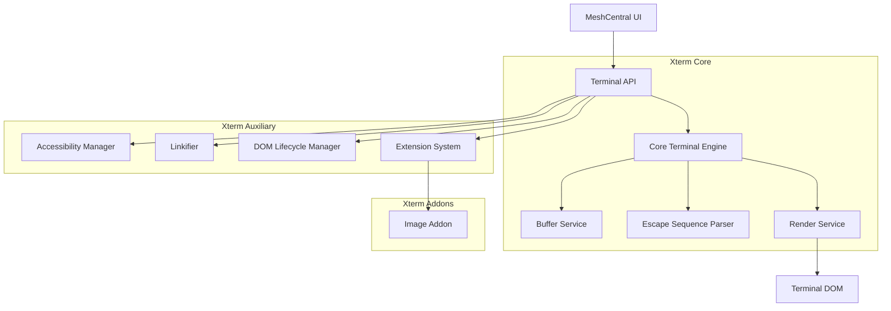
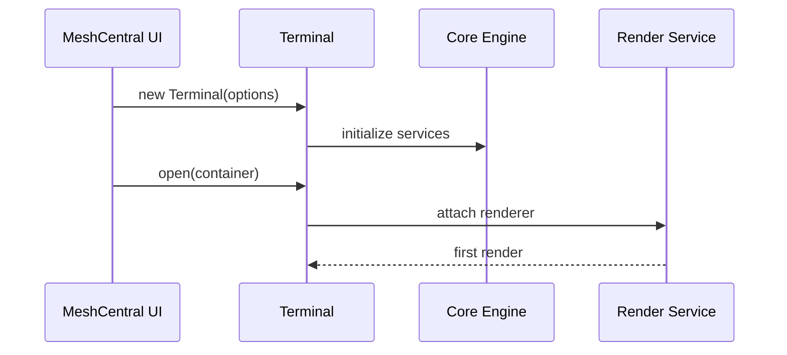
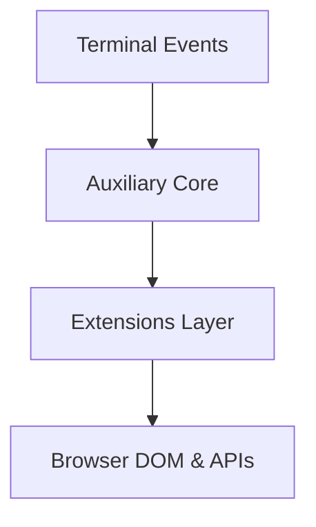
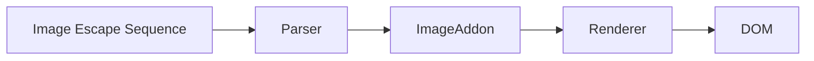
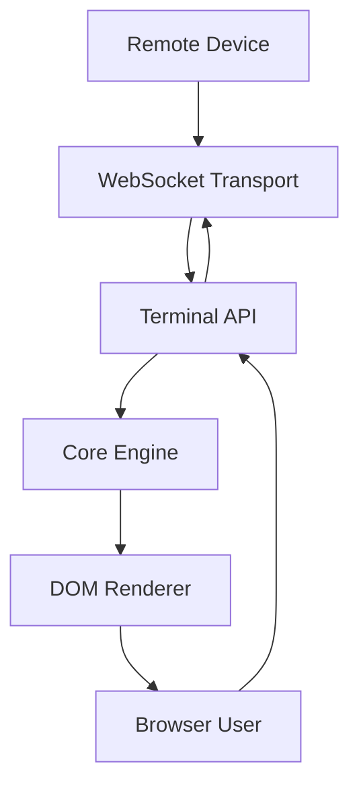

# Xterm

The **Xterm** module provides the browser-based terminal engine used by MeshCentral to deliver fully interactive remote shell sessions. It is built on a modular architecture that separates:

- Core terminal emulation logic  
- Browser integration and rendering  
- Accessibility and extensions  
- Addon support (such as image rendering)

The module lives under:

```text
public/scripts/xterm
```

It is responsible for rendering ANSI/VT-compatible terminal output, processing keyboard and mouse input, synchronizing with remote device streams, and integrating with MeshCentral’s UI and session lifecycle.

---

# 1. Purpose of the Xterm Module

The Xterm module enables:

- ANSI/VT100-compatible terminal emulation
- Interactive remote shell sessions over WebSocket
- Efficient DOM-based rendering
- Keyboard and mouse input processing
- Accessibility and ARIA support
- Extension and addon integration
- Clean lifecycle and resource disposal

It acts as the bridge between:

- Remote device streams (SSH, shell, etc.)
- The terminal buffer and parser
- The browser DOM
- MeshCentral UI services

---

# 2. High-Level Architecture

The Xterm module is composed of three primary layers:

- **Xterm Core** – Terminal engine and public API
- **Xterm Auxiliary** – Browser integration and extensions
- **Xterm Addons** – Optional enhancements (e.g., image support)



### Architectural Characteristics

- Service-based modular design  
- Strict separation of core and browser logic  
- Event-driven rendering updates  
- Dirty-region rendering optimization  
- Extensible via addon system  

---

# 3. Repository Structure

```text
public/scripts/
├── xterm/
│   ├── xterm-core/
│   │   ├── xterm-core-main/
│   │   └── xterm-core-auxiliary/
│   └── xterm-auxiliary/
└── xterm-addon-image/
```

---

# 4. Core Components

## 4.1 Xterm Core

Location:

```text
public/scripts/xterm
```

### Core Main Components

- `meshcentral.public.scripts.xterm.P` → Terminal (public API)
- `meshcentral.public.scripts.xterm.S`

### Core Auxiliary Components

- `meshcentral.public.scripts.xterm.a`
- `meshcentral.public.scripts.xterm.c`
- `meshcentral.public.scripts.xterm.d`

### Responsibilities

- Expose the `Terminal` API
- Parse ANSI escape sequences
- Maintain terminal buffer state
- Coordinate rendering
- Translate keyboard input into control sequences
- Manage terminal lifecycle

### Initialization Flow



📘 See: **Xterm Core** documentation for detailed engine internals.

---

## 4.2 Xterm Auxiliary

Location:

```text
public/scripts/xterm → xterm-auxiliary
```

### Core Components

- `meshcentral.public.scripts.xterm.h` → Accessibility Manager
- `meshcentral.public.scripts.xterm.k` → Linkifier
- `meshcentral.public.scripts.xterm.l` → Disposable utilities

### Extension Components

- `meshcentral.public.scripts.xterm.n`
- `meshcentral.public.scripts.xterm.o`
- `meshcentral.public.scripts.xterm.s`

### Responsibilities

- ARIA tree synchronization
- Screen reader support
- Hyperlink detection
- Clipboard integration
- Decoration and mouse protocol enhancements
- DOM lifecycle management

### Enhancement Flow



📘 See:
- **Xterm Auxiliary**
- **Xterm Auxiliary Core**
- **Xterm Auxiliary Extensions**

---

## 4.3 Xterm Addon: Image Support

Location:

```text
public/scripts/xterm-addon-image
```

### Core Addon Components

- `meshcentral.public.scripts.xterm-addon-image.B`
- `meshcentral.public.scripts.xterm-addon-image.Q`
- `meshcentral.public.scripts.xterm-addon-image._`
- `meshcentral.public.scripts.xterm-addon-image.a`

### Responsibilities

- Inline image rendering within terminal cells
- Extended escape sequence handling
- Image decoding and drawing
- Integration with render pipeline



📘 See: **Xterm Addon Image** documentation.

---

# 5. End-to-End Session Flow

The Xterm module integrates directly with MeshCentral’s WebSocket session layer.



### Data Flow Summary

1. Remote device sends output  
2. WebSocket delivers data to Terminal  
3. Parser updates buffer  
4. Renderer updates DOM  
5. User input is encoded and sent back  

---

# 6. Design Principles

- **Layered separation** between engine and browser
- **Service-oriented architecture**
- **Extensibility-first design**
- **Accessibility compliance**
- **Performance optimization through batching**
- **Clean lifecycle management**

---

# 7. Relationship to Other Modules

| Module | Role |
|--------|------|
| Xterm Core | Terminal engine and buffer management |
| Xterm Auxiliary | Browser integration and accessibility |
| Xterm Addon Image | Extended rendering capability |
| MeshCentral WebSocket | Transport layer for terminal data |

---

# 8. Summary

The **Xterm** module is the complete browser terminal subsystem used by MeshCentral.

It:

- Provides the `Terminal` public API  
- Implements ANSI-compatible emulation  
- Separates core engine from browser integration  
- Enables accessibility and extensibility  
- Supports addons such as inline image rendering  
- Bridges remote device streams with interactive browser UI  

Together, **Xterm Core**, **Xterm Auxiliary**, and **Xterm Addons** form a modular, extensible, and production-grade terminal engine powering MeshCentral’s remote shell experience.