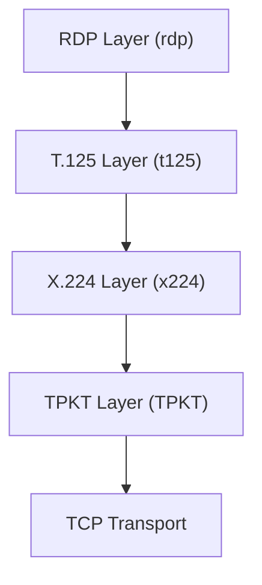

<!-- source-hash: 075d356bf90c2c23551e476729e00ae7 -->
Entry point for the `node-rdpjs` protocol stack, aggregating and re-exporting the core RDP protocol layer modules.

## Key Components

| Export | Description |
|--------|-------------|
| `TPKT` | Transport Protocol Data Unit layer (RFC 1006) |
| `x224` | X.224 connection-oriented transport protocol layer |
| `t125` | T.125 multipoint communication service layer |
| `rdp` | Core RDP (Remote Desktop Protocol) session layer |

## Usage Example

```javascript
const { TPKT, x224, t125, rdp } = require('./index');

// Access individual protocol layers
const tpktLayer = new TPKT.createClient();
const x224Layer = new x224.createClient();

// Or import the full stack for RDP client usage
const rdpClient = rdp.createClient({
  domain: '',
  userName: 'admin',
  password: 'secret'
})
.on('connect', () => console.log('RDP session established'))
.on('close', () => console.log('RDP session closed'))
.connect('192.168.1.100', 3389);
```

## Protocol Stack

The modules form a layered RDP protocol stack:



Each layer wraps the one beneath it, following the standard RDP connection sequence used in remote desktop communication.

> **Source:** [`index.js`](https://github.com/flamingo-stack/meshcentral/blob/main/node_modules/node-rdpjs/lib/index.js)