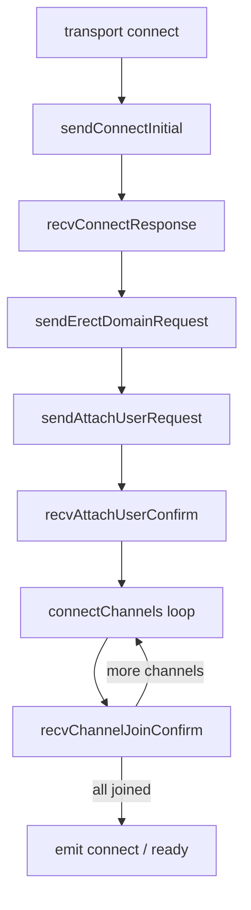

<!-- source-hash: d2e21da7e31d097f6e96046e34ffac56 -->
Implements the ITU-T T.125 Multi-Channel Services (MCS) protocol layer for RDP connections, handling channel establishment, PDU encoding/decoding, and multi-channel data routing between client and server.

## Key Components

### Constants
- **`Message`** — MCS connect message types (`CONNECT_INITIAL`, `CONNECT_RESPONSE`)
- **`DomainMCSPDU`** — PDU opcode enum (erect domain, attach user, channel join, send data, etc.)
- **`Channel`** — Predefined channel IDs (global `1003`, user base `1001`, clipboard `1005`)

### Channel Definitions
- **`RdpdrChannelDef`** — Device redirection virtual channel descriptor
- **`RdpsndChannelDef`** — Sound virtual channel descriptor
- **`CliprdrChannelDef`** — Clipboard redirection channel descriptor

### ASN.1 Structures
- **`DomainParameters()`** — Builds ASN.1 Sequence for MCS domain negotiation parameters
- **`ConnectInitial()`** — Constructs the MCS Connect-Initial PDU with caller/callee selectors and GCC user data
- **`ConnectResponse()`** — Parses/builds the server's MCS Connect-Response PDU

### Core Classes
- **`MCS`** — Base EventEmitter class; handles raw PDU send/recv, opcode validation, and channel dispatch
- **`Client`** — Extends `MCS`; drives the full connection automata (connect → erect domain → attach user → join channels)

### Helper Functions
- **`writeMCSPDUHeader(mcsPdu, options)`** — Encodes a PDU opcode into a single byte header
- **`readMCSPDUHeader(opcode, mcsPdu)`** — Validates a received opcode against an expected PDU type

## Usage Example

```javascript
var mcs = require('./mcs');

// Create an MCS client over an existing transport
var client = new mcs.Client(transport);

// Transport emits 'connect' with the negotiated protocol
transport.emit('connect', selectedProtocol);

// Listen for data on the global channel
client.on('global', function(stream) {
    // Handle incoming RDP PDU stream
});

// Listen for clipboard channel data
client.on('cliprdr', function(stream) {
    // Handle clipboard PDU stream
});

// Send data to a named channel
client.send('global', dataComponent);

// Tear down the connection
client.close();
```

## Connection Automata Flow



**Source:** [`mcs.js`](https://github.com/flamingo-stack/meshcentral/blob/main/main/mcs.js)